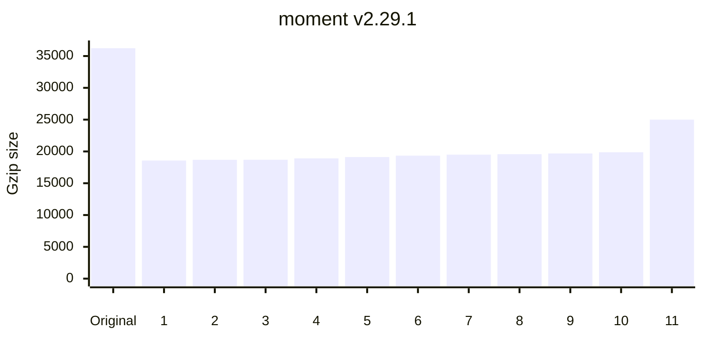
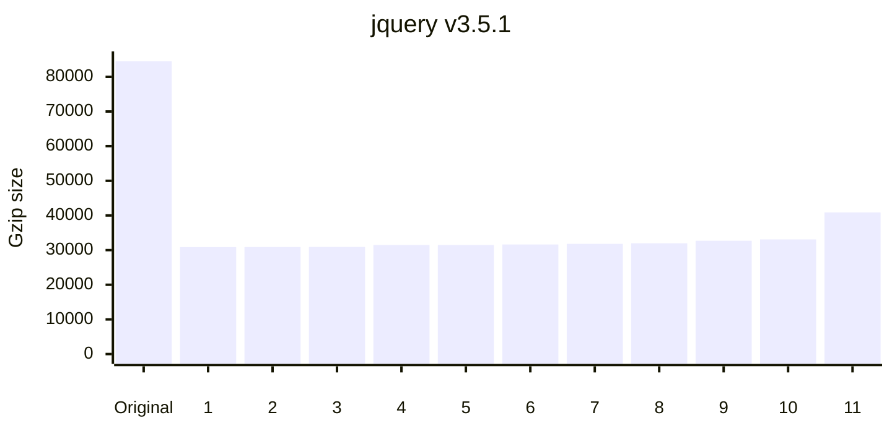
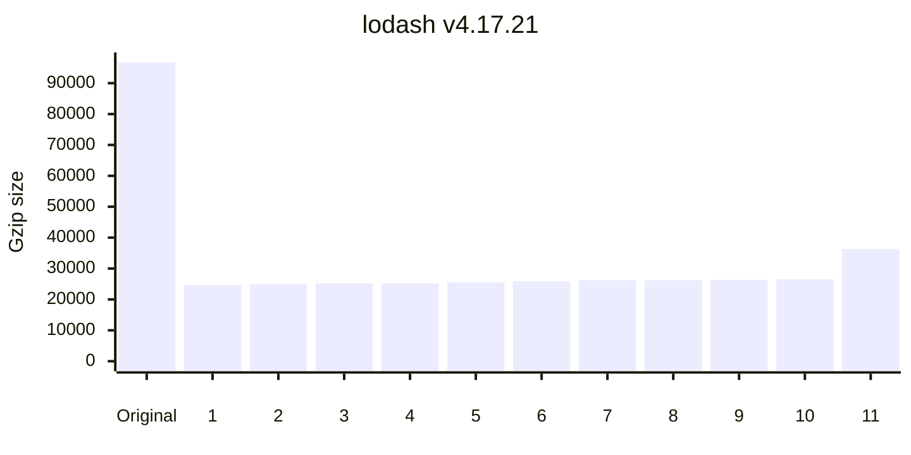
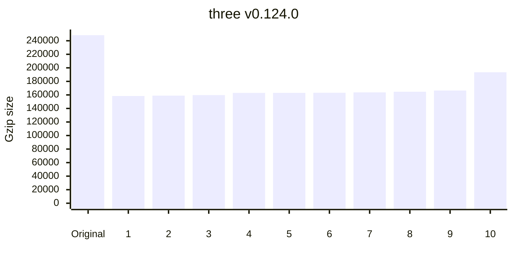
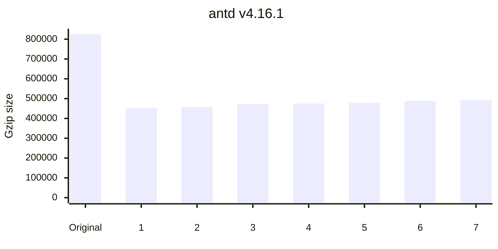

	

<h1 align="center">
	minification benchmarks
</h1>

> What's the best JavaScript minifier?

This project benchmarks the following minifiers:

<!-- minifiers:start -->
- [babel-minify](https://github.com/babel/minify/tree/master/packages/babel-minify) v0.5.2
- [bun](https://github.com/oven-sh/bun) v1.1.4
- [esbuild](https://github.com/evanw/esbuild) v0.20.2
- [google-closure-compiler](https://github.com/google/closure-compiler-npm/tree/master/packages/google-closure-compiler) v20240317.0.0
- [tedivm/jshrink](https://github.com/tedious/JShrink) v1.7.0
- [@swc/core](https://github.com/swc-project/swc) v1.4.16
- [@tdewolff/minify](https://github.com/tdewolff/minify#readme) v2.20.19
- [terser](https://github.com/terser/terser) v5.30.3
- [uglify-js](https://github.com/mishoo/UglifyJS) v3.17.4
<!-- minifiers:end -->

_Benchmarks last updated on <!-- lastUpdated:start -->Apr 18, 2024<!-- lastUpdated:end -->._

 

	<a href="https://privatenumber-sponsors.vercel.app/api/sponsor?tier=platinum">
		<picture>
			<source width="830" media="(prefers-color-scheme: dark)" srcset="https://privatenumber-sponsors.vercel.app/api/sponsor?tier=platinum&image=dark">
			<source width="830" media="(prefers-color-scheme: light)" srcset="https://privatenumber-sponsors.vercel.app/api/sponsor?tier=platinum&image">
			
		</picture>
	</a>

## 🙋‍♂️ Why?

1. To help you pick a minifier that fits your needs
2. To promote JS minifiers and document their performances
3. To encourage healthy competition and improvement amongst minifiers

## 👟 Methodology

- Each minifier is executed in its own process with a 10s timeout
- Artifact integrity is verified by a test before and after minification
- Minifier upgrade PRs are automated via [WhiteSource Renovate](https://www.whitesourcesoftware.com/free-developer-tools/renovate/)
- Benchmarks are updated on every PR via [GitHub Actions](https://github.com/privatenumber/minification-benchmarks/actions/workflows/benchmark.yml)

## ⏱ Metrics

Minifiers are ranked by smallest minzipped size.

#### Minified size

Size of the minified output.

#### Minzipped size

Size of the minified output with [Gzip compression](https://en.wikipedia.org/wiki/Gzip).

For minifiers, this measures how compressable the output is.

For users, this measures network transfer size, which is usually the metric that matters most.

#### Time

How long minification took (average of 5 runs). Each time is annotated with a multiplier relative to the fastest minifier.

 

	<a href="https://privatenumber-sponsors.vercel.app/api/sponsor?tier=gold">
		<picture>
			<source width="830" media="(prefers-color-scheme: dark)" srcset="https://privatenumber-sponsors.vercel.app/api/sponsor?tier=gold&image=dark">
			<source width="830" media="(prefers-color-scheme: light)" srcset="https://privatenumber-sponsors.vercel.app/api/sponsor?tier=gold&image">
			
		</picture>
	</a>

## 📋 Results

<!-- benchmarks:start -->

| Artifact                                                                                                                          |                    Original size |                       Gzip size |                               |
| :-------------------------------------------------------------------------------------------------------------------------------- | -------------------------------: | ------------------------------: | ----------------------------: |
| [react v17.0.2](https://www.npmjs.com/package/react/v/17.0.2) ([Source](https://unpkg.com/react@17.0.2/cjs/react.development.js)) |                       `72.13 kB` |                      `19.39 kB` |                               |
| **Minifier**                                                                                                                      |                **Minified size** |              **Minzipped size** |                      **Time** |
| 1. [@swc/core](packages/minifiers/minifiers/swc.ts)                                                                               |       -68% `22.87 kB` | **🏆-58% `8.17 kB`** |      *12x* `21 ms` |
| 2. [uglify-js](packages/minifiers/minifiers/uglify-js.ts)                                                                         | **🏆-69% `22.67 kB`** |       -58% `8.18 kB` |    *259x* `459 ms` |
| 3. [google-closure-compiler](packages/minifiers/minifiers/google-closure-compiler.ts)                                             |       -68% `22.83 kB` |       -58% `8.19 kB` | *1850x* `3,269 ms` |
| 4. [terser](packages/minifiers/minifiers/terser.ts)                                                                               |       -68% `23.14 kB` |       -57% `8.32 kB` |    *144x* `254 ms` |
| 5. [babel-minify](packages/minifiers/minifiers/babel-minify.ts)                                                                   |       -67% `23.60 kB` |       -56% `8.45 kB` |    *333x* `590 ms` |
| 6. [esbuild](packages/minifiers/minifiers/esbuild.ts)                                                                             |       -67% `23.70 kB` |       -56% `8.54 kB` |       *7x* `14 ms` |
| 7. [@tdewolff/minify](packages/minifiers/minifiers/tdewolff-minify.ts)                                                            |       -67% `23.53 kB` |       -56% `8.63 kB` |      **🏆 `2 ms`** |
| 8. [bun](packages/minifiers/minifiers/bun.ts)                                                                                     |       -67% `24.01 kB` |       -55% `8.65 kB` |       *8x* `15 ms` |
| 9. [uglify-js (no compress)](packages/minifiers/minifiers/uglify-js.ts)                                                           |       -65% `25.03 kB` |       -55% `8.67 kB` |      *47x* `83 ms` |
| 10. [terser (no compress)](packages/minifiers/minifiers/terser.ts)                                                                |       -65% `25.08 kB` |       -55% `8.75 kB` |     *60x* `107 ms` |
| 11. [tedivm/jshrink](packages/minifiers/minifiers/jshrink/index.ts)                                                               |       -43% `40.82 kB` |      -43% `11.04 kB` |     *59x* `105 ms` |

----

| Artifact                                                                                                              |                    Original size |                        Gzip size |                               |
| :-------------------------------------------------------------------------------------------------------------------- | -------------------------------: | -------------------------------: | ----------------------------: |
| [moment v2.29.1](https://www.npmjs.com/package/moment/v/2.29.1) ([Source](https://unpkg.com/moment@2.29.1/moment.js)) |                      `173.90 kB` |                       `36.23 kB` |                               |
| **Minifier**                                                                                                          |                **Minified size** |               **Minzipped size** |                      **Time** |
| 1. [uglify-js](packages/minifiers/minifiers/uglify-js.ts)                                                             | **🏆-67% `57.87 kB`** | **🏆-49% `18.57 kB`** |  *339x* `1,029 ms` |
| 2. [@swc/core](packages/minifiers/minifiers/swc.ts)                                                                   |       -67% `58.21 kB` |       -48% `18.69 kB` |      *17x* `52 ms` |
| 3. [terser](packages/minifiers/minifiers/terser.ts)                                                                   |       -66% `59.16 kB` |       -48% `18.69 kB` |    *206x* `627 ms` |
| 4. [google-closure-compiler](packages/minifiers/minifiers/google-closure-compiler.ts)                                 |       -66% `58.27 kB` |       -48% `18.91 kB` | *1272x* `3,856 ms` |
| 5. [babel-minify](packages/minifiers/minifiers/babel-minify.ts)                                                       |       -66% `59.70 kB` |       -47% `19.12 kB` |  *451x* `1,367 ms` |
| 6. [esbuild](packages/minifiers/minifiers/esbuild.ts)                                                                 |       -66% `59.82 kB` |       -47% `19.33 kB` |       *6x* `21 ms` |
| 7. [@tdewolff/minify](packages/minifiers/minifiers/tdewolff-minify.ts)                                                |       -66% `59.94 kB` |       -46% `19.49 kB` |      **🏆 `3 ms`** |
| 8. [uglify-js (no compress)](packages/minifiers/minifiers/uglify-js.ts)                                               |       -64% `62.50 kB` |       -46% `19.57 kB` |     *63x* `194 ms` |
| 9. [terser (no compress)](packages/minifiers/minifiers/terser.ts)                                                     |       -64% `63.15 kB` |       -46% `19.68 kB` |     *85x* `259 ms` |
| 10. [bun](packages/minifiers/minifiers/bun.ts)                                                                        |       -64% `61.86 kB` |       -45% `19.87 kB` |       *5x* `17 ms` |
| 11. [tedivm/jshrink](packages/minifiers/minifiers/jshrink/index.ts)                                                   |       -44% `97.63 kB` |       -31% `25.00 kB` |     *81x* `246 ms` |

----

| Artifact                                                                                                                |                    Original size |                        Gzip size |                              |
| :---------------------------------------------------------------------------------------------------------------------- | -------------------------------: | -------------------------------: | ---------------------------: |
| [jquery v3.5.1](https://www.npmjs.com/package/jquery/v/3.5.1) ([Source](https://unpkg.com/jquery@3.5.1/dist/jquery.js)) |                      `287.63 kB` |                       `84.50 kB` |                              |
| **Minifier**                                                                                                            |                **Minified size** |               **Minzipped size** |                     **Time** |
| 1. [@swc/core](packages/minifiers/minifiers/swc.ts)                                                                     |       -69% `89.16 kB` | **🏆-63% `30.87 kB`** |     *18x* `94 ms` |
| 2. [uglify-js](packages/minifiers/minifiers/uglify-js.ts)                                                               | **🏆-69% `88.54 kB`** |       -63% `30.89 kB` | *273x* `1,401 ms` |
| 3. [terser](packages/minifiers/minifiers/terser.ts)                                                                     |       -69% `89.54 kB` |       -63% `30.91 kB` |   *159x* `816 ms` |
| 4. [@tdewolff/minify](packages/minifiers/minifiers/tdewolff-minify.ts)                                                  |       -69% `89.85 kB` |       -63% `31.46 kB` |     **🏆 `5 ms`** |
| 5. [uglify-js (no compress)](packages/minifiers/minifiers/uglify-js.ts)                                                 |       -67% `94.08 kB` |       -63% `31.47 kB` |    *53x* `274 ms` |
| 6. [terser (no compress)](packages/minifiers/minifiers/terser.ts)                                                       |       -67% `94.55 kB` |       -63% `31.62 kB` |    *66x* `339 ms` |
| 7. [babel-minify](packages/minifiers/minifiers/babel-minify.ts)                                                         |       -68% `92.10 kB` |       -62% `31.80 kB` | *440x* `2,255 ms` |
| 8. [esbuild](packages/minifiers/minifiers/esbuild.ts)                                                                   |       -69% `90.07 kB` |       -62% `31.95 kB` |      *5x* `28 ms` |
| 9. [bun](packages/minifiers/minifiers/bun.ts)                                                                           |       -68% `92.56 kB` |       -61% `32.70 kB` |      *3x* `20 ms` |
| 10. [google-closure-compiler](packages/minifiers/minifiers/google-closure-compiler.ts)                                  |       -68% `92.70 kB` |       -61% `33.09 kB` | *852x* `4,363 ms` |
| 11. [tedivm/jshrink](packages/minifiers/minifiers/jshrink/index.ts)                                                     |      -50% `144.14 kB` |       -52% `40.88 kB` |    *61x* `315 ms` |

----

| Artifact                                                                                                       |                     Original size |                        Gzip size |                              |
| :------------------------------------------------------------------------------------------------------------- | --------------------------------: | -------------------------------: | ---------------------------: |
| [vue v2.6.12](https://www.npmjs.com/package/vue/v/2.6.12) ([Source](https://unpkg.com/vue@2.6.12/dist/vue.js)) |                       `342.15 kB` |                       `89.67 kB` |                              |
| **Minifier**                                                                                                   |                 **Minified size** |               **Minzipped size** |                     **Time** |
| 1. [@swc/core](packages/minifiers/minifiers/swc.ts)                                                            |       -66% `115.46 kB` | **🏆-53% `42.48 kB`** |    *14x* `128 ms` |
| 2. [terser](packages/minifiers/minifiers/terser.ts)                                                            |       -66% `116.83 kB` |       -52% `42.94 kB` | *117x* `1,024 ms` |
| 3. [uglify-js](packages/minifiers/minifiers/uglify-js.ts)                                                      | **🏆-67% `113.98 kB`** |       -52% `42.95 kB` | *221x* `1,924 ms` |
| 4. [babel-minify](packages/minifiers/minifiers/babel-minify.ts)                                                |       -66% `117.90 kB` |       -51% `43.93 kB` | *284x* `2,476 ms` |
| 5. [google-closure-compiler](packages/minifiers/minifiers/google-closure-compiler.ts)                          |       -66% `115.61 kB` |       -51% `44.23 kB` | *542x* `4,717 ms` |
| 6. [@tdewolff/minify](packages/minifiers/minifiers/tdewolff-minify.ts)                                         |       -66% `117.83 kB` |       -51% `44.37 kB` |     **🏆 `9 ms`** |
| 7. [esbuild](packages/minifiers/minifiers/esbuild.ts)                                                          |       -65% `118.14 kB` |       -51% `44.37 kB` |      *3x* `33 ms` |
| 8. [uglify-js (no compress)](packages/minifiers/minifiers/uglify-js.ts)                                        |       -63% `126.14 kB` |       -50% `44.45 kB` |    *38x* `337 ms` |
| 9. [terser (no compress)](packages/minifiers/minifiers/terser.ts)                                              |       -63% `126.58 kB` |       -50% `44.68 kB` |    *45x* `400 ms` |
| 10. [bun](packages/minifiers/minifiers/bun.ts)                                                                 |       -64% `121.70 kB` |       -49% `45.34 kB` |      *2x* `23 ms` |
| 11. [tedivm/jshrink](packages/minifiers/minifiers/jshrink/index.ts)                                            |       -42% `197.36 kB` |       -36% `57.17 kB` |    *47x* `416 ms` |

----

| Artifact                                                                                                                 |                    Original size |                        Gzip size |                              |
| :----------------------------------------------------------------------------------------------------------------------- | -------------------------------: | -------------------------------: | ---------------------------: |
| [lodash v4.17.21](https://www.npmjs.com/package/lodash/v/4.17.21) ([Source](https://unpkg.com/lodash@4.17.21/lodash.js)) |                      `544.09 kB` |                       `96.69 kB` |                              |
| **Minifier**                                                                                                             |                **Minified size** |               **Minzipped size** |                     **Time** |
| 1. [uglify-js](packages/minifiers/minifiers/uglify-js.ts)                                                                | **🏆-87% `68.24 kB`** | **🏆-74% `24.66 kB`** | *212x* `1,526 ms` |
| 2. [google-closure-compiler](packages/minifiers/minifiers/google-closure-compiler.ts)                                    |       -86% `73.47 kB` |       -74% `24.97 kB` | *644x* `4,633 ms` |
| 3. [@swc/core](packages/minifiers/minifiers/swc.ts)                                                                      |       -87% `69.83 kB` |       -74% `25.18 kB` |    *15x* `112 ms` |
| 4. [terser](packages/minifiers/minifiers/terser.ts)                                                                      |       -87% `70.67 kB` |       -74% `25.19 kB` |   *118x* `849 ms` |
| 5. [babel-minify](packages/minifiers/minifiers/babel-minify.ts)                                                          |       -87% `72.37 kB` |       -74% `25.50 kB` | *269x* `1,940 ms` |
| 6. [uglify-js (no compress)](packages/minifiers/minifiers/uglify-js.ts)                                                  |       -86% `74.61 kB` |       -73% `25.86 kB` |    *43x* `315 ms` |
| 7. [esbuild](packages/minifiers/minifiers/esbuild.ts)                                                                    |       -87% `72.48 kB` |       -73% `26.20 kB` |      *4x* `35 ms` |
| 8. [terser (no compress)](packages/minifiers/minifiers/terser.ts)                                                        |       -86% `75.29 kB` |       -73% `26.22 kB` |    *49x* `356 ms` |
| 9. [@tdewolff/minify](packages/minifiers/minifiers/tdewolff-minify.ts)                                                   |       -87% `72.42 kB` |       -73% `26.37 kB` |     **🏆 `7 ms`** |
| 10. [bun](packages/minifiers/minifiers/bun.ts)                                                                           |       -86% `74.12 kB` |       -73% `26.50 kB` |      *3x* `22 ms` |
| 11. [tedivm/jshrink](packages/minifiers/minifiers/jshrink/index.ts)                                                      |      -73% `148.78 kB` |       -62% `36.33 kB` |    *45x* `328 ms` |

----

| Artifact                                                                                                                   |                     Original size |                        Gzip size |                              |
| :------------------------------------------------------------------------------------------------------------------------- | --------------------------------: | -------------------------------: | ---------------------------: |
| [d3 v6.3.1](https://www.npmjs.com/package/d3/v/6.3.1) ([Source](https://unpkg.com/d3@6.3.1/dist/d3.js))                    |                       `555.77 kB` |                      `130.69 kB` |                              |
| **Minifier**                                                                                                               |                 **Minified size** |               **Minzipped size** |                     **Time** |
| 1. [uglify-js](packages/minifiers/minifiers/uglify-js.ts)                                                                  | **🏆-53% `263.91 kB`** | **🏆-33% `87.11 kB`** | *167x* `3,555 ms` |
| 2. [@swc/core](packages/minifiers/minifiers/swc.ts)                                                                        |       -52% `265.27 kB` |       -33% `87.28 kB` |    *13x* `290 ms` |
| 3. [uglify-js (no compress)](packages/minifiers/minifiers/uglify-js.ts)                                                    |       -50% `275.35 kB` |       -32% `88.32 kB` |    *30x* `653 ms` |
| 4. [terser](packages/minifiers/minifiers/terser.ts)                                                                        |       -52% `267.90 kB` |       -32% `88.34 kB` | *100x* `2,127 ms` |
| 5. [terser (no compress)](packages/minifiers/minifiers/terser.ts)                                                          |       -50% `276.47 kB` |       -32% `89.16 kB` |    *44x* `945 ms` |
| 6. [@tdewolff/minify](packages/minifiers/minifiers/tdewolff-minify.ts)                                                     |       -51% `269.93 kB` |       -31% `89.89 kB` |    **🏆 `21 ms`** |
| 7. [esbuild](packages/minifiers/minifiers/esbuild.ts)                                                                      |       -51% `270.13 kB` |       -31% `90.80 kB` |      *3x* `77 ms` |
| 8. [bun](packages/minifiers/minifiers/bun.ts)                                                                              |       -51% `273.63 kB` |       -29% `92.38 kB` |      *1x* `36 ms` |
| 9. [google-closure-compiler](packages/minifiers/minifiers/google-closure-compiler.ts)                                      |       -51% `270.30 kB` |       -28% `94.12 kB` | *335x* `7,110 ms` |
| 10. [babel-minify](packages/minifiers/minifiers/babel-minify.ts) ❌ Minification    |                                 ❌ |                               ❌  |                            - |
| 11. [tedivm/jshrink](packages/minifiers/minifiers/jshrink/index.ts) ❌ Minification |                                 ❌ |                               ❌  |                            - |

----

| Artifact                                                                                                                       |                     Original size |                         Gzip size |                              |
| :----------------------------------------------------------------------------------------------------------------------------- | --------------------------------: | --------------------------------: | ---------------------------: |
| [terser v5.30.3](https://www.npmjs.com/package/terser/v/5.30.3) ([Source](https://unpkg.com/terser@5.30.3/dist/bundle.min.js)) |                         `1.01 MB` |                       `193.76 kB` |                              |
| **Minifier**                                                                                                                   |                 **Minified size** |                **Minzipped size** |                     **Time** |
| 1. [@swc/core](packages/minifiers/minifiers/swc.ts)                                                                            |       -55% `455.58 kB` | **🏆-36% `123.06 kB`** |    *11x* `251 ms` |
| 2. [uglify-js](packages/minifiers/minifiers/uglify-js.ts)                                                                      |       -55% `451.77 kB` |       -36% `123.35 kB` | *155x* `3,368 ms` |
| 3. [terser](packages/minifiers/minifiers/terser.ts)                                                                            |       -55% `458.31 kB` |       -36% `123.50 kB` |  *91x* `1,981 ms` |
| 4. [terser (no compress)](packages/minifiers/minifiers/terser.ts)                                                              |       -53% `474.40 kB` |       -36% `124.43 kB` |    *41x* `892 ms` |
| 5. [uglify-js (no compress)](packages/minifiers/minifiers/uglify-js.ts)                                                        |       -53% `472.16 kB` |       -36% `124.61 kB` |    *33x* `718 ms` |
| 6. [@tdewolff/minify](packages/minifiers/minifiers/tdewolff-minify.ts)                                                         |       -55% `456.81 kB` |       -36% `124.85 kB` |    **🏆 `22 ms`** |
| 7. [google-closure-compiler](packages/minifiers/minifiers/google-closure-compiler.ts)                                          | **🏆-56% `439.95 kB`** |       -35% `126.56 kB` | *305x* `6,631 ms` |
| 8. [esbuild](packages/minifiers/minifiers/esbuild.ts)                                                                          |       -55% `458.89 kB` |       -35% `126.71 kB` |      *3x* `72 ms` |
| 9. [bun](packages/minifiers/minifiers/bun.ts)                                                                                  |       -54% `466.96 kB` |       -34% `127.55 kB` |      *1x* `36 ms` |
| 10. [tedivm/jshrink](packages/minifiers/minifiers/jshrink/index.ts)                                                            |       -37% `633.71 kB` |       -25% `145.18 kB` |  *54x* `1,185 ms` |
| 11. [babel-minify](packages/minifiers/minifiers/babel-minify.ts) ❌ Minification        |                                 ❌ |                                ❌  |                            - |

----

| Artifact                                                                                                                   |                     Original size |                         Gzip size |                                   |
| :------------------------------------------------------------------------------------------------------------------------- | --------------------------------: | --------------------------------: | --------------------------------: |
| [three v0.124.0](https://www.npmjs.com/package/three/v/0.124.0) ([Source](https://unpkg.com/three@0.124.0/build/three.js)) |                         `1.25 MB` |                       `248.27 kB` |                                   |
| **Minifier**                                                                                                               |                 **Minified size** |                **Minzipped size** |                          **Time** |
| 1. [@swc/core](packages/minifiers/minifiers/swc.ts)                                                                        |       -48% `642.88 kB` | **🏆-36% `158.37 kB`** |         *12x* `389 ms` |
| 2. [uglify-js](packages/minifiers/minifiers/uglify-js.ts)                                                                  | **🏆-49% `642.22 kB`** |       -36% `158.91 kB` |      *145x* `4,534 ms` |
| 3. [terser](packages/minifiers/minifiers/terser.ts)                                                                        |       -48% `653.99 kB` |       -36% `159.73 kB` |       *87x* `2,734 ms` |
| 4. [google-closure-compiler](packages/minifiers/minifiers/google-closure-compiler.ts)                                      |       -48% `644.45 kB` |       -34% `163.00 kB` |      *262x* `8,208 ms` |
| 5. [uglify-js (no compress)](packages/minifiers/minifiers/uglify-js.ts)                                                    |       -46% `674.49 kB` |       -34% `163.04 kB` |         *29x* `932 ms` |
| 6. [terser (no compress)](packages/minifiers/minifiers/terser.ts)                                                          |       -46% `675.50 kB` |       -34% `163.20 kB` |       *38x* `1,210 ms` |
| 7. [esbuild](packages/minifiers/minifiers/esbuild.ts)                                                                      |       -48% `646.76 kB` |       -34% `163.73 kB` |           *3x* `97 ms` |
| 8. [@tdewolff/minify](packages/minifiers/minifiers/tdewolff-minify.ts)                                                     |       -48% `644.89 kB` |       -34% `164.68 kB` |         **🏆 `31 ms`** |
| 9. [bun](packages/minifiers/minifiers/bun.ts)                                                                              |       -47% `662.76 kB` |       -33% `166.48 kB` |           *1x* `48 ms` |
| 10. [tedivm/jshrink](packages/minifiers/minifiers/jshrink/index.ts)                                                        |       -24% `952.01 kB` |       -22% `193.47 kB` |       *48x* `1,519 ms` |
| 11. [babel-minify](packages/minifiers/minifiers/babel-minify.ts) ❌ Timed out            |                                 - |                                 - | :warning: `+10,000 ms` |

----

| Artifact                                                                                                                             |                     Original size |                         Gzip size |                                   |
| :----------------------------------------------------------------------------------------------------------------------------------- | --------------------------------: | --------------------------------: | --------------------------------: |
| [victory v35.8.4](https://www.npmjs.com/package/victory/v/35.8.4) ([Source](https://unpkg.com/victory@35.8.4/dist/victory.js))       |                         `2.13 MB` |                       `309.94 kB` |                                   |
| **Minifier**                                                                                                                         |                 **Minified size** |                **Minzipped size** |                          **Time** |
| 1. [@swc/core](packages/minifiers/minifiers/swc.ts)                                                                                  |       -67% `707.21 kB` | **🏆-49% `157.86 kB`** |         *16x* `600 ms` |
| 2. [uglify-js](packages/minifiers/minifiers/uglify-js.ts)                                                                            | **🏆-67% `702.67 kB`** |       -49% `158.22 kB` |      *160x* `5,951 ms` |
| 3. [terser](packages/minifiers/minifiers/terser.ts)                                                                                  |       -66% `715.59 kB` |       -49% `158.72 kB` |       *99x* `3,705 ms` |
| 4. [@tdewolff/minify](packages/minifiers/minifiers/tdewolff-minify.ts)                                                               |       -66% `718.74 kB` |       -47% `165.09 kB` |         **🏆 `37 ms`** |
| 5. [terser (no compress)](packages/minifiers/minifiers/terser.ts)                                                                    |       -64% `759.34 kB` |       -46% `166.39 kB` |       *39x* `1,476 ms` |
| 6. [uglify-js (no compress)](packages/minifiers/minifiers/uglify-js.ts)                                                              |       -65% `756.53 kB` |       -46% `167.58 kB` |       *32x* `1,190 ms` |
| 7. [esbuild](packages/minifiers/minifiers/esbuild.ts)                                                                                |       -66% `724.14 kB` |       -42% `181.07 kB` |          *3x* `132 ms` |
| 8. [bun](packages/minifiers/minifiers/bun.ts)                                                                                        |       -66% `728.20 kB` |       -41% `182.57 kB` |           *1x* `65 ms` |
| 9. [google-closure-compiler](packages/minifiers/minifiers/google-closure-compiler.ts) ❌ Timed out |                                 - |                                 - | :warning: `+10,000 ms` |
| 10. [babel-minify](packages/minifiers/minifiers/babel-minify.ts) ❌ Minification              |                                 ❌ |                                ❌  |                                 - |
| 11. [tedivm/jshrink](packages/minifiers/minifiers/jshrink/index.ts) ❌ Post-validation     |                                 ❌ |                                ❌  |                                 - |

----

| Artifact                                                                                                                             |                     Original size |                         Gzip size |                                   |
| :----------------------------------------------------------------------------------------------------------------------------------- | --------------------------------: | --------------------------------: | --------------------------------: |
| [echarts v5.1.1](https://www.npmjs.com/package/echarts/v/5.1.1) ([Source](https://unpkg.com/echarts@5.1.1/dist/echarts.js))          |                         `3.20 MB` |                       `684.61 kB` |                                   |
| **Minifier**                                                                                                                         |                 **Minified size** |                **Minzipped size** |                          **Time** |
| 1. [@swc/core](packages/minifiers/minifiers/swc.ts)                                                                                  | **🏆-69% `993.07 kB`** | **🏆-53% `320.25 kB`** |       *13x* `1,097 ms` |
| 2. [terser](packages/minifiers/minifiers/terser.ts)                                                                                  |         -69% `1.00 MB` |       -53% `322.11 kB` |       *68x* `5,583 ms` |
| 3. [terser (no compress)](packages/minifiers/minifiers/terser.ts)                                                                    |         -66% `1.07 MB` |       -52% `330.74 kB` |       *29x* `2,450 ms` |
| 4. [uglify-js (no compress)](packages/minifiers/minifiers/uglify-js.ts)                                                              |         -67% `1.07 MB` |       -52% `331.41 kB` |       *20x* `1,665 ms` |
| 5. [esbuild](packages/minifiers/minifiers/esbuild.ts)                                                                                |         -68% `1.01 MB` |       -52% `331.56 kB` |          *2x* `221 ms` |
| 6. [@tdewolff/minify](packages/minifiers/minifiers/tdewolff-minify.ts)                                                               |         -68% `1.01 MB` |       -52% `331.90 kB` |         **🏆 `82 ms`** |
| 7. [bun](packages/minifiers/minifiers/bun.ts)                                                                                        |         -68% `1.03 MB` |       -51% `337.78 kB` |          *1x* `105 ms` |
| 8. [babel-minify](packages/minifiers/minifiers/babel-minify.ts) ❌ Timed out                       |                                 - |                                 - | :warning: `+10,000 ms` |
| 9. [google-closure-compiler](packages/minifiers/minifiers/google-closure-compiler.ts) ❌ Timed out |                                 - |                                 - | :warning: `+10,000 ms` |
| 10. [uglify-js](packages/minifiers/minifiers/uglify-js.ts) ❌ Timed out                            |                                 - |                                 - | :warning: `+10,000 ms` |
| 11. [tedivm/jshrink](packages/minifiers/minifiers/jshrink/index.ts) ❌ Minification           |                                 ❌ |                                ❌  |                                 - |

----

| Artifact                                                                                                                             |                   Original size |                         Gzip size |                                   |
| :----------------------------------------------------------------------------------------------------------------------------------- | ------------------------------: | --------------------------------: | --------------------------------: |
| [antd v4.16.1](https://www.npmjs.com/package/antd/v/4.16.1) ([Source](https://unpkg.com/antd@4.16.1/dist/antd.js))                   |                       `6.67 MB` |                       `825.18 kB` |                                   |
| **Minifier**                                                                                                                         |               **Minified size** |                **Minzipped size** |                          **Time** |
| 1. [@swc/core](packages/minifiers/minifiers/swc.ts)                                                                                  | **🏆-68% `2.15 MB`** | **🏆-45% `452.87 kB`** |       *15x* `1,384 ms` |
| 2. [terser](packages/minifiers/minifiers/terser.ts)                                                                                  |       -66% `2.25 MB` |       -45% `457.82 kB` |       *70x* `6,312 ms` |
| 3. [@tdewolff/minify](packages/minifiers/minifiers/tdewolff-minify.ts)                                                               |       -66% `2.30 MB` |       -43% `472.07 kB` |         **🏆 `90 ms`** |
| 4. [terser (no compress)](packages/minifiers/minifiers/terser.ts)                                                                    |       -64% `2.43 MB` |       -42% `475.48 kB` |       *32x* `2,892 ms` |
| 5. [uglify-js (no compress)](packages/minifiers/minifiers/uglify-js.ts)                                                              |       -64% `2.42 MB` |       -42% `478.57 kB` |       *25x* `2,285 ms` |
| 6. [esbuild](packages/minifiers/minifiers/esbuild.ts)                                                                                |       -65% `2.31 MB` |       -41% `488.28 kB` |          *3x* `311 ms` |
| 7. [bun](packages/minifiers/minifiers/bun.ts)                                                                                        |       -66% `2.30 MB` |       -40% `491.75 kB` |          *1x* `141 ms` |
| 8. [babel-minify](packages/minifiers/minifiers/babel-minify.ts) ❌ Timed out                       |                               - |                                 - | :warning: `+10,000 ms` |
| 9. [google-closure-compiler](packages/minifiers/minifiers/google-closure-compiler.ts) ❌ Timed out |                               - |                                 - | :warning: `+10,000 ms` |
| 10. [tedivm/jshrink](packages/minifiers/minifiers/jshrink/index.ts) ❌ Timed out                   |                               - |                                 - | :warning: `+10,000 ms` |
| 11. [uglify-js](packages/minifiers/minifiers/uglify-js.ts) ❌ Timed out                            |                               - |                                 - | :warning: `+10,000 ms` |

----

| Artifact                                                                                                                               |                   Original size |                         Gzip size |                                   |
| :------------------------------------------------------------------------------------------------------------------------------------- | ------------------------------: | --------------------------------: | --------------------------------: |
| [typescript v4.9.5](https://www.npmjs.com/package/typescript/v/4.9.5) ([Source](https://unpkg.com/typescript@4.9.5/lib/typescript.js)) |                      `10.95 MB` |                         `1.88 MB` |                                   |
| **Minifier**                                                                                                                           |               **Minified size** |                **Minzipped size** |                          **Time** |
| 1. [@swc/core](packages/minifiers/minifiers/swc.ts)                                                                                    | **🏆-70% `3.31 MB`** | **🏆-55% `852.34 kB`** |       *15x* `2,760 ms` |
| 2. [terser](packages/minifiers/minifiers/terser.ts)                                                                                    |       -69% `3.35 MB` |       -55% `854.27 kB` |       *39x* `6,859 ms` |
| 3. [uglify-js (no compress)](packages/minifiers/minifiers/uglify-js.ts)                                                                |       -68% `3.54 MB` |       -53% `876.54 kB` |       *12x* `2,099 ms` |
| 4. [@tdewolff/minify](packages/minifiers/minifiers/tdewolff-minify.ts)                                                                 |       -69% `3.36 MB` |       -53% `876.92 kB` |        **🏆 `175 ms`** |
| 5. [terser (no compress)](packages/minifiers/minifiers/terser.ts)                                                                      |       -68% `3.53 MB` |       -53% `879.30 kB` |       *18x* `3,250 ms` |
| 6. [esbuild](packages/minifiers/minifiers/esbuild.ts)                                                                                  |       -68% `3.49 MB` |       -51% `915.50 kB` |          *2x* `523 ms` |
| 7. [babel-minify](packages/minifiers/minifiers/babel-minify.ts) ❌ Timed out                         |                               - |                                 - | :warning: `+10,000 ms` |
| 8. [google-closure-compiler](packages/minifiers/minifiers/google-closure-compiler.ts) ❌ Timed out   |                               - |                                 - | :warning: `+10,000 ms` |
| 9. [uglify-js](packages/minifiers/minifiers/uglify-js.ts) ❌ Timed out                               |                               - |                                 - | :warning: `+10,000 ms` |
| 10. [tedivm/jshrink](packages/minifiers/minifiers/jshrink/index.ts) ❌ Minification             |                               ❌ |                                ❌  |                                 - |
| 11. [bun](packages/minifiers/minifiers/bun.ts) ❌ Post-validation                            |                               ❌ |                                ❌  |                                 - |

<!-- benchmarks:end -->

## Sponsors

	<a href="https://privatenumber-sponsors.vercel.app/api/sponsor?tier=silver1">
		<picture>
			<source width="410" media="(prefers-color-scheme: dark)" srcset="https://privatenumber-sponsors.vercel.app/api/sponsor?tier=silver1&image=dark">
			<source width="410" media="(prefers-color-scheme: light)" srcset="https://privatenumber-sponsors.vercel.app/api/sponsor?tier=silver1&image">
			
		</picture>
	</a>
	<a href="https://privatenumber-sponsors.vercel.app/api/sponsor?tier=silver2">
		<picture>
			<source width="410" media="(prefers-color-scheme: dark)" srcset="https://privatenumber-sponsors.vercel.app/api/sponsor?tier=silver2&image=dark">
			<source width="410" media="(prefers-color-scheme: light)" srcset="https://privatenumber-sponsors.vercel.app/api/sponsor?tier=silver2&image">
			
		</picture>
	</a>

	

