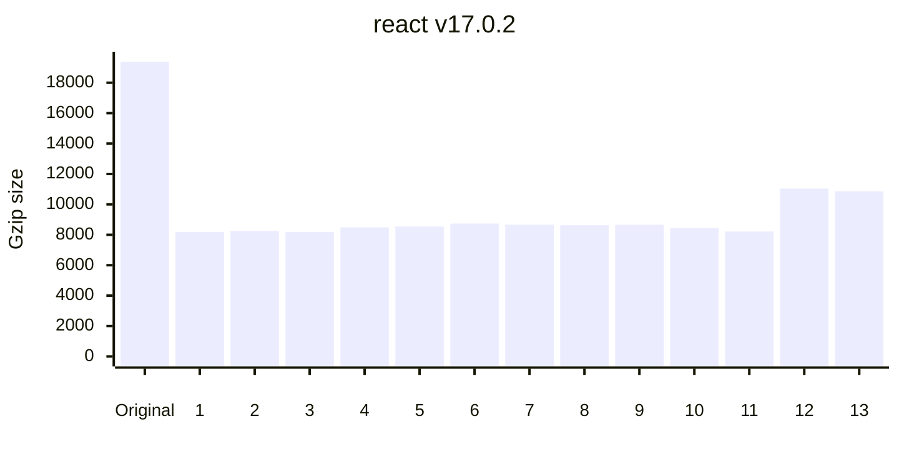
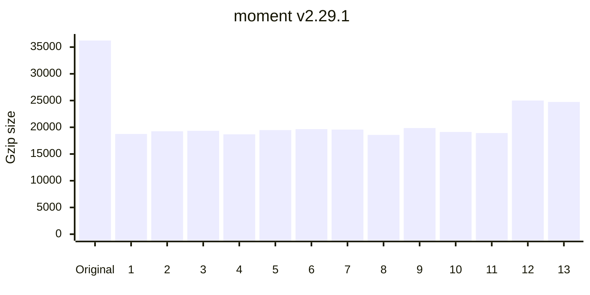
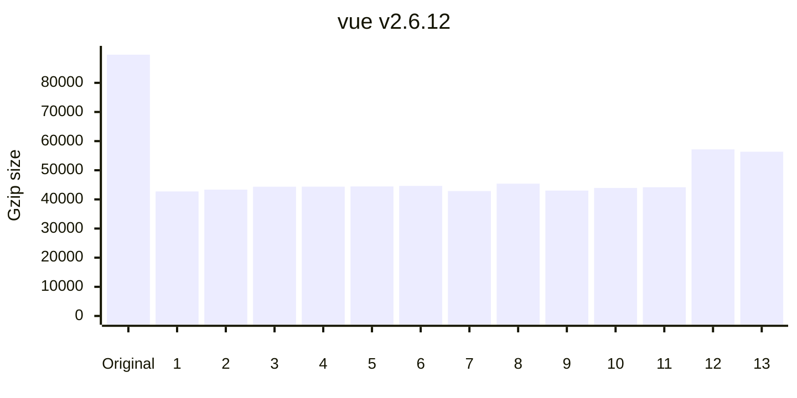
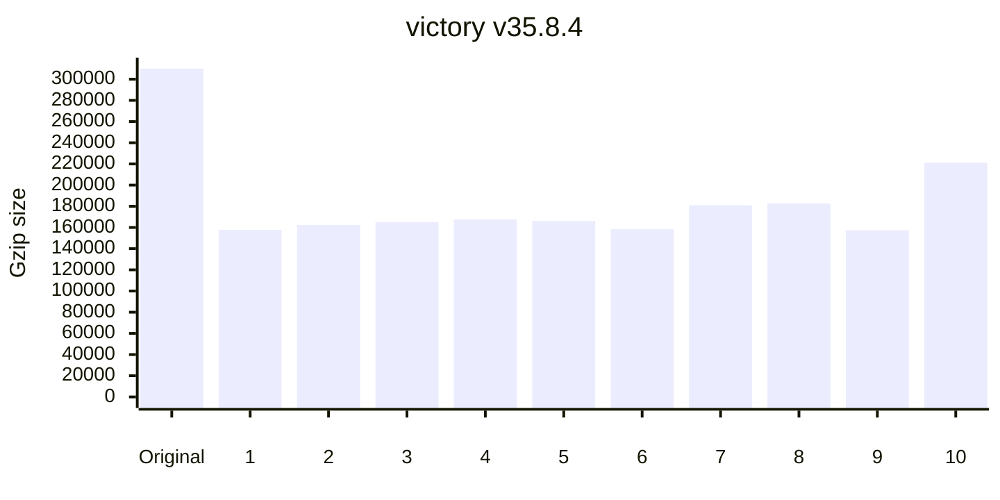
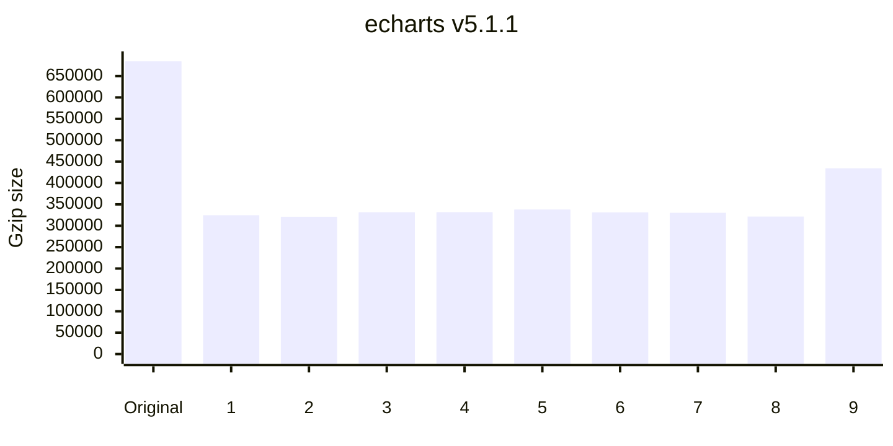
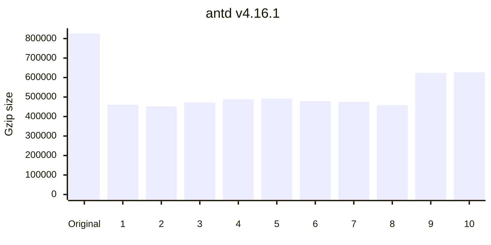

	

<h1 align="center">
	minification benchmarks
</h1>

> What's the best JavaScript minifier?

This project benchmarks the following minifiers:

<!-- minifiers:start -->
| Minifier                                                                                                    | Version                                                                              | Release date ↓ |
| ----------------------------------------------------------------------------------------------------------- | ------------------------------------------------------------------------------------ | -------------- |
| [oxc-minify](https://github.com/oxc-project/oxc.git)                                                        | [0.79.1](https://www.npmjs.com/package/oxc-minify/v/0.79.1)                          | 2025-07-31     |
| [google-closure-compiler](https://github.com/git+https://github.com/google/closure-compiler-npm.git#master) | [20250727.0.0](https://www.npmjs.com/package/google-closure-compiler/v/20250727.0.0) | 2025-07-29     |
| [@swc/core](https://github.com/swc-project/swc)                                                             | [1.13.3](https://www.npmjs.com/package/@swc/core/v/1.13.3)                           | 2025-07-29     |
| [@cminify/cminify-linux-x64](https://codeberg.org/Jumping-Beaver/cminify)                                   | [3.0.1](https://www.npmjs.com/package/@cminify/cminify-linux-x64/v/3.0.1)            | 2025-07-27     |
| [@tdewolff/minify](https://github.com/tdewolff/minify#readme)                                               | [2.23.10](https://www.npmjs.com/package/@tdewolff/minify/v/2.23.10)                  | 2025-07-22     |
| [esbuild](https://github.com/evanw/esbuild)                                                                 | [0.25.8](https://www.npmjs.com/package/esbuild/v/0.25.8)                             | 2025-07-19     |
| [bun](https://github.com/oven-sh/bun)                                                                       | [1.2.19](https://www.npmjs.com/package/bun/v/1.2.19)                                 | 2025-07-19     |
| [terser](https://github.com/terser/terser)                                                                  | [5.43.1](https://www.npmjs.com/package/terser/v/5.43.1)                              | 2025-06-19     |
| [uglify-js](https://github.com/mishoo/UglifyJS)                                                             | [3.19.3](https://www.npmjs.com/package/uglify-js/v/3.19.3)                           | 2024-08-29     |
| [babel-minify](https://github.com/babel/minify/tree/master/packages/babel-minify)                           | [0.5.2](https://www.npmjs.com/package/babel-minify/v/0.5.2)                          | 2022-05-06     |
| [tedivm/jshrink](https://github.com/tedious/JShrink)                                                        | 1.8.0                                                                                |                |
<!-- minifiers:end -->

_Benchmarks last updated on <!-- lastUpdated:start -->Aug 2, 2025<!-- lastUpdated:end -->._

 

	
	

## 🙋‍♂️ Why?

1. To help you pick a minifier that fits your needs
2. To promote JS minifiers and document their performances
3. To encourage healthy competition and improvement amongst minifiers

## 👟 Methodology

- Each minifier is executed in its own process with a 10s timeout
- Artifact integrity is verified by a test before and after minification
- Each minifier is minimally configured (sourcemaps & comments disabled), comparing out-of-the-box experience
- Minifier upgrade PRs are automated via [WhiteSource Renovate](https://www.whitesourcesoftware.com/free-developer-tools/renovate/)
- Benchmarks are updated on every PR via [GitHub Actions](https://github.com/privatenumber/minification-benchmarks/actions/workflows/benchmark.yml)
- The raw benchmark data is available in [`/packages/data/data/data.json`](/packages/data/data/data.json)

## ⏱ Metrics

### Ranking

For each benchmark, minifiers are ranked by a score that reflects the best balance of trade-offs.

The score combines minzipped size and minification time, with size weighted more heavily by default (85% size, 15% time) since it's usually the top priority. If a minifier is unusually slow, the weights shift toward time using a [logistic sigmoid function](https://en.wikipedia.org/wiki/Sigmoid_function), up to a 50/50 split. This avoids harsh cutoffs while still penalizing extreme slowness.

Both size and time are scaled using [min-max normalization](https://en.wikipedia.org/wiki/Feature_scaling#Rescaling_%28min–max_normalization%29) so they can be compared fairly. The result is a context-aware score that helps surface the best overall choice—but make sure to check each column directly if size or speed matters more to you.

#### Minified size

Size of the minified output.

#### Minzipped size

Size of the minified output with [Gzip compression](https://en.wikipedia.org/wiki/Gzip).

For minifiers, this measures how compressable the output is.

For users, this measures network transfer size, which is usually the metric that matters most.

#### Time

How long minification took (average of 5 runs). Each time is annotated with a multiplier relative to the fastest minifier.

## 📋 Results

> [!TIP]
> What's the verdict? [⚔️ See the _Minifier showdown_](#%EF%B8%8F-minifier-showdown)

<!-- benchmarks:start -->

| Artifact                                                                                                                          |                    Original size |                       Gzip size |                               |
| :-------------------------------------------------------------------------------------------------------------------------------- | -------------------------------: | ------------------------------: | ----------------------------: |
| [react v17.0.2](https://www.npmjs.com/package/react/v/17.0.2) ([Source](https://unpkg.com/react@17.0.2/cjs/react.development.js)) |                       `72.13 kB` |                      `19.39 kB` |                               |
| **Minifier**                                                                                                                      |                **Minified size** |              **Minzipped size** |                      **Time** |
| 1. [@swc/core](packages/minifiers/minifiers/swc.ts)                                                                               |       -68% `22.81 kB` |       -58% `8.19 kB` |       *4x* `12 ms` |
| 2. [terser](packages/minifiers/minifiers/terser.ts)                                                                               |       -68% `23.05 kB` |       -57% `8.26 kB` |    *105x* `275 ms` |
| 3. [uglify-js](packages/minifiers/minifiers/uglify-js.ts)                                                                         | **🏆-69% `22.64 kB`** | **🏆-58% `8.18 kB`** |    *191x* `497 ms` |
| 4. [oxc-minify](packages/minifiers/minifiers/oxc-minify.ts)                                                                       |       -67% `23.51 kB` |       -56% `8.49 kB` |        *1x* `3 ms` |
| 5. [esbuild](packages/minifiers/minifiers/esbuild.ts)                                                                             |       -67% `23.70 kB` |       -56% `8.54 kB` |       *5x* `14 ms` |
| 6. [terser (no compress)](packages/minifiers/minifiers/terser.ts)                                                                 |       -65% `25.06 kB` |       -55% `8.74 kB` |     *45x* `118 ms` |
| 7. [uglify-js (no compress)](packages/minifiers/minifiers/uglify-js.ts)                                                           |       -65% `25.03 kB` |       -55% `8.67 kB` |      *35x* `91 ms` |
| 8. [@tdewolff/minify](packages/minifiers/minifiers/tdewolff-minify.ts)                                                            |       -67% `23.49 kB` |       -55% `8.63 kB` |      **🏆 `3 ms`** |
| 9. [bun](packages/minifiers/minifiers/bun.ts)                                                                                     |       -67% `23.99 kB` |       -55% `8.66 kB` |       *5x* `13 ms` |
| 10. [babel-minify](packages/minifiers/minifiers/babel-minify.ts)                                                                  |       -67% `23.60 kB` |       -56% `8.45 kB` |    *249x* `647 ms` |
| 11. [google-closure-compiler](packages/minifiers/minifiers/google-closure-compiler.ts)                                            |       -68% `22.84 kB` |       -58% `8.22 kB` | *1248x* `3,239 ms` |
| 12. [tedivm/jshrink](packages/minifiers/minifiers/jshrink/index.ts)                                                               |       -43% `40.82 kB` |      -43% `11.04 kB` |     *48x* `126 ms` |
| 13. [@cminify/cminify-linux-x64](packages/minifiers/minifiers/cminify.ts)                                                         |       -44% `40.04 kB` |      -44% `10.86 kB` |       *4x* `12 ms` |

----

| Artifact                                                                                                              |                    Original size |                        Gzip size |                              |
| :-------------------------------------------------------------------------------------------------------------------- | -------------------------------: | -------------------------------: | ---------------------------: |
| [moment v2.29.1](https://www.npmjs.com/package/moment/v/2.29.1) ([Source](https://unpkg.com/moment@2.29.1/moment.js)) |                      `173.90 kB` |                       `36.23 kB` |                              |
| **Minifier**                                                                                                          |                **Minified size** |               **Minzipped size** |                     **Time** |
| 1. [@swc/core](packages/minifiers/minifiers/swc.ts)                                                                   |       -66% `58.42 kB` |       -48% `18.75 kB` |      *4x* `30 ms` |
| 2. [oxc-minify](packages/minifiers/minifiers/oxc-minify.ts)                                                           |       -66% `59.51 kB` |       -47% `19.26 kB` |       *1x* `9 ms` |
| 3. [esbuild](packages/minifiers/minifiers/esbuild.ts)                                                                 |       -66% `59.82 kB` |       -47% `19.33 kB` |      *3x* `22 ms` |
| 4. [terser](packages/minifiers/minifiers/terser.ts)                                                                   |       -66% `59.01 kB` |       -48% `18.69 kB` |   *113x* `693 ms` |
| 5. [@tdewolff/minify](packages/minifiers/minifiers/tdewolff-minify.ts)                                                |       -66% `59.87 kB` |       -46% `19.48 kB` |     **🏆 `6 ms`** |
| 6. [terser (no compress)](packages/minifiers/minifiers/terser.ts)                                                     |       -64% `63.01 kB` |       -46% `19.65 kB` |    *47x* `289 ms` |
| 7. [uglify-js (no compress)](packages/minifiers/minifiers/uglify-js.ts)                                               |       -64% `62.50 kB` |       -46% `19.57 kB` |    *35x* `215 ms` |
| 8. [uglify-js](packages/minifiers/minifiers/uglify-js.ts)                                                             | **🏆-67% `57.73 kB`** | **🏆-49% `18.57 kB`** | *188x* `1,149 ms` |
| 9. [bun](packages/minifiers/minifiers/bun.ts)                                                                         |       -64% `61.84 kB` |       -45% `19.86 kB` |      *2x* `17 ms` |
| 10. [babel-minify](packages/minifiers/minifiers/babel-minify.ts)                                                      |       -66% `59.70 kB` |       -47% `19.12 kB` | *240x* `1,465 ms` |
| 11. [google-closure-compiler](packages/minifiers/minifiers/google-closure-compiler.ts)                                |       -66% `58.29 kB` |       -48% `18.92 kB` | *602x* `3,670 ms` |
| 12. [tedivm/jshrink](packages/minifiers/minifiers/jshrink/index.ts)                                                   |       -44% `97.63 kB` |       -31% `25.00 kB` |    *46x* `284 ms` |
| 13. [@cminify/cminify-linux-x64](packages/minifiers/minifiers/cminify.ts)                                             |       -45% `95.93 kB` |       -32% `24.74 kB` |      *1x* `10 ms` |

----

| Artifact                                                                                                                |                    Original size |                        Gzip size |                              |
| :---------------------------------------------------------------------------------------------------------------------- | -------------------------------: | -------------------------------: | ---------------------------: |
| [jquery v3.5.1](https://www.npmjs.com/package/jquery/v/3.5.1) ([Source](https://unpkg.com/jquery@3.5.1/dist/jquery.js)) |                      `287.63 kB` |                       `84.50 kB` |                              |
| **Minifier**                                                                                                            |                **Minified size** |               **Minzipped size** |                     **Time** |
| 1. [@swc/core](packages/minifiers/minifiers/swc.ts)                                                                     |       -69% `89.17 kB` |       -63% `30.87 kB` |      *5x* `47 ms` |
| 2. [oxc-minify](packages/minifiers/minifiers/oxc-minify.ts)                                                             |       -69% `89.34 kB` |       -63% `30.97 kB` |      *1x* `15 ms` |
| 3. [@tdewolff/minify](packages/minifiers/minifiers/tdewolff-minify.ts)                                                  |       -69% `89.68 kB` |       -63% `31.45 kB` |     **🏆 `8 ms`** |
| 4. [uglify-js (no compress)](packages/minifiers/minifiers/uglify-js.ts)                                                 |       -67% `94.08 kB` |       -63% `31.47 kB` |    *39x* `314 ms` |
| 5. [terser (no compress)](packages/minifiers/minifiers/terser.ts)                                                       |       -67% `94.26 kB` |       -63% `31.56 kB` |    *46x* `373 ms` |
| 6. [esbuild](packages/minifiers/minifiers/esbuild.ts)                                                                   |       -69% `90.07 kB` |       -62% `31.95 kB` |      *4x* `36 ms` |
| 7. [terser](packages/minifiers/minifiers/terser.ts)                                                                     |       -69% `89.24 kB` | **🏆-63% `30.86 kB`** |   *116x* `921 ms` |
| 8. [bun](packages/minifiers/minifiers/bun.ts)                                                                           |       -68% `92.55 kB` |       -61% `32.65 kB` |      *3x* `28 ms` |
| 9. [uglify-js](packages/minifiers/minifiers/uglify-js.ts)                                                               | **🏆-69% `88.45 kB`** |       -63% `30.90 kB` | *200x* `1,593 ms` |
| 10. [babel-minify](packages/minifiers/minifiers/babel-minify.ts)                                                        |       -68% `92.10 kB` |       -62% `31.80 kB` | *302x* `2,398 ms` |
| 11. [tedivm/jshrink](packages/minifiers/minifiers/jshrink/index.ts)                                                     |      -50% `144.14 kB` |       -52% `40.88 kB` |    *45x* `361 ms` |
| 12. [google-closure-compiler](packages/minifiers/minifiers/google-closure-compiler.ts)                                  |       -68% `92.73 kB` |       -61% `33.09 kB` | *510x* `4,044 ms` |
| 13. [@cminify/cminify-linux-x64](packages/minifiers/minifiers/cminify.ts)                                               |      -51% `141.45 kB` |       -52% `40.37 kB` |      *2x* `22 ms` |

----

| Artifact                                                                                                       |                     Original size |                        Gzip size |                              |
| :------------------------------------------------------------------------------------------------------------- | --------------------------------: | -------------------------------: | ---------------------------: |
| [vue v2.6.12](https://www.npmjs.com/package/vue/v/2.6.12) ([Source](https://unpkg.com/vue@2.6.12/dist/vue.js)) |                       `342.15 kB` |                       `89.67 kB` |                              |
| **Minifier**                                                                                                   |                 **Minified size** |               **Minzipped size** |                     **Time** |
| 1. [@swc/core](packages/minifiers/minifiers/swc.ts)                                                            |       -66% `115.69 kB` | **🏆-52% `42.73 kB`** |      *5x* `65 ms` |
| 2. [oxc-minify](packages/minifiers/minifiers/oxc-minify.ts)                                                    |       -66% `117.22 kB` |       -52% `43.35 kB` |      *1x* `18 ms` |
| 3. [@tdewolff/minify](packages/minifiers/minifiers/tdewolff-minify.ts)                                         |       -66% `117.69 kB` |       -51% `44.36 kB` |    **🏆 `12 ms`** |
| 4. [esbuild](packages/minifiers/minifiers/esbuild.ts)                                                          |       -65% `118.14 kB` |       -51% `44.37 kB` |      *3x* `42 ms` |
| 5. [uglify-js (no compress)](packages/minifiers/minifiers/uglify-js.ts)                                        |       -63% `126.14 kB` |       -50% `44.45 kB` |    *29x* `364 ms` |
| 6. [terser (no compress)](packages/minifiers/minifiers/terser.ts)                                              |       -63% `126.39 kB` |       -50% `44.64 kB` |    *35x* `442 ms` |
| 7. [terser](packages/minifiers/minifiers/terser.ts)                                                            |       -66% `116.60 kB` |       -52% `42.87 kB` |  *92x* `1,143 ms` |
| 8. [bun](packages/minifiers/minifiers/bun.ts)                                                                  |       -64% `121.50 kB` |       -49% `45.40 kB` |      *2x* `29 ms` |
| 9. [uglify-js](packages/minifiers/minifiers/uglify-js.ts)                                                      | **🏆-67% `113.80 kB`** |       -52% `43.04 kB` | *178x* `2,206 ms` |
| 10. [babel-minify](packages/minifiers/minifiers/babel-minify.ts)                                               |       -66% `117.90 kB` |       -51% `43.93 kB` | *218x* `2,696 ms` |
| 11. [google-closure-compiler](packages/minifiers/minifiers/google-closure-compiler.ts)                         |       -66% `115.61 kB` |       -51% `44.18 kB` | *360x* `4,450 ms` |
| 12. [tedivm/jshrink](packages/minifiers/minifiers/jshrink/index.ts)                                            |       -42% `197.36 kB` |       -36% `57.17 kB` |    *38x* `478 ms` |
| 13. [@cminify/cminify-linux-x64](packages/minifiers/minifiers/cminify.ts)                                      |       -43% `193.91 kB` |       -37% `56.36 kB` |      *1x* `23 ms` |

----

| Artifact                                                                                                                 |                    Original size |                        Gzip size |                              |
| :----------------------------------------------------------------------------------------------------------------------- | -------------------------------: | -------------------------------: | ---------------------------: |
| [lodash v4.17.21](https://www.npmjs.com/package/lodash/v/4.17.21) ([Source](https://unpkg.com/lodash@4.17.21/lodash.js)) |                      `544.09 kB` |                       `96.69 kB` |                              |
| **Minifier**                                                                                                             |                **Minified size** |               **Minzipped size** |                     **Time** |
| 1. [@swc/core](packages/minifiers/minifiers/swc.ts)                                                                      |       -87% `69.81 kB` |       -74% `25.24 kB` |      *4x* `53 ms` |
| 2. [uglify-js (no compress)](packages/minifiers/minifiers/uglify-js.ts)                                                  |       -86% `74.61 kB` |       -73% `25.86 kB` |    *26x* `333 ms` |
| 3. [oxc-minify](packages/minifiers/minifiers/oxc-minify.ts)                                                              |       -87% `71.38 kB` |       -73% `25.98 kB` |      *1x* `14 ms` |
| 4. [esbuild](packages/minifiers/minifiers/esbuild.ts)                                                                    |       -87% `72.48 kB` |       -73% `26.20 kB` |      *2x* `35 ms` |
| 5. [terser (no compress)](packages/minifiers/minifiers/terser.ts)                                                        |       -86% `75.04 kB` |       -73% `26.19 kB` |    *31x* `393 ms` |
| 6. [@tdewolff/minify](packages/minifiers/minifiers/tdewolff-minify.ts)                                                   |       -87% `71.90 kB` |       -73% `26.50 kB` |    **🏆 `13 ms`** |
| 7. [bun](packages/minifiers/minifiers/bun.ts)                                                                            |       -87% `73.45 kB` |       -72% `26.66 kB` |      *1x* `23 ms` |
| 8. [terser](packages/minifiers/minifiers/terser.ts)                                                                      |       -87% `70.41 kB` |       -74% `25.15 kB` |  *81x* `1,028 ms` |
| 9. [uglify-js](packages/minifiers/minifiers/uglify-js.ts)                                                                | **🏆-87% `68.17 kB`** | **🏆-74% `24.69 kB`** | *134x* `1,689 ms` |
| 10. [babel-minify](packages/minifiers/minifiers/babel-minify.ts)                                                         |       -87% `72.37 kB` |       -74% `25.50 kB` | *165x* `2,083 ms` |
| 11. [google-closure-compiler](packages/minifiers/minifiers/google-closure-compiler.ts)                                   |       -86% `73.50 kB` |       -74% `25.02 kB` | *322x* `4,050 ms` |
| 12. [tedivm/jshrink](packages/minifiers/minifiers/jshrink/index.ts)                                                      |      -73% `148.78 kB` |       -62% `36.33 kB` |    *29x* `371 ms` |
| 13. [@cminify/cminify-linux-x64](packages/minifiers/minifiers/cminify.ts)                                                |      -73% `146.27 kB` |       -63% `35.94 kB` |      *1x* `13 ms` |

----

| Artifact                                                                                                                   |                     Original size |                        Gzip size |                              |
| :------------------------------------------------------------------------------------------------------------------------- | --------------------------------: | -------------------------------: | ---------------------------: |
| [d3 v6.3.1](https://www.npmjs.com/package/d3/v/6.3.1) ([Source](https://unpkg.com/d3@6.3.1/dist/d3.js))                    |                       `555.77 kB` |                      `130.69 kB` |                              |
| **Minifier**                                                                                                               |                 **Minified size** |               **Minzipped size** |                     **Time** |
| 1. [@swc/core](packages/minifiers/minifiers/swc.ts)                                                                        |       -52% `265.22 kB` |       -33% `87.21 kB` |     *5x* `144 ms` |
| 2. [oxc-minify](packages/minifiers/minifiers/oxc-minify.ts)                                                                |       -51% `270.88 kB` |       -33% `88.14 kB` |      *1x* `43 ms` |
| 3. [uglify-js (no compress)](packages/minifiers/minifiers/uglify-js.ts)                                                    |       -50% `275.35 kB` |       -32% `88.32 kB` |    *25x* `711 ms` |
| 4. [terser (no compress)](packages/minifiers/minifiers/terser.ts)                                                          |       -50% `276.13 kB` |       -32% `89.07 kB` |  *36x* `1,020 ms` |
| 5. [@tdewolff/minify](packages/minifiers/minifiers/tdewolff-minify.ts)                                                     |       -52% `269.35 kB` |       -31% `89.88 kB` |      *1x* `33 ms` |
| 6. [esbuild](packages/minifiers/minifiers/esbuild.ts)                                                                      |       -51% `270.13 kB` |       -31% `90.80 kB` |      *2x* `69 ms` |
| 7. [terser](packages/minifiers/minifiers/terser.ts)                                                                        |       -52% `267.42 kB` |       -33% `88.00 kB` |  *83x* `2,338 ms` |
| 8. [bun](packages/minifiers/minifiers/bun.ts)                                                                              |       -51% `273.41 kB` |       -29% `92.40 kB` |      *1x* `47 ms` |
| 9. [uglify-js](packages/minifiers/minifiers/uglify-js.ts)                                                                  | **🏆-53% `263.56 kB`** | **🏆-33% `87.02 kB`** | *140x* `3,927 ms` |
| 10. [google-closure-compiler](packages/minifiers/minifiers/google-closure-compiler.ts)                                     |       -51% `270.32 kB` |       -28% `94.17 kB` | *238x* `6,681 ms` |
| 11. [@cminify/cminify-linux-x64](packages/minifiers/minifiers/cminify.ts)                                                  |       -29% `393.70 kB` |      -21% `103.81 kB` |    **🏆 `28 ms`** |
| 12. [babel-minify](packages/minifiers/minifiers/babel-minify.ts) ❌ Minification    |                                 ❌ |                               ❌  |                            - |
| 13. [tedivm/jshrink](packages/minifiers/minifiers/jshrink/index.ts) ❌ Minification |                                 ❌ |                               ❌  |                            - |

----

| Artifact                                                                                                                       |                     Original size |                         Gzip size |                              |
| :----------------------------------------------------------------------------------------------------------------------------- | --------------------------------: | --------------------------------: | ---------------------------: |
| [terser v5.30.3](https://www.npmjs.com/package/terser/v/5.30.3) ([Source](https://unpkg.com/terser@5.30.3/dist/bundle.min.js)) |                         `1.01 MB` |                       `193.76 kB` |                              |
| **Minifier**                                                                                                                   |                 **Minified size** |                **Minzipped size** |                     **Time** |
| 1. [oxc-minify](packages/minifiers/minifiers/oxc-minify.ts)                                                                    |       -56% `440.04 kB` | **🏆-37% `122.26 kB`** |      *1x* `44 ms` |
| 2. [@swc/core](packages/minifiers/minifiers/swc.ts)                                                                            |       -55% `455.52 kB` |       -36% `123.26 kB` |     *5x* `130 ms` |
| 3. [@tdewolff/minify](packages/minifiers/minifiers/tdewolff-minify.ts)                                                         |       -55% `456.59 kB` |       -36% `124.89 kB` |      *1x* `35 ms` |
| 4. [uglify-js (no compress)](packages/minifiers/minifiers/uglify-js.ts)                                                        |       -53% `472.16 kB` |       -36% `124.61 kB` |    *33x* `778 ms` |
| 5. [terser (no compress)](packages/minifiers/minifiers/terser.ts)                                                              |       -53% `472.58 kB` |       -36% `124.25 kB` |    *41x* `966 ms` |
| 6. [esbuild](packages/minifiers/minifiers/esbuild.ts)                                                                          |       -55% `458.89 kB` |       -35% `126.71 kB` |      *2x* `63 ms` |
| 7. [bun](packages/minifiers/minifiers/bun.ts)                                                                                  |       -54% `466.80 kB` |       -34% `127.65 kB` |      *1x* `42 ms` |
| 8. [terser](packages/minifiers/minifiers/terser.ts)                                                                            |       -55% `456.59 kB` |       -36% `123.35 kB` |  *95x* `2,227 ms` |
| 9. [uglify-js](packages/minifiers/minifiers/uglify-js.ts)                                                                      |       -55% `451.19 kB` |       -36% `123.33 kB` | *162x* `3,787 ms` |
| 10. [google-closure-compiler](packages/minifiers/minifiers/google-closure-compiler.ts)                                         | **🏆-56% `439.97 kB`** |       -35% `126.45 kB` | *262x* `6,113 ms` |
| 11. [tedivm/jshrink](packages/minifiers/minifiers/jshrink/index.ts)                                                            |       -37% `633.71 kB` |       -25% `145.18 kB` |  *57x* `1,337 ms` |
| 12. [@cminify/cminify-linux-x64](packages/minifiers/minifiers/cminify.ts)                                                      |       -38% `625.93 kB` |       -26% `144.30 kB` |    **🏆 `23 ms`** |
| 13. [babel-minify](packages/minifiers/minifiers/babel-minify.ts) ❌ Minification        |                                 ❌ |                                ❌  |                            - |

----

| Artifact                                                                                                                   |                     Original size |                         Gzip size |                                   |
| :------------------------------------------------------------------------------------------------------------------------- | --------------------------------: | --------------------------------: | --------------------------------: |
| [three v0.124.0](https://www.npmjs.com/package/three/v/0.124.0) ([Source](https://unpkg.com/three@0.124.0/build/three.js)) |                         `1.25 MB` |                       `248.27 kB` |                                   |
| **Minifier**                                                                                                               |                 **Minified size** |                **Minzipped size** |                          **Time** |
| 1. [@swc/core](packages/minifiers/minifiers/swc.ts)                                                                        |       -48% `643.03 kB` | **🏆-36% `158.75 kB`** |          *8x* `204 ms` |
| 2. [oxc-minify](packages/minifiers/minifiers/oxc-minify.ts)                                                                |       -48% `647.00 kB` |       -35% `160.83 kB` |           *2x* `62 ms` |
| 3. [uglify-js (no compress)](packages/minifiers/minifiers/uglify-js.ts)                                                    |       -46% `674.49 kB` |       -34% `163.04 kB` |         *41x* `994 ms` |
| 4. [esbuild](packages/minifiers/minifiers/esbuild.ts)                                                                      |       -48% `646.76 kB` |       -34% `163.72 kB` |           *3x* `95 ms` |
| 5. [terser (no compress)](packages/minifiers/minifiers/terser.ts)                                                          |       -46% `675.43 kB` |       -34% `163.18 kB` |       *53x* `1,294 ms` |
| 6. [@tdewolff/minify](packages/minifiers/minifiers/tdewolff-minify.ts)                                                     |       -48% `642.46 kB` |       -34% `164.61 kB` |           *2x* `49 ms` |
| 7. [bun](packages/minifiers/minifiers/bun.ts)                                                                              |       -47% `655.93 kB` |       -33% `166.21 kB` |           *2x* `55 ms` |
| 8. [terser](packages/minifiers/minifiers/terser.ts)                                                                        |       -48% `653.18 kB` |       -36% `159.17 kB` |      *124x* `2,985 ms` |
| 9. [uglify-js](packages/minifiers/minifiers/uglify-js.ts)                                                                  | **🏆-49% `641.59 kB`** |       -36% `159.07 kB` |      *209x* `5,046 ms` |
| 10. [google-closure-compiler](packages/minifiers/minifiers/google-closure-compiler.ts)                                     |       -48% `644.52 kB` |       -34% `162.77 kB` |      *333x* `8,018 ms` |
| 11. [tedivm/jshrink](packages/minifiers/minifiers/jshrink/index.ts)                                                        |       -24% `952.01 kB` |       -22% `193.47 kB` |       *71x* `1,714 ms` |
| 12. [@cminify/cminify-linux-x64](packages/minifiers/minifiers/cminify.ts)                                                  |       -25% `941.06 kB` |       -23% `191.97 kB` |         **🏆 `24 ms`** |
| 13. [babel-minify](packages/minifiers/minifiers/babel-minify.ts) ❌ Timed out            |                                 - |                                 - | :warning: `+10,000 ms` |

----

| Artifact                                                                                                                              |                     Original size |                         Gzip size |                                   |
| :------------------------------------------------------------------------------------------------------------------------------------ | --------------------------------: | --------------------------------: | --------------------------------: |
| [victory v35.8.4](https://www.npmjs.com/package/victory/v/35.8.4) ([Source](https://unpkg.com/victory@35.8.4/dist/victory.js))        |                         `2.13 MB` |                       `309.94 kB` |                                   |
| **Minifier**                                                                                                                          |                 **Minified size** |                **Minzipped size** |                          **Time** |
| 1. [@swc/core](packages/minifiers/minifiers/swc.ts)                                                                                   |       -67% `705.99 kB` |       -49% `157.75 kB` |          *8x* `307 ms` |
| 2. [oxc-minify](packages/minifiers/minifiers/oxc-minify.ts)                                                                           |       -66% `717.55 kB` |       -48% `162.35 kB` |           *2x* `90 ms` |
| 3. [@tdewolff/minify](packages/minifiers/minifiers/tdewolff-minify.ts)                                                                |       -66% `717.07 kB` |       -47% `165.01 kB` |           *1x* `57 ms` |
| 4. [uglify-js (no compress)](packages/minifiers/minifiers/uglify-js.ts)                                                               |       -65% `756.53 kB` |       -46% `167.58 kB` |       *38x* `1,314 ms` |
| 5. [terser (no compress)](packages/minifiers/minifiers/terser.ts)                                                                     |       -65% `756.62 kB` |       -46% `166.18 kB` |       *45x* `1,573 ms` |
| 6. [terser](packages/minifiers/minifiers/terser.ts)                                                                                   |       -67% `712.87 kB` |       -49% `158.46 kB` |      *118x* `4,042 ms` |
| 7. [esbuild](packages/minifiers/minifiers/esbuild.ts)                                                                                 |       -66% `724.14 kB` |       -42% `181.07 kB` |          *3x* `123 ms` |
| 8. [bun](packages/minifiers/minifiers/bun.ts)                                                                                         |       -66% `727.90 kB` |       -41% `182.67 kB` |           *2x* `77 ms` |
| 9. [uglify-js](packages/minifiers/minifiers/uglify-js.ts)                                                                             | **🏆-67% `694.78 kB`** | **🏆-49% `157.44 kB`** |      *192x* `6,579 ms` |
| 10. [@cminify/cminify-linux-x64](packages/minifiers/minifiers/cminify.ts)                                                             |         -33% `1.43 MB` |       -29% `221.12 kB` |         **🏆 `34 ms`** |
| 11. [google-closure-compiler](packages/minifiers/minifiers/google-closure-compiler.ts) ❌ Timed out |                                 - |                                 - | :warning: `+10,000 ms` |
| 12. [babel-minify](packages/minifiers/minifiers/babel-minify.ts) ❌ Minification               |                                 ❌ |                                ❌  |                                 - |
| 13. [tedivm/jshrink](packages/minifiers/minifiers/jshrink/index.ts) ❌ Post-validation      |                                 ❌ |                                ❌  |                                 - |

----

| Artifact                                                                                                                              |                     Original size |                         Gzip size |                                   |
| :------------------------------------------------------------------------------------------------------------------------------------ | --------------------------------: | --------------------------------: | --------------------------------: |
| [echarts v5.1.1](https://www.npmjs.com/package/echarts/v/5.1.1) ([Source](https://unpkg.com/echarts@5.1.1/dist/echarts.js))           |                         `3.20 MB` |                       `684.61 kB` |                                   |
| **Minifier**                                                                                                                          |                 **Minified size** |                **Minzipped size** |                          **Time** |
| 1. [oxc-minify](packages/minifiers/minifiers/oxc-minify.ts)                                                                           |         -69% `1.01 MB` |       -53% `324.59 kB` |          *3x* `179 ms` |
| 2. [@swc/core](packages/minifiers/minifiers/swc.ts)                                                                                   | **🏆-69% `994.07 kB`** | **🏆-53% `321.11 kB`** |         *13x* `623 ms` |
| 3. [esbuild](packages/minifiers/minifiers/esbuild.ts)                                                                                 |         -68% `1.01 MB` |       -52% `331.56 kB` |          *4x* `205 ms` |
| 4. [@tdewolff/minify](packages/minifiers/minifiers/tdewolff-minify.ts)                                                                |         -68% `1.01 MB` |       -52% `331.85 kB` |          *2x* `119 ms` |
| 5. [bun](packages/minifiers/minifiers/bun.ts)                                                                                         |         -68% `1.02 MB` |       -51% `337.93 kB` |          *2x* `126 ms` |
| 6. [uglify-js (no compress)](packages/minifiers/minifiers/uglify-js.ts)                                                               |         -67% `1.07 MB` |       -52% `331.41 kB` |       *38x* `1,756 ms` |
| 7. [terser (no compress)](packages/minifiers/minifiers/terser.ts)                                                                     |         -67% `1.07 MB` |       -52% `330.35 kB` |       *58x* `2,684 ms` |
| 8. [terser](packages/minifiers/minifiers/terser.ts)                                                                                   |       -69% `998.45 kB` |       -53% `321.56 kB` |      *132x* `6,086 ms` |
| 9. [@cminify/cminify-linux-x64](packages/minifiers/minifiers/cminify.ts)                                                              |         -45% `1.77 MB` |       -37% `434.45 kB` |         **🏆 `46 ms`** |
| 10. [babel-minify](packages/minifiers/minifiers/babel-minify.ts) ❌ Timed out                       |                                 - |                                 - | :warning: `+10,000 ms` |
| 11. [uglify-js](packages/minifiers/minifiers/uglify-js.ts) ❌ Timed out                             |                                 - |                                 - | :warning: `+10,000 ms` |
| 12. [google-closure-compiler](packages/minifiers/minifiers/google-closure-compiler.ts) ❌ Timed out |                                 - |                                 - | :warning: `+10,000 ms` |
| 13. [tedivm/jshrink](packages/minifiers/minifiers/jshrink/index.ts) ❌ Minification            |                                 ❌ |                                ❌  |                                 - |

----

| Artifact                                                                                                                              |                   Original size |                         Gzip size |                                   |
| :------------------------------------------------------------------------------------------------------------------------------------ | ------------------------------: | --------------------------------: | --------------------------------: |
| [antd v4.16.1](https://www.npmjs.com/package/antd/v/4.16.1) ([Source](https://unpkg.com/antd@4.16.1/dist/antd.js))                    |                       `6.67 MB` |                       `825.18 kB` |                                   |
| **Minifier**                                                                                                                          |               **Minified size** |                **Minzipped size** |                          **Time** |
| 1. [oxc-minify](packages/minifiers/minifiers/oxc-minify.ts)                                                                           |       -66% `2.25 MB` |       -44% `460.60 kB` |          *3x* `250 ms` |
| 2. [@swc/core](packages/minifiers/minifiers/swc.ts)                                                                                   | **🏆-68% `2.15 MB`** | **🏆-45% `452.40 kB`** |         *10x* `801 ms` |
| 3. [@tdewolff/minify](packages/minifiers/minifiers/tdewolff-minify.ts)                                                                |       -66% `2.29 MB` |       -43% `471.79 kB` |          *1x* `141 ms` |
| 4. [esbuild](packages/minifiers/minifiers/esbuild.ts)                                                                                 |       -65% `2.31 MB` |       -41% `488.28 kB` |          *4x* `312 ms` |
| 5. [bun](packages/minifiers/minifiers/bun.ts)                                                                                         |       -66% `2.30 MB` |       -40% `491.83 kB` |          *2x* `171 ms` |
| 6. [uglify-js (no compress)](packages/minifiers/minifiers/uglify-js.ts)                                                               |       -64% `2.42 MB` |       -42% `478.57 kB` |       *34x* `2,525 ms` |
| 7. [terser (no compress)](packages/minifiers/minifiers/terser.ts)                                                                     |       -64% `2.42 MB` |       -42% `474.97 kB` |       *42x* `3,144 ms` |
| 8. [terser](packages/minifiers/minifiers/terser.ts)                                                                                   |       -66% `2.24 MB` |       -45% `457.35 kB` |       *97x* `7,180 ms` |
| 9. [@cminify/cminify-linux-x64](packages/minifiers/minifiers/cminify.ts)                                                              |       -34% `4.43 MB` |       -24% `623.37 kB` |         **🏆 `74 ms`** |
| 10. [tedivm/jshrink](packages/minifiers/minifiers/jshrink/index.ts)                                                                   |       -33% `4.45 MB` |       -24% `626.68 kB` |       *98x* `7,276 ms` |
| 11. [babel-minify](packages/minifiers/minifiers/babel-minify.ts) ❌ Timed out                       |                               - |                                 - | :warning: `+10,000 ms` |
| 12. [uglify-js](packages/minifiers/minifiers/uglify-js.ts) ❌ Timed out                             |                               - |                                 - | :warning: `+10,000 ms` |
| 13. [google-closure-compiler](packages/minifiers/minifiers/google-closure-compiler.ts) ❌ Timed out |                               - |                                 - | :warning: `+10,000 ms` |

----

| Artifact                                                                                                                               |                   Original size |                         Gzip size |                                   |
| :------------------------------------------------------------------------------------------------------------------------------------- | ------------------------------: | --------------------------------: | --------------------------------: |
| [typescript v4.9.5](https://www.npmjs.com/package/typescript/v/4.9.5) ([Source](https://unpkg.com/typescript@4.9.5/lib/typescript.js)) |                      `10.95 MB` |                         `1.88 MB` |                                   |
| **Minifier**                                                                                                                           |               **Minified size** |                **Minzipped size** |                          **Time** |
| 1. [oxc-minify](packages/minifiers/minifiers/oxc-minify.ts)                                                                            |       -69% `3.35 MB` |       -54% `860.69 kB` |          *4x* `487 ms` |
| 2. [@tdewolff/minify](packages/minifiers/minifiers/tdewolff-minify.ts)                                                                 |       -69% `3.35 MB` |       -54% `875.82 kB` |          *2x* `265 ms` |
| 3. [@swc/core](packages/minifiers/minifiers/swc.ts)                                                                                    | **🏆-70% `3.31 MB`** | **🏆-54% `859.04 kB`** |       *15x* `1,701 ms` |
| 4. [esbuild](packages/minifiers/minifiers/esbuild.ts)                                                                                  |       -68% `3.49 MB` |       -51% `915.55 kB` |          *4x* `519 ms` |
| 5. [uglify-js (no compress)](packages/minifiers/minifiers/uglify-js.ts)                                                                |       -68% `3.54 MB` |       -53% `876.54 kB` |       *36x* `4,029 ms` |
| 6. [terser (no compress)](packages/minifiers/minifiers/terser.ts)                                                                      |       -68% `3.53 MB` |       -53% `878.64 kB` |       *47x* `5,316 ms` |
| 7. [@cminify/cminify-linux-x64](packages/minifiers/minifiers/cminify.ts)                                                               |       -47% `5.85 MB` |         -40% `1.13 MB` |        **🏆 `111 ms`** |
| 8. [terser](packages/minifiers/minifiers/terser.ts) ❌ Timed out                                     |                               - |                                 - | :warning: `+10,000 ms` |
| 9. [babel-minify](packages/minifiers/minifiers/babel-minify.ts) ❌ Timed out                         |                               - |                                 - | :warning: `+10,000 ms` |
| 10. [uglify-js](packages/minifiers/minifiers/uglify-js.ts) ❌ Timed out                              |                               - |                                 - | :warning: `+10,000 ms` |
| 11. [tedivm/jshrink](packages/minifiers/minifiers/jshrink/index.ts) ❌ Timed out                     |                               - |                                 - | :warning: `+10,000 ms` |
| 12. [google-closure-compiler](packages/minifiers/minifiers/google-closure-compiler.ts) ❌ Timed out  |                               - |                                 - | :warning: `+10,000 ms` |
| 13. [bun](packages/minifiers/minifiers/bun.ts) ❌ Post-validation                            |                               ❌ |                                ❌  |                                 - |

<!-- benchmarks:end -->

## ⚔️ Minifier showdown

> [!NOTE]
> 🤖 This analysis is AI generated

<!-- analysis:start -->
The competitive world of JavaScript minifiers has never been fiercer. It’s not just about shaving kilobytes anymore; it’s about how fast you do it, how gracefully you dance between raw speed and compression perfection, and, sometimes, simply not crashing under pressure. Let’s dive into the results, where some contenders raced ahead, some stumbled, and one walked away wearing the crown.

### Best minifier
The undisputed champion this year is **@swc/core**. From the smallest of libraries to massive, code-heavy projects, this minifier balanced its performance like a veteran gymnast. It rarely claimed the top speed but delivered compression that was consistently top-tier—or very close—with a speed that left most challengers lagging.

Take the heavyweight match with "antd," a whopping 825 kB beast: @swc/core delivered 452.40 kB (a significant 45% reduction) in just 801 ms. Compare that to the compression-first heavyweight **uglify-js**, which might crawl to a similar result over 6,500 ms. Or look at how @swc/core tackled the colossal "typescript," compressing it to 859.04 kB (54% reduction) in 1,701 ms—a clear display of resilience and excellence on the hardest stages.

What crowns @swc/core as the overall best isn’t just its consistency, though. It’s the rare versatility to adapt across all library sizes—powerful compression for the big boys, blinding speed for tighter scripts, and out-of-the-box reliability. It may not always be the number one sprinter or the muscle of the pack, but it excels where it counts most: in the balance.

### Honorable mentions
While @swc/core stole the spotlight, there are plenty of reasons to cheer for its competition:

- **Uglify-js**, the titan of byte-purging brutality, still rules with an iron fist in pure compression. No tool struck deeper cuts in files like "lodash" (74% reduction in 1,689 ms) or "victory" (49% slashed in 6,579 ms). But, let’s face it—the cost of such precision is abysmal speed. Think of it as the meticulous artisan in an assembly line world.

- **@tdewolff/minify** made your CI pipeline’s dreams come true, ripping through files like lightning. "React" in 3 milliseconds. "Moment" in 6 milliseconds. Even the hulking "three" was reduced in just 8 milliseconds. It’s not quite the best at compression, but when you need *fast and good enough* (and you often will), @tdewolff/minify is your weapon of choice.

- **Oxc-minify**, a rising star, snuck quietly into the "most balanced" category across multiple challenges. From "echarts" (53% slashed in 179 ms) to "typescript" (54% reduced in 487 ms), it showed it’s a reliable middle-ground tool. And yet, it could flex a strong compression win too—leading "terser" (37% shaved in 44 ms) with incredible precision.

- **@cminify/cminify-linux-x64** secured the "fastest" crown in the later rounds by an outrageous margin. Hammering through "d3" and "typescript" in just 28 ms and 111 ms respectively, it’s a productivity freak—but beware, its compression ratios tap out early (23–40% range in key rounds). Small projects? Consider it. Big optimization budgets? Look elsewhere.

### Eliminated
Not everyone made it through the gauntlet. Let’s take a moment for those who fell behind:

- **babel-minify** threw in the towel on "d3," raising a cryptic error when it encountered undefined properties. A solid veteran in past competitions, but clearly showing wear from its age.

- **tedivm/jshrink**, valiant but tragically flawed, keeled over when regex complexity reared its head during "d3." Precision in the details matters—it stumbled in the unforgiving world of JavaScript edge cases.

- **bun**, a promising debutant, spoiled its reputation in post-validation. Mismanaging line endings on "typescript" isn’t a fatal stumble, but in a race this competitive, even a small misstep can cost you everything.

### Closing remarks
What a race. Minifiers showed us speed, showed us size, and showed us what happens under real-world pressure. But while benchmarks tell us who’s the fastest and most efficient, they don’t tell the whole story. Developer experience, compatibility, and ecosystem maturity still matter.

So, if you’re choosing a minifier for your next project, don’t just pick the raw champion—pick the tool that fits your workflow. But if you’re looking for the one minifier to rule them all, @swc/core proved it’s ready. Explore, experiment, and remember: in the race for smaller code, every byte counts.
<!-- analysis:end -->

## Sponsors

	

