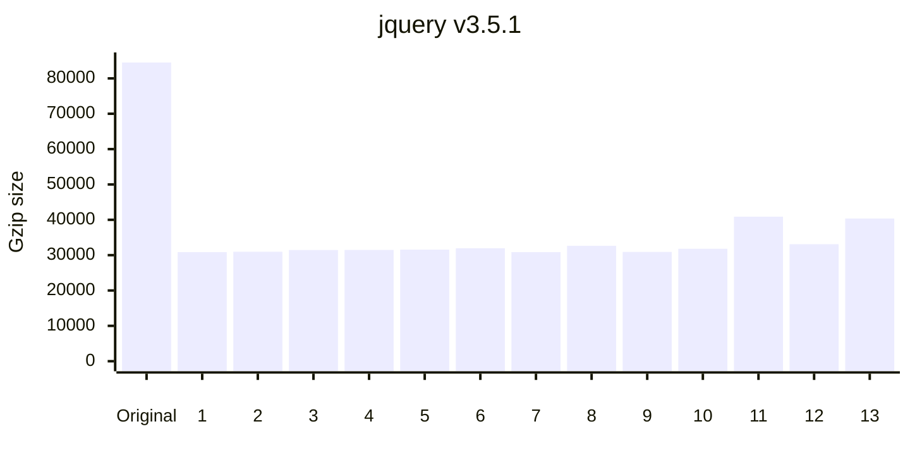
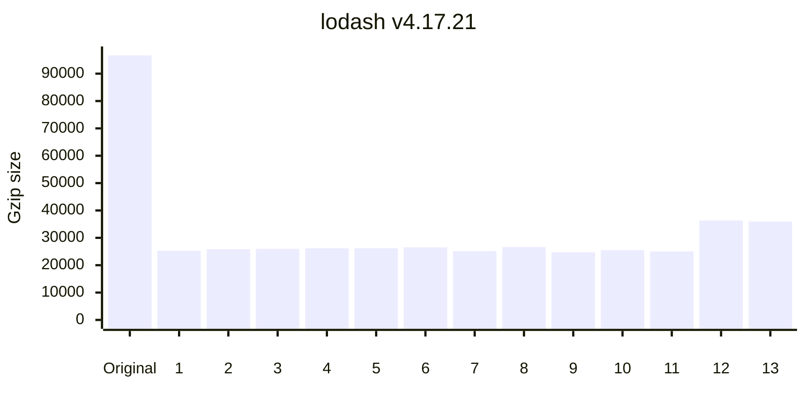
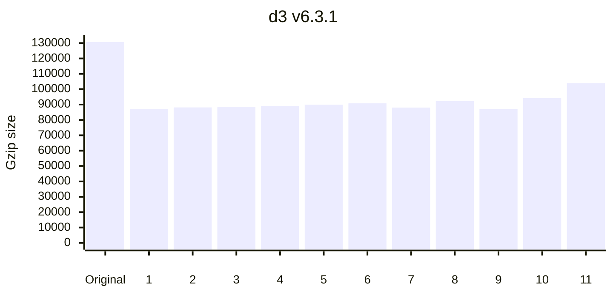
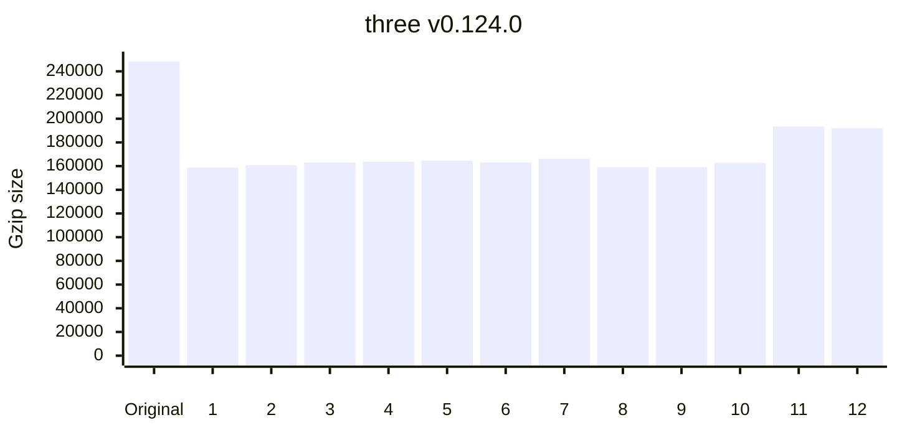

<p align="center">
	
</p>
<h1 align="center">
	<sup>minification benchmarks</sup>
</h1>

> What's the best JavaScript minifier?

This project benchmarks the following minifiers:

<!-- minifiers:start -->
| Minifier                                                                                                    | Version                                                                              | Release date ↓ |
| ----------------------------------------------------------------------------------------------------------- | ------------------------------------------------------------------------------------ | -------------- |
| [google-closure-compiler](https://github.com/git+https://github.com/google/closure-compiler-npm.git#master) | [20250813.0.0](https://www.npmjs.com/package/google-closure-compiler/v/20250813.0.0) | 2025-08-15     |
| [oxc-minify](https://github.com/oxc-project/oxc.git)                                                        | [0.82.1](https://www.npmjs.com/package/oxc-minify/v/0.82.1)                          | 2025-08-13     |
| [esbuild](https://github.com/evanw/esbuild)                                                                 | [0.25.9](https://www.npmjs.com/package/esbuild/v/0.25.9)                             | 2025-08-12     |
| [bun](https://github.com/oven-sh/bun)                                                                       | [1.2.20](https://www.npmjs.com/package/bun/v/1.2.20)                                 | 2025-08-10     |
| [@tdewolff/minify](https://github.com/tdewolff/minify#readme)                                               | [2.23.11](https://www.npmjs.com/package/@tdewolff/minify/v/2.23.11)                  | 2025-08-06     |
| [@swc/core](https://github.com/swc-project/swc)                                                             | [1.13.3](https://www.npmjs.com/package/@swc/core/v/1.13.3)                           | 2025-07-29     |
| [@cminify/cminify-linux-x64](https://codeberg.org/Jumping-Beaver/cminify)                                   | [3.0.1](https://www.npmjs.com/package/@cminify/cminify-linux-x64/v/3.0.1)            | 2025-07-27     |
| [terser](https://github.com/terser/terser)                                                                  | [5.43.1](https://www.npmjs.com/package/terser/v/5.43.1)                              | 2025-06-19     |
| [uglify-js](https://github.com/mishoo/UglifyJS)                                                             | [3.19.3](https://www.npmjs.com/package/uglify-js/v/3.19.3)                           | 2024-08-29     |
| [babel-minify](https://github.com/babel/minify/tree/master/packages/babel-minify)                           | [0.5.2](https://www.npmjs.com/package/babel-minify/v/0.5.2)                          | 2022-05-06     |
| [tedivm/jshrink](https://github.com/tedious/JShrink)                                                        | 1.8.0                                                                                |                |
<!-- minifiers:end -->

_Benchmarks last updated on <!-- lastUpdated:start -->Aug 15, 2025<!-- lastUpdated:end -->._

<br>

<p align="center">
	<a href="https://github.com/sponsors/privatenumber/sponsorships?tier_id=398771"></a>
	<a href="https://github.com/sponsors/privatenumber/sponsorships?tier_id=397608"></a>
</p>

## 🙋‍♂️ Why?

1. To help you pick a minifier that fits your needs
2. To promote JS minifiers and document their performances
3. To encourage healthy competition and improvement amongst minifiers

## 👟 Methodology

- Each minifier is executed in its own process with a 10s timeout
- Artifact integrity is verified by a test before and after minification
- Each minifier is minimally configured (sourcemaps & comments disabled), comparing out-of-the-box experience
- Minifier upgrade PRs are automated via [WhiteSource Renovate](https://www.whitesourcesoftware.com/free-developer-tools/renovate/)
- Benchmarks are updated on every PR via [GitHub Actions](https://github.com/privatenumber/minification-benchmarks/actions/workflows/benchmark.yml)
- The raw benchmark data is available in [`/packages/data/data/data.json`](/packages/data/data/data.json)


## ⏱ Metrics

### Ranking

For each benchmark, minifiers are ranked by a score that reflects the best balance of trade-offs.

The score combines minzipped size and minification time, with size weighted more heavily by default (85% size, 15% time) since it's usually the top priority. If a minifier is unusually slow, the weights shift toward time using a [logistic sigmoid function](https://en.wikipedia.org/wiki/Sigmoid_function), up to a 50/50 split. This avoids harsh cutoffs while still penalizing extreme slowness.

Both size and time are scaled using [min-max normalization](https://en.wikipedia.org/wiki/Feature_scaling#Rescaling_%28min–max_normalization%29) so they can be compared fairly. The result is a context-aware score that helps surface the best overall choice—but make sure to check each column directly if size or speed matters more to you.


#### Minified size

Size of the minified output.

#### Minzipped size

Size of the minified output with [Gzip compression](https://en.wikipedia.org/wiki/Gzip).

For minifiers, this measures how compressable the output is.

For users, this measures network transfer size, which is usually the metric that matters most.

#### Time

How long minification took (average of 5 runs). Each time is annotated with a multiplier relative to the fastest minifier.

## 📋 Results

> [!TIP]
> What's the verdict? [⚔️ See the _Minifier showdown_](#%EF%B8%8F-minifier-showdown)

<!-- benchmarks:start -->


<div align="center">

| Artifact                                                                                                                          |                    Original size |                       Gzip size |                               |
| :-------------------------------------------------------------------------------------------------------------------------------- | -------------------------------: | ------------------------------: | ----------------------------: |
| [react v17.0.2](https://www.npmjs.com/package/react/v/17.0.2) ([Source](https://unpkg.com/react@17.0.2/cjs/react.development.js)) |                       `72.13 kB` |                      `19.39 kB` |                               |
| **Minifier**                                                                                                                      |                **Minified size** |              **Minzipped size** |                      **Time** |
| 1. [@swc/core](packages/minifiers/minifiers/swc.ts)                                                                               |       <sup>-68% </sup>`22.81 kB` |       <sup>-58% </sup>`8.19 kB` |       <sup>*4x* </sup>`12 ms` |
| 2. [terser](packages/minifiers/minifiers/terser.ts)                                                                               |       <sup>-68% </sup>`23.05 kB` |       <sup>-57% </sup>`8.26 kB` |    <sup>*108x* </sup>`275 ms` |
| 3. [uglify-js](packages/minifiers/minifiers/uglify-js.ts)                                                                         | **<sup>🏆-69% </sup>`22.64 kB`** | **<sup>🏆-58% </sup>`8.18 kB`** |    <sup>*197x* </sup>`497 ms` |
| 4. [oxc-minify](packages/minifiers/minifiers/oxc-minify.ts)                                                                       |       <sup>-67% </sup>`23.51 kB` |       <sup>-56% </sup>`8.49 kB` |        <sup>*1x* </sup>`3 ms` |
| 5. [esbuild](packages/minifiers/minifiers/esbuild.ts)                                                                             |       <sup>-67% </sup>`23.70 kB` |       <sup>-56% </sup>`8.54 kB` |       <sup>*5x* </sup>`15 ms` |
| 6. [terser (no compress)](packages/minifiers/minifiers/terser.ts)                                                                 |       <sup>-65% </sup>`25.06 kB` |       <sup>-55% </sup>`8.74 kB` |     <sup>*46x* </sup>`118 ms` |
| 7. [uglify-js (no compress)](packages/minifiers/minifiers/uglify-js.ts)                                                           |       <sup>-65% </sup>`25.03 kB` |       <sup>-55% </sup>`8.67 kB` |      <sup>*36x* </sup>`91 ms` |
| 8. [@tdewolff/minify](packages/minifiers/minifiers/tdewolff-minify.ts)                                                            |       <sup>-67% </sup>`23.49 kB` |       <sup>-55% </sup>`8.63 kB` |      **<sup>🏆 </sup>`3 ms`** |
| 9. [babel-minify](packages/minifiers/minifiers/babel-minify.ts)                                                                   |       <sup>-67% </sup>`23.60 kB` |       <sup>-56% </sup>`8.45 kB` |    <sup>*256x* </sup>`647 ms` |
| 10. [bun](packages/minifiers/minifiers/bun.ts)                                                                                    |       <sup>-67% </sup>`23.99 kB` |       <sup>-55% </sup>`8.66 kB` |       <sup>*5x* </sup>`13 ms` |
| 11. [google-closure-compiler](packages/minifiers/minifiers/google-closure-compiler.ts)                                            |       <sup>-68% </sup>`22.84 kB` |       <sup>-58% </sup>`8.22 kB` | <sup>*1396x* </sup>`3,520 ms` |
| 12. [tedivm/jshrink](packages/minifiers/minifiers/jshrink/index.ts)                                                               |       <sup>-43% </sup>`40.82 kB` |      <sup>-43% </sup>`11.04 kB` |     <sup>*49x* </sup>`126 ms` |
| 13. [@cminify/cminify-linux-x64](packages/minifiers/minifiers/cminify.ts)                                                         |       <sup>-44% </sup>`40.04 kB` |      <sup>-44% </sup>`10.86 kB` |       <sup>*4x* </sup>`12 ms` |
</div>

----


<div align="center">

| Artifact                                                                                                              |                    Original size |                        Gzip size |                              |
| :-------------------------------------------------------------------------------------------------------------------- | -------------------------------: | -------------------------------: | ---------------------------: |
| [moment v2.29.1](https://www.npmjs.com/package/moment/v/2.29.1) ([Source](https://unpkg.com/moment@2.29.1/moment.js)) |                      `173.90 kB` |                       `36.23 kB` |                              |
| **Minifier**                                                                                                          |                **Minified size** |               **Minzipped size** |                     **Time** |
| 1. [@swc/core](packages/minifiers/minifiers/swc.ts)                                                                   |       <sup>-66% </sup>`58.42 kB` |       <sup>-48% </sup>`18.75 kB` |      <sup>*5x* </sup>`30 ms` |
| 2. [oxc-minify](packages/minifiers/minifiers/oxc-minify.ts)                                                           |       <sup>-66% </sup>`59.48 kB` |       <sup>-47% </sup>`19.26 kB` |       <sup>*1x* </sup>`9 ms` |
| 3. [esbuild](packages/minifiers/minifiers/esbuild.ts)                                                                 |       <sup>-66% </sup>`59.82 kB` |       <sup>-47% </sup>`19.33 kB` |      <sup>*3x* </sup>`20 ms` |
| 4. [terser](packages/minifiers/minifiers/terser.ts)                                                                   |       <sup>-66% </sup>`59.01 kB` |       <sup>-48% </sup>`18.69 kB` |   <sup>*126x* </sup>`693 ms` |
| 5. [@tdewolff/minify](packages/minifiers/minifiers/tdewolff-minify.ts)                                                |       <sup>-66% </sup>`59.87 kB` |       <sup>-46% </sup>`19.48 kB` |     **<sup>🏆 </sup>`5 ms`** |
| 6. [terser (no compress)](packages/minifiers/minifiers/terser.ts)                                                     |       <sup>-64% </sup>`63.01 kB` |       <sup>-46% </sup>`19.65 kB` |    <sup>*52x* </sup>`289 ms` |
| 7. [uglify-js (no compress)](packages/minifiers/minifiers/uglify-js.ts)                                               |       <sup>-64% </sup>`62.50 kB` |       <sup>-46% </sup>`19.57 kB` |    <sup>*39x* </sup>`215 ms` |
| 8. [uglify-js](packages/minifiers/minifiers/uglify-js.ts)                                                             | **<sup>🏆-67% </sup>`57.73 kB`** | **<sup>🏆-49% </sup>`18.57 kB`** | <sup>*209x* </sup>`1,149 ms` |
| 9. [bun](packages/minifiers/minifiers/bun.ts)                                                                         |       <sup>-64% </sup>`61.84 kB` |       <sup>-45% </sup>`19.86 kB` |      <sup>*3x* </sup>`17 ms` |
| 10. [babel-minify](packages/minifiers/minifiers/babel-minify.ts)                                                      |       <sup>-66% </sup>`59.70 kB` |       <sup>-47% </sup>`19.12 kB` | <sup>*267x* </sup>`1,465 ms` |
| 11. [google-closure-compiler](packages/minifiers/minifiers/google-closure-compiler.ts)                                |       <sup>-66% </sup>`58.29 kB` |       <sup>-48% </sup>`18.92 kB` | <sup>*668x* </sup>`3,658 ms` |
| 12. [tedivm/jshrink](packages/minifiers/minifiers/jshrink/index.ts)                                                   |       <sup>-44% </sup>`97.63 kB` |       <sup>-31% </sup>`25.00 kB` |    <sup>*51x* </sup>`284 ms` |
| 13. [@cminify/cminify-linux-x64](packages/minifiers/minifiers/cminify.ts)                                             |       <sup>-45% </sup>`95.93 kB` |       <sup>-32% </sup>`24.74 kB` |      <sup>*1x* </sup>`10 ms` |
</div>

----



<div align="center">

| Artifact                                                                                                                |                    Original size |                        Gzip size |                              |
| :---------------------------------------------------------------------------------------------------------------------- | -------------------------------: | -------------------------------: | ---------------------------: |
| [jquery v3.5.1](https://www.npmjs.com/package/jquery/v/3.5.1) ([Source](https://unpkg.com/jquery@3.5.1/dist/jquery.js)) |                      `287.63 kB` |                       `84.50 kB` |                              |
| **Minifier**                                                                                                            |                **Minified size** |               **Minzipped size** |                     **Time** |
| 1. [@swc/core](packages/minifiers/minifiers/swc.ts)                                                                     |       <sup>-69% </sup>`89.17 kB` |       <sup>-63% </sup>`30.87 kB` |      <sup>*5x* </sup>`47 ms` |
| 2. [oxc-minify](packages/minifiers/minifiers/oxc-minify.ts)                                                             |       <sup>-69% </sup>`89.34 kB` |       <sup>-63% </sup>`30.97 kB` |      <sup>*1x* </sup>`15 ms` |
| 3. [@tdewolff/minify](packages/minifiers/minifiers/tdewolff-minify.ts)                                                  |       <sup>-69% </sup>`89.68 kB` |       <sup>-63% </sup>`31.45 kB` |     **<sup>🏆 </sup>`9 ms`** |
| 4. [uglify-js (no compress)](packages/minifiers/minifiers/uglify-js.ts)                                                 |       <sup>-67% </sup>`94.08 kB` |       <sup>-63% </sup>`31.47 kB` |    <sup>*36x* </sup>`314 ms` |
| 5. [terser (no compress)](packages/minifiers/minifiers/terser.ts)                                                       |       <sup>-67% </sup>`94.26 kB` |       <sup>-63% </sup>`31.56 kB` |    <sup>*43x* </sup>`373 ms` |
| 6. [esbuild](packages/minifiers/minifiers/esbuild.ts)                                                                   |       <sup>-69% </sup>`90.07 kB` |       <sup>-62% </sup>`31.96 kB` |      <sup>*4x* </sup>`36 ms` |
| 7. [terser](packages/minifiers/minifiers/terser.ts)                                                                     |       <sup>-69% </sup>`89.24 kB` | **<sup>🏆-63% </sup>`30.86 kB`** |   <sup>*106x* </sup>`921 ms` |
| 8. [bun](packages/minifiers/minifiers/bun.ts)                                                                           |       <sup>-68% </sup>`92.55 kB` |       <sup>-61% </sup>`32.65 kB` |      <sup>*3x* </sup>`27 ms` |
| 9. [uglify-js](packages/minifiers/minifiers/uglify-js.ts)                                                               | **<sup>🏆-69% </sup>`88.45 kB`** |       <sup>-63% </sup>`30.90 kB` | <sup>*184x* </sup>`1,593 ms` |
| 10. [babel-minify](packages/minifiers/minifiers/babel-minify.ts)                                                        |       <sup>-68% </sup>`92.10 kB` |       <sup>-62% </sup>`31.80 kB` | <sup>*276x* </sup>`2,398 ms` |
| 11. [tedivm/jshrink](packages/minifiers/minifiers/jshrink/index.ts)                                                     |      <sup>-50% </sup>`144.14 kB` |       <sup>-52% </sup>`40.88 kB` |    <sup>*41x* </sup>`361 ms` |
| 12. [google-closure-compiler](packages/minifiers/minifiers/google-closure-compiler.ts)                                  |       <sup>-68% </sup>`92.73 kB` |       <sup>-61% </sup>`33.09 kB` | <sup>*478x* </sup>`4,141 ms` |
| 13. [@cminify/cminify-linux-x64](packages/minifiers/minifiers/cminify.ts)                                               |      <sup>-51% </sup>`141.45 kB` |       <sup>-52% </sup>`40.37 kB` |      <sup>*2x* </sup>`22 ms` |
</div>

----


<div align="center">

| Artifact                                                                                                       |                     Original size |                        Gzip size |                              |
| :------------------------------------------------------------------------------------------------------------- | --------------------------------: | -------------------------------: | ---------------------------: |
| [vue v2.6.12](https://www.npmjs.com/package/vue/v/2.6.12) ([Source](https://unpkg.com/vue@2.6.12/dist/vue.js)) |                       `342.15 kB` |                       `89.67 kB` |                              |
| **Minifier**                                                                                                   |                 **Minified size** |               **Minzipped size** |                     **Time** |
| 1. [@swc/core](packages/minifiers/minifiers/swc.ts)                                                            |       <sup>-66% </sup>`115.69 kB` | **<sup>🏆-52% </sup>`42.73 kB`** |      <sup>*5x* </sup>`65 ms` |
| 2. [oxc-minify](packages/minifiers/minifiers/oxc-minify.ts)                                                    |       <sup>-66% </sup>`117.22 kB` |       <sup>-52% </sup>`43.35 kB` |      <sup>*1x* </sup>`18 ms` |
| 3. [@tdewolff/minify](packages/minifiers/minifiers/tdewolff-minify.ts)                                         |       <sup>-66% </sup>`117.69 kB` |       <sup>-51% </sup>`44.36 kB` |    **<sup>🏆 </sup>`13 ms`** |
| 4. [esbuild](packages/minifiers/minifiers/esbuild.ts)                                                          |       <sup>-65% </sup>`118.14 kB` |       <sup>-51% </sup>`44.37 kB` |      <sup>*3x* </sup>`41 ms` |
| 5. [uglify-js (no compress)](packages/minifiers/minifiers/uglify-js.ts)                                        |       <sup>-63% </sup>`126.14 kB` |       <sup>-50% </sup>`44.45 kB` |    <sup>*28x* </sup>`364 ms` |
| 6. [terser (no compress)](packages/minifiers/minifiers/terser.ts)                                              |       <sup>-63% </sup>`126.39 kB` |       <sup>-50% </sup>`44.64 kB` |    <sup>*34x* </sup>`442 ms` |
| 7. [terser](packages/minifiers/minifiers/terser.ts)                                                            |       <sup>-66% </sup>`116.60 kB` |       <sup>-52% </sup>`42.87 kB` |  <sup>*88x* </sup>`1,143 ms` |
| 8. [bun](packages/minifiers/minifiers/bun.ts)                                                                  |       <sup>-64% </sup>`121.50 kB` |       <sup>-49% </sup>`45.40 kB` |      <sup>*2x* </sup>`30 ms` |
| 9. [uglify-js](packages/minifiers/minifiers/uglify-js.ts)                                                      | **<sup>🏆-67% </sup>`113.80 kB`** |       <sup>-52% </sup>`43.04 kB` | <sup>*171x* </sup>`2,206 ms` |
| 10. [babel-minify](packages/minifiers/minifiers/babel-minify.ts)                                               |       <sup>-66% </sup>`117.90 kB` |       <sup>-51% </sup>`43.93 kB` | <sup>*209x* </sup>`2,696 ms` |
| 11. [google-closure-compiler](packages/minifiers/minifiers/google-closure-compiler.ts)                         |       <sup>-66% </sup>`115.61 kB` |       <sup>-51% </sup>`44.18 kB` | <sup>*351x* </sup>`4,536 ms` |
| 12. [tedivm/jshrink](packages/minifiers/minifiers/jshrink/index.ts)                                            |       <sup>-42% </sup>`197.36 kB` |       <sup>-36% </sup>`57.17 kB` |    <sup>*37x* </sup>`478 ms` |
| 13. [@cminify/cminify-linux-x64](packages/minifiers/minifiers/cminify.ts)                                      |       <sup>-43% </sup>`193.91 kB` |       <sup>-37% </sup>`56.36 kB` |      <sup>*1x* </sup>`23 ms` |
</div>

----



<div align="center">

| Artifact                                                                                                                 |                    Original size |                        Gzip size |                              |
| :----------------------------------------------------------------------------------------------------------------------- | -------------------------------: | -------------------------------: | ---------------------------: |
| [lodash v4.17.21](https://www.npmjs.com/package/lodash/v/4.17.21) ([Source](https://unpkg.com/lodash@4.17.21/lodash.js)) |                      `544.09 kB` |                       `96.69 kB` |                              |
| **Minifier**                                                                                                             |                **Minified size** |               **Minzipped size** |                     **Time** |
| 1. [@swc/core](packages/minifiers/minifiers/swc.ts)                                                                      |       <sup>-87% </sup>`69.81 kB` |       <sup>-74% </sup>`25.24 kB` |      <sup>*4x* </sup>`53 ms` |
| 2. [uglify-js (no compress)](packages/minifiers/minifiers/uglify-js.ts)                                                  |       <sup>-86% </sup>`74.61 kB` |       <sup>-73% </sup>`25.86 kB` |    <sup>*28x* </sup>`333 ms` |
| 3. [oxc-minify](packages/minifiers/minifiers/oxc-minify.ts)                                                              |       <sup>-87% </sup>`71.38 kB` |       <sup>-73% </sup>`25.98 kB` |      <sup>*1x* </sup>`12 ms` |
| 4. [terser (no compress)](packages/minifiers/minifiers/terser.ts)                                                        |       <sup>-86% </sup>`75.04 kB` |       <sup>-73% </sup>`26.19 kB` |    <sup>*33x* </sup>`393 ms` |
| 5. [esbuild](packages/minifiers/minifiers/esbuild.ts)                                                                    |       <sup>-87% </sup>`72.50 kB` |       <sup>-73% </sup>`26.20 kB` |      <sup>*2x* </sup>`34 ms` |
| 6. [@tdewolff/minify](packages/minifiers/minifiers/tdewolff-minify.ts)                                                   |       <sup>-87% </sup>`71.90 kB` |       <sup>-73% </sup>`26.50 kB` |    **<sup>🏆 </sup>`12 ms`** |
| 7. [terser](packages/minifiers/minifiers/terser.ts)                                                                      |       <sup>-87% </sup>`70.41 kB` |       <sup>-74% </sup>`25.15 kB` |  <sup>*87x* </sup>`1,028 ms` |
| 8. [bun](packages/minifiers/minifiers/bun.ts)                                                                            |       <sup>-87% </sup>`73.45 kB` |       <sup>-72% </sup>`26.66 kB` |      <sup>*1x* </sup>`22 ms` |
| 9. [uglify-js](packages/minifiers/minifiers/uglify-js.ts)                                                                | **<sup>🏆-87% </sup>`68.17 kB`** | **<sup>🏆-74% </sup>`24.69 kB`** | <sup>*143x* </sup>`1,689 ms` |
| 10. [babel-minify](packages/minifiers/minifiers/babel-minify.ts)                                                         |       <sup>-87% </sup>`72.37 kB` |       <sup>-74% </sup>`25.50 kB` | <sup>*176x* </sup>`2,083 ms` |
| 11. [google-closure-compiler](packages/minifiers/minifiers/google-closure-compiler.ts)                                   |       <sup>-86% </sup>`73.50 kB` |       <sup>-74% </sup>`25.02 kB` | <sup>*366x* </sup>`4,329 ms` |
| 12. [tedivm/jshrink](packages/minifiers/minifiers/jshrink/index.ts)                                                      |      <sup>-73% </sup>`148.78 kB` |       <sup>-62% </sup>`36.33 kB` |    <sup>*31x* </sup>`371 ms` |
| 13. [@cminify/cminify-linux-x64](packages/minifiers/minifiers/cminify.ts)                                                |      <sup>-73% </sup>`146.27 kB` |       <sup>-63% </sup>`35.94 kB` |      <sup>*1x* </sup>`13 ms` |
</div>

----



<div align="center">

| Artifact                                                                                                                   |                     Original size |                        Gzip size |                              |
| :------------------------------------------------------------------------------------------------------------------------- | --------------------------------: | -------------------------------: | ---------------------------: |
| [d3 v6.3.1](https://www.npmjs.com/package/d3/v/6.3.1) ([Source](https://unpkg.com/d3@6.3.1/dist/d3.js))                    |                       `555.77 kB` |                      `130.69 kB` |                              |
| **Minifier**                                                                                                               |                 **Minified size** |               **Minzipped size** |                     **Time** |
| 1. [@swc/core](packages/minifiers/minifiers/swc.ts)                                                                        |       <sup>-52% </sup>`265.22 kB` |       <sup>-33% </sup>`87.21 kB` |     <sup>*5x* </sup>`144 ms` |
| 2. [oxc-minify](packages/minifiers/minifiers/oxc-minify.ts)                                                                |       <sup>-51% </sup>`270.87 kB` |       <sup>-33% </sup>`88.14 kB` |      <sup>*1x* </sup>`42 ms` |
| 3. [uglify-js (no compress)](packages/minifiers/minifiers/uglify-js.ts)                                                    |       <sup>-50% </sup>`275.35 kB` |       <sup>-32% </sup>`88.32 kB` |    <sup>*25x* </sup>`711 ms` |
| 4. [terser (no compress)](packages/minifiers/minifiers/terser.ts)                                                          |       <sup>-50% </sup>`276.13 kB` |       <sup>-32% </sup>`89.07 kB` |  <sup>*36x* </sup>`1,020 ms` |
| 5. [@tdewolff/minify](packages/minifiers/minifiers/tdewolff-minify.ts)                                                     |       <sup>-52% </sup>`269.35 kB` |       <sup>-31% </sup>`89.88 kB` |      <sup>*1x* </sup>`35 ms` |
| 6. [esbuild](packages/minifiers/minifiers/esbuild.ts)                                                                      |       <sup>-51% </sup>`270.21 kB` |       <sup>-31% </sup>`90.81 kB` |      <sup>*2x* </sup>`68 ms` |
| 7. [terser](packages/minifiers/minifiers/terser.ts)                                                                        |       <sup>-52% </sup>`267.42 kB` |       <sup>-33% </sup>`88.00 kB` |  <sup>*83x* </sup>`2,338 ms` |
| 8. [bun](packages/minifiers/minifiers/bun.ts)                                                                              |       <sup>-51% </sup>`273.41 kB` |       <sup>-29% </sup>`92.40 kB` |      <sup>*1x* </sup>`46 ms` |
| 9. [uglify-js](packages/minifiers/minifiers/uglify-js.ts)                                                                  | **<sup>🏆-53% </sup>`263.56 kB`** | **<sup>🏆-33% </sup>`87.02 kB`** | <sup>*140x* </sup>`3,927 ms` |
| 10. [google-closure-compiler](packages/minifiers/minifiers/google-closure-compiler.ts)                                     |       <sup>-51% </sup>`270.32 kB` |       <sup>-28% </sup>`94.17 kB` | <sup>*239x* </sup>`6,705 ms` |
| 11. [@cminify/cminify-linux-x64](packages/minifiers/minifiers/cminify.ts)                                                  |       <sup>-29% </sup>`393.70 kB` |      <sup>-21% </sup>`103.81 kB` |    **<sup>🏆 </sup>`28 ms`** |
| 12. [babel-minify](packages/minifiers/minifiers/babel-minify.ts) <sub title="Failed: minification">❌ Minification</sub>    |                                 ❌ |                               ❌  |                            - |
| 13. [tedivm/jshrink](packages/minifiers/minifiers/jshrink/index.ts) <sub title="Failed: minification">❌ Minification</sub> |                                 ❌ |                               ❌  |                            - |
</div>

----


<div align="center">

| Artifact                                                                                                                       |                     Original size |                         Gzip size |                              |
| :----------------------------------------------------------------------------------------------------------------------------- | --------------------------------: | --------------------------------: | ---------------------------: |
| [terser v5.30.3](https://www.npmjs.com/package/terser/v/5.30.3) ([Source](https://unpkg.com/terser@5.30.3/dist/bundle.min.js)) |                         `1.01 MB` |                       `193.76 kB` |                              |
| **Minifier**                                                                                                                   |                 **Minified size** |                **Minzipped size** |                     **Time** |
| 1. [oxc-minify](packages/minifiers/minifiers/oxc-minify.ts)                                                                    |       <sup>-56% </sup>`440.04 kB` | **<sup>🏆-37% </sup>`122.26 kB`** |      <sup>*1x* </sup>`43 ms` |
| 2. [@swc/core](packages/minifiers/minifiers/swc.ts)                                                                            |       <sup>-55% </sup>`455.52 kB` |       <sup>-36% </sup>`123.26 kB` |     <sup>*5x* </sup>`130 ms` |
| 3. [@tdewolff/minify](packages/minifiers/minifiers/tdewolff-minify.ts)                                                         |       <sup>-55% </sup>`456.59 kB` |       <sup>-36% </sup>`124.89 kB` |      <sup>*1x* </sup>`38 ms` |
| 4. [uglify-js (no compress)](packages/minifiers/minifiers/uglify-js.ts)                                                        |       <sup>-53% </sup>`472.16 kB` |       <sup>-36% </sup>`124.61 kB` |    <sup>*33x* </sup>`778 ms` |
| 5. [terser (no compress)](packages/minifiers/minifiers/terser.ts)                                                              |       <sup>-53% </sup>`472.58 kB` |       <sup>-36% </sup>`124.25 kB` |    <sup>*41x* </sup>`966 ms` |
| 6. [esbuild](packages/minifiers/minifiers/esbuild.ts)                                                                          |       <sup>-55% </sup>`458.93 kB` |       <sup>-35% </sup>`126.71 kB` |      <sup>*2x* </sup>`62 ms` |
| 7. [terser](packages/minifiers/minifiers/terser.ts)                                                                            |       <sup>-55% </sup>`456.59 kB` |       <sup>-36% </sup>`123.35 kB` |  <sup>*95x* </sup>`2,227 ms` |
| 8. [bun](packages/minifiers/minifiers/bun.ts)                                                                                  |       <sup>-54% </sup>`466.80 kB` |       <sup>-34% </sup>`127.65 kB` |      <sup>*1x* </sup>`41 ms` |
| 9. [uglify-js](packages/minifiers/minifiers/uglify-js.ts)                                                                      |       <sup>-55% </sup>`451.19 kB` |       <sup>-36% </sup>`123.33 kB` | <sup>*162x* </sup>`3,787 ms` |
| 10. [google-closure-compiler](packages/minifiers/minifiers/google-closure-compiler.ts)                                         | **<sup>🏆-56% </sup>`439.97 kB`** |       <sup>-35% </sup>`126.45 kB` | <sup>*269x* </sup>`6,283 ms` |
| 11. [tedivm/jshrink](packages/minifiers/minifiers/jshrink/index.ts)                                                            |       <sup>-37% </sup>`633.71 kB` |       <sup>-25% </sup>`145.18 kB` |  <sup>*57x* </sup>`1,337 ms` |
| 12. [@cminify/cminify-linux-x64](packages/minifiers/minifiers/cminify.ts)                                                      |       <sup>-38% </sup>`625.93 kB` |       <sup>-26% </sup>`144.30 kB` |    **<sup>🏆 </sup>`23 ms`** |
| 13. [babel-minify](packages/minifiers/minifiers/babel-minify.ts) <sub title="Failed: minification">❌ Minification</sub>        |                                 ❌ |                                ❌  |                            - |
</div>

----



<div align="center">

| Artifact                                                                                                                   |                     Original size |                         Gzip size |                                   |
| :------------------------------------------------------------------------------------------------------------------------- | --------------------------------: | --------------------------------: | --------------------------------: |
| [three v0.124.0](https://www.npmjs.com/package/three/v/0.124.0) ([Source](https://unpkg.com/three@0.124.0/build/three.js)) |                         `1.25 MB` |                       `248.27 kB` |                                   |
| **Minifier**                                                                                                               |                 **Minified size** |                **Minzipped size** |                          **Time** |
| 1. [@swc/core](packages/minifiers/minifiers/swc.ts)                                                                        |       <sup>-48% </sup>`643.03 kB` | **<sup>🏆-36% </sup>`158.75 kB`** |          <sup>*8x* </sup>`204 ms` |
| 2. [oxc-minify](packages/minifiers/minifiers/oxc-minify.ts)                                                                |       <sup>-48% </sup>`646.98 kB` |       <sup>-35% </sup>`160.82 kB` |           <sup>*2x* </sup>`63 ms` |
| 3. [uglify-js (no compress)](packages/minifiers/minifiers/uglify-js.ts)                                                    |       <sup>-46% </sup>`674.49 kB` |       <sup>-34% </sup>`163.04 kB` |         <sup>*41x* </sup>`994 ms` |
| 4. [esbuild](packages/minifiers/minifiers/esbuild.ts)                                                                      |       <sup>-48% </sup>`646.93 kB` |       <sup>-34% </sup>`163.75 kB` |           <sup>*3x* </sup>`88 ms` |
| 5. [@tdewolff/minify](packages/minifiers/minifiers/tdewolff-minify.ts)                                                     |       <sup>-48% </sup>`642.46 kB` |       <sup>-34% </sup>`164.61 kB` |           <sup>*2x* </sup>`53 ms` |
| 6. [terser (no compress)](packages/minifiers/minifiers/terser.ts)                                                          |       <sup>-46% </sup>`675.43 kB` |       <sup>-34% </sup>`163.18 kB` |       <sup>*53x* </sup>`1,294 ms` |
| 7. [bun](packages/minifiers/minifiers/bun.ts)                                                                              |       <sup>-47% </sup>`655.93 kB` |       <sup>-33% </sup>`166.21 kB` |           <sup>*2x* </sup>`53 ms` |
| 8. [terser](packages/minifiers/minifiers/terser.ts)                                                                        |       <sup>-48% </sup>`653.18 kB` |       <sup>-36% </sup>`159.17 kB` |      <sup>*124x* </sup>`2,985 ms` |
| 9. [uglify-js](packages/minifiers/minifiers/uglify-js.ts)                                                                  | **<sup>🏆-49% </sup>`641.59 kB`** |       <sup>-36% </sup>`159.07 kB` |      <sup>*209x* </sup>`5,046 ms` |
| 10. [google-closure-compiler](packages/minifiers/minifiers/google-closure-compiler.ts)                                     |       <sup>-48% </sup>`644.52 kB` |       <sup>-34% </sup>`162.77 kB` |      <sup>*328x* </sup>`7,905 ms` |
| 11. [tedivm/jshrink](packages/minifiers/minifiers/jshrink/index.ts)                                                        |       <sup>-24% </sup>`952.01 kB` |       <sup>-22% </sup>`193.47 kB` |       <sup>*71x* </sup>`1,714 ms` |
| 12. [@cminify/cminify-linux-x64](packages/minifiers/minifiers/cminify.ts)                                                  |       <sup>-25% </sup>`941.06 kB` |       <sup>-23% </sup>`191.97 kB` |         **<sup>🏆 </sup>`24 ms`** |
| 13. [babel-minify](packages/minifiers/minifiers/babel-minify.ts) <sub title="Failed: timeout">❌ Timed out</sub>            |                                 - |                                 - | <sup>:warning:</sup> `+10,000 ms` |
</div>

----


<div align="center">

| Artifact                                                                                                                              |                     Original size |                         Gzip size |                                   |
| :------------------------------------------------------------------------------------------------------------------------------------ | --------------------------------: | --------------------------------: | --------------------------------: |
| [victory v35.8.4](https://www.npmjs.com/package/victory/v/35.8.4) ([Source](https://unpkg.com/victory@35.8.4/dist/victory.js))        |                         `2.13 MB` |                       `309.94 kB` |                                   |
| **Minifier**                                                                                                                          |                 **Minified size** |                **Minzipped size** |                          **Time** |
| 1. [@swc/core](packages/minifiers/minifiers/swc.ts)                                                                                   |       <sup>-67% </sup>`705.99 kB` |       <sup>-49% </sup>`157.75 kB` |          <sup>*8x* </sup>`307 ms` |
| 2. [oxc-minify](packages/minifiers/minifiers/oxc-minify.ts)                                                                           |       <sup>-66% </sup>`717.51 kB` |       <sup>-48% </sup>`162.34 kB` |           <sup>*2x* </sup>`97 ms` |
| 3. [@tdewolff/minify](packages/minifiers/minifiers/tdewolff-minify.ts)                                                                |       <sup>-66% </sup>`717.07 kB` |       <sup>-47% </sup>`165.01 kB` |           <sup>*1x* </sup>`62 ms` |
| 4. [uglify-js (no compress)](packages/minifiers/minifiers/uglify-js.ts)                                                               |       <sup>-65% </sup>`756.53 kB` |       <sup>-46% </sup>`167.58 kB` |       <sup>*38x* </sup>`1,314 ms` |
| 5. [terser (no compress)](packages/minifiers/minifiers/terser.ts)                                                                     |       <sup>-65% </sup>`756.62 kB` |       <sup>-46% </sup>`166.18 kB` |       <sup>*45x* </sup>`1,573 ms` |
| 6. [terser](packages/minifiers/minifiers/terser.ts)                                                                                   |       <sup>-67% </sup>`712.87 kB` |       <sup>-49% </sup>`158.46 kB` |      <sup>*118x* </sup>`4,042 ms` |
| 7. [esbuild](packages/minifiers/minifiers/esbuild.ts)                                                                                 |       <sup>-66% </sup>`725.65 kB` |       <sup>-42% </sup>`181.23 kB` |          <sup>*3x* </sup>`122 ms` |
| 8. [bun](packages/minifiers/minifiers/bun.ts)                                                                                         |       <sup>-66% </sup>`727.90 kB` |       <sup>-41% </sup>`182.67 kB` |           <sup>*2x* </sup>`73 ms` |
| 9. [uglify-js](packages/minifiers/minifiers/uglify-js.ts)                                                                             | **<sup>🏆-67% </sup>`694.78 kB`** | **<sup>🏆-49% </sup>`157.44 kB`** |      <sup>*192x* </sup>`6,579 ms` |
| 10. [@cminify/cminify-linux-x64](packages/minifiers/minifiers/cminify.ts)                                                             |         <sup>-33% </sup>`1.43 MB` |       <sup>-29% </sup>`221.12 kB` |         **<sup>🏆 </sup>`34 ms`** |
| 11. [google-closure-compiler](packages/minifiers/minifiers/google-closure-compiler.ts) <sub title="Failed: timeout">❌ Timed out</sub> |                                 - |                                 - | <sup>:warning:</sup> `+10,000 ms` |
| 12. [babel-minify](packages/minifiers/minifiers/babel-minify.ts) <sub title="Failed: minification">❌ Minification</sub>               |                                 ❌ |                                ❌  |                                 - |
| 13. [tedivm/jshrink](packages/minifiers/minifiers/jshrink/index.ts) <sub title="Failed: post-validation">❌ Post-validation</sub>      |                                 ❌ |                                ❌  |                                 - |
</div>

----


<div align="center">

| Artifact                                                                                                                              |                     Original size |                         Gzip size |                                   |
| :------------------------------------------------------------------------------------------------------------------------------------ | --------------------------------: | --------------------------------: | --------------------------------: |
| [echarts v5.1.1](https://www.npmjs.com/package/echarts/v/5.1.1) ([Source](https://unpkg.com/echarts@5.1.1/dist/echarts.js))           |                         `3.20 MB` |                       `684.61 kB` |                                   |
| **Minifier**                                                                                                                          |                 **Minified size** |                **Minzipped size** |                          **Time** |
| 1. [oxc-minify](packages/minifiers/minifiers/oxc-minify.ts)                                                                           |         <sup>-69% </sup>`1.01 MB` |       <sup>-53% </sup>`324.59 kB` |          <sup>*4x* </sup>`205 ms` |
| 2. [@swc/core](packages/minifiers/minifiers/swc.ts)                                                                                   | **<sup>🏆-69% </sup>`994.07 kB`** | **<sup>🏆-53% </sup>`321.11 kB`** |         <sup>*13x* </sup>`623 ms` |
| 3. [esbuild](packages/minifiers/minifiers/esbuild.ts)                                                                                 |         <sup>-68% </sup>`1.01 MB` |       <sup>-52% </sup>`331.62 kB` |          <sup>*4x* </sup>`188 ms` |
| 4. [@tdewolff/minify](packages/minifiers/minifiers/tdewolff-minify.ts)                                                                |         <sup>-68% </sup>`1.01 MB` |       <sup>-52% </sup>`331.85 kB` |          <sup>*2x* </sup>`126 ms` |
| 5. [bun](packages/minifiers/minifiers/bun.ts)                                                                                         |         <sup>-68% </sup>`1.02 MB` |       <sup>-51% </sup>`337.93 kB` |          <sup>*2x* </sup>`118 ms` |
| 6. [uglify-js (no compress)](packages/minifiers/minifiers/uglify-js.ts)                                                               |         <sup>-67% </sup>`1.07 MB` |       <sup>-52% </sup>`331.41 kB` |       <sup>*38x* </sup>`1,756 ms` |
| 7. [terser (no compress)](packages/minifiers/minifiers/terser.ts)                                                                     |         <sup>-67% </sup>`1.07 MB` |       <sup>-52% </sup>`330.35 kB` |       <sup>*58x* </sup>`2,684 ms` |
| 8. [terser](packages/minifiers/minifiers/terser.ts)                                                                                   |       <sup>-69% </sup>`998.45 kB` |       <sup>-53% </sup>`321.56 kB` |      <sup>*132x* </sup>`6,086 ms` |
| 9. [@cminify/cminify-linux-x64](packages/minifiers/minifiers/cminify.ts)                                                              |         <sup>-45% </sup>`1.77 MB` |       <sup>-37% </sup>`434.45 kB` |         **<sup>🏆 </sup>`46 ms`** |
| 10. [babel-minify](packages/minifiers/minifiers/babel-minify.ts) <sub title="Failed: timeout">❌ Timed out</sub>                       |                                 - |                                 - | <sup>:warning:</sup> `+10,000 ms` |
| 11. [uglify-js](packages/minifiers/minifiers/uglify-js.ts) <sub title="Failed: timeout">❌ Timed out</sub>                             |                                 - |                                 - | <sup>:warning:</sup> `+10,000 ms` |
| 12. [google-closure-compiler](packages/minifiers/minifiers/google-closure-compiler.ts) <sub title="Failed: timeout">❌ Timed out</sub> |                                 - |                                 - | <sup>:warning:</sup> `+10,000 ms` |
| 13. [tedivm/jshrink](packages/minifiers/minifiers/jshrink/index.ts) <sub title="Failed: minification">❌ Minification</sub>            |                                 ❌ |                                ❌  |                                 - |
</div>

----


<div align="center">

| Artifact                                                                                                                              |                   Original size |                         Gzip size |                                   |
| :------------------------------------------------------------------------------------------------------------------------------------ | ------------------------------: | --------------------------------: | --------------------------------: |
| [antd v4.16.1](https://www.npmjs.com/package/antd/v/4.16.1) ([Source](https://unpkg.com/antd@4.16.1/dist/antd.js))                    |                       `6.67 MB` |                       `825.18 kB` |                                   |
| **Minifier**                                                                                                                          |               **Minified size** |                **Minzipped size** |                          **Time** |
| 1. [oxc-minify](packages/minifiers/minifiers/oxc-minify.ts)                                                                           |       <sup>-66% </sup>`2.25 MB` |       <sup>-44% </sup>`460.57 kB` |          <sup>*3x* </sup>`276 ms` |
| 2. [@swc/core](packages/minifiers/minifiers/swc.ts)                                                                                   | **<sup>🏆-68% </sup>`2.15 MB`** | **<sup>🏆-45% </sup>`452.40 kB`** |         <sup>*10x* </sup>`801 ms` |
| 3. [@tdewolff/minify](packages/minifiers/minifiers/tdewolff-minify.ts)                                                                |       <sup>-66% </sup>`2.29 MB` |       <sup>-43% </sup>`471.79 kB` |          <sup>*1x* </sup>`146 ms` |
| 4. [esbuild](packages/minifiers/minifiers/esbuild.ts)                                                                                 |       <sup>-65% </sup>`2.31 MB` |       <sup>-41% </sup>`488.42 kB` |          <sup>*4x* </sup>`300 ms` |
| 5. [bun](packages/minifiers/minifiers/bun.ts)                                                                                         |       <sup>-66% </sup>`2.30 MB` |       <sup>-40% </sup>`491.83 kB` |          <sup>*2x* </sup>`163 ms` |
| 6. [uglify-js (no compress)](packages/minifiers/minifiers/uglify-js.ts)                                                               |       <sup>-64% </sup>`2.42 MB` |       <sup>-42% </sup>`478.57 kB` |       <sup>*34x* </sup>`2,525 ms` |
| 7. [terser (no compress)](packages/minifiers/minifiers/terser.ts)                                                                     |       <sup>-64% </sup>`2.42 MB` |       <sup>-42% </sup>`474.97 kB` |       <sup>*42x* </sup>`3,144 ms` |
| 8. [terser](packages/minifiers/minifiers/terser.ts)                                                                                   |       <sup>-66% </sup>`2.24 MB` |       <sup>-45% </sup>`457.35 kB` |       <sup>*97x* </sup>`7,180 ms` |
| 9. [@cminify/cminify-linux-x64](packages/minifiers/minifiers/cminify.ts)                                                              |       <sup>-34% </sup>`4.43 MB` |       <sup>-24% </sup>`623.37 kB` |         **<sup>🏆 </sup>`74 ms`** |
| 10. [tedivm/jshrink](packages/minifiers/minifiers/jshrink/index.ts)                                                                   |       <sup>-33% </sup>`4.45 MB` |       <sup>-24% </sup>`626.68 kB` |       <sup>*98x* </sup>`7,276 ms` |
| 11. [babel-minify](packages/minifiers/minifiers/babel-minify.ts) <sub title="Failed: timeout">❌ Timed out</sub>                       |                               - |                                 - | <sup>:warning:</sup> `+10,000 ms` |
| 12. [uglify-js](packages/minifiers/minifiers/uglify-js.ts) <sub title="Failed: timeout">❌ Timed out</sub>                             |                               - |                                 - | <sup>:warning:</sup> `+10,000 ms` |
| 13. [google-closure-compiler](packages/minifiers/minifiers/google-closure-compiler.ts) <sub title="Failed: timeout">❌ Timed out</sub> |                               - |                                 - | <sup>:warning:</sup> `+10,000 ms` |
</div>

----


<div align="center">

| Artifact                                                                                                                               |                   Original size |                         Gzip size |                                   |
| :------------------------------------------------------------------------------------------------------------------------------------- | ------------------------------: | --------------------------------: | --------------------------------: |
| [typescript v4.9.5](https://www.npmjs.com/package/typescript/v/4.9.5) ([Source](https://unpkg.com/typescript@4.9.5/lib/typescript.js)) |                      `10.95 MB` |                         `1.88 MB` |                                   |
| **Minifier**                                                                                                                           |               **Minified size** |                **Minzipped size** |                          **Time** |
| 1. [oxc-minify](packages/minifiers/minifiers/oxc-minify.ts)                                                                            |       <sup>-69% </sup>`3.35 MB` |       <sup>-54% </sup>`860.68 kB` |          <sup>*4x* </sup>`495 ms` |
| 2. [@tdewolff/minify](packages/minifiers/minifiers/tdewolff-minify.ts)                                                                 |       <sup>-69% </sup>`3.35 MB` |       <sup>-54% </sup>`875.82 kB` |          <sup>*2x* </sup>`266 ms` |
| 3. [@swc/core](packages/minifiers/minifiers/swc.ts)                                                                                    | **<sup>🏆-70% </sup>`3.31 MB`** | **<sup>🏆-54% </sup>`859.04 kB`** |       <sup>*15x* </sup>`1,701 ms` |
| 4. [esbuild](packages/minifiers/minifiers/esbuild.ts)                                                                                  |       <sup>-68% </sup>`3.49 MB` |       <sup>-51% </sup>`915.59 kB` |          <sup>*4x* </sup>`491 ms` |
| 5. [uglify-js (no compress)](packages/minifiers/minifiers/uglify-js.ts)                                                                |       <sup>-68% </sup>`3.54 MB` |       <sup>-53% </sup>`876.54 kB` |       <sup>*36x* </sup>`4,029 ms` |
| 6. [terser (no compress)](packages/minifiers/minifiers/terser.ts)                                                                      |       <sup>-68% </sup>`3.53 MB` |       <sup>-53% </sup>`878.64 kB` |       <sup>*47x* </sup>`5,316 ms` |
| 7. [@cminify/cminify-linux-x64](packages/minifiers/minifiers/cminify.ts)                                                               |       <sup>-47% </sup>`5.85 MB` |         <sup>-40% </sup>`1.13 MB` |        **<sup>🏆 </sup>`111 ms`** |
| 8. [terser](packages/minifiers/minifiers/terser.ts) <sub title="Failed: timeout">❌ Timed out</sub>                                     |                               - |                                 - | <sup>:warning:</sup> `+10,000 ms` |
| 9. [babel-minify](packages/minifiers/minifiers/babel-minify.ts) <sub title="Failed: timeout">❌ Timed out</sub>                         |                               - |                                 - | <sup>:warning:</sup> `+10,000 ms` |
| 10. [uglify-js](packages/minifiers/minifiers/uglify-js.ts) <sub title="Failed: timeout">❌ Timed out</sub>                              |                               - |                                 - | <sup>:warning:</sup> `+10,000 ms` |
| 11. [tedivm/jshrink](packages/minifiers/minifiers/jshrink/index.ts) <sub title="Failed: timeout">❌ Timed out</sub>                     |                               - |                                 - | <sup>:warning:</sup> `+10,000 ms` |
| 12. [google-closure-compiler](packages/minifiers/minifiers/google-closure-compiler.ts) <sub title="Failed: timeout">❌ Timed out</sub>  |                               - |                                 - | <sup>:warning:</sup> `+10,000 ms` |
| 13. [bun](packages/minifiers/minifiers/bun.ts) <sub title="Failed: post-validation">❌ Post-validation</sub>                            |                               ❌ |                                ❌  |                                 - |
</div>
<!-- benchmarks:end -->

## ⚔️ Minifier showdown

> [!NOTE]
> 🤖 This analysis is AI generated. See below for the system prompt.

<!-- aiAnalysis:start -->
The stakes couldn’t have been higher. With twelve rounds of relentless benchmarking and a field of minifiers as varied as the libraries they faced, this race delivered drama at every turn. Some contestants sprinted ahead with blistering speed, others crouched low, chiseling away every unnecessary byte, while a few fell spectacularly on the track. Let’s break it all down.

### Best minifier
**Crowning victory: @swc/core**

Ladies and gents, the gold medal goes to @swc/core. Why? Consistency and balance. While some racers specialized in breaking speed limits or shaving file sizes to the bone, @swc/core danced gracefully between both worlds. It claimed the title of "most balanced" in eight out of twelve rounds and dominated the heavyweight classes, proving its mettle on giants like `typescript` and `antd`. That’s no small feat.

Its most jaw-dropping performance? The epic showdown in Round 11 with `antd`. 825.18 kB of JavaScript started on the track. When the dust settled, @swc/core crossed the finish line with a remarkable 452.40 kB—that’s a 45% reduction—in just 801 ms. Sure, it wasn’t the fastest, but it struck the perfect balance. It also aced the monstrous 1.88 MB `typescript` package, cutting it to 859.04 kB while staying impressively snappy.

@swc/core didn’t just win rounds; it left a legacy. For developers juggling the demands of transfer size with reasonable build times, no other contender was as reliably effective. Bow down to the king.

### Honorable mentions
Though @swc/core brought harmony, it wasn’t alone in impressing the crowd. Several other stars stole the show in their own unique ways.

**Speed demon: @cminify/cminify-linux-x64**  
This one zipped across the finish line so fast we almost missed it. On hulking packages like `antd` and `typescript`, it delivered results in *seconds* others could only dream of. It crossed the 1.88 MB `typescript` beast in just 111 ms, though it sacrificed significant compression, leaving 40% of the file size untouched. For developers prioritizing lightning speed—CI pipelines or live feedback during builds—@cminify is an absolute powerhouse. Just don’t expect the smallest payloads.

**The byte-shaver: uglify-js**  
If compression was an art, uglify-js would be the tortured perfectionist, chiseling every last gram of marble. While its competitors clocked out early, uglify-js would still be grinding, file after file. The result? The absolute smallest outputs, round after round. It obliterated `lodash`, leaving an astonishing 24.69 kB (74% shaved), and took a chainsaw to `victory`, cutting 6,579 ms and 309.94 kB of JavaScript down to 157.44 kB. Granted, the speeds weren't impressive—closer to glacier drift than meteoric rise—but if squeezing bytes is all that matters, this is your champion.

**The dark horse: oxc-minify**  
Where did this newcomer come from? oxc-minify may have lacked the outright dominance of @swc/core or the headline-grabbing speed of @cminify, but it quietly became the MVP in the middle ground. It delivered balanced results in five rounds and showed an edge on giant files like `echarts` and `antd`. Its performance on `typescript`, 860.68 kB in 495 ms, was everything you’d want in a dependable minifier. Keep an eye on this one—it’s a resilient contender with room to grow.

**The sprinter: @tdewolff/minify**  
Speed with style. While it rarely claimed the top spot for size, @tdewolff/minify consistently blazed across the finish line. Its Round 1 win for `react` in just 3 ms—a hair slower than a page refresh—captured the crowd’s attention. This wasn’t a one-off, either; it remained the fastest option in six rounds and produced decent compression alongside. On everyday workloads or mid-sized libraries, it’s a practical choice.

**Quiet veteran: terser**  
terser reminded us why it’s been a favorite in developer circles for years. Though it rarely topped the charts, it stayed competitive across the board, hitting respectable sizes and reasonable speeds. Its standout moment came in Round 3 with `jquery`, where it shaved 63% (30.86 kB) off the original and nearly stole the compression crown. Reliable and steady, terser remains an excellent middle-of-the-pack workhorse.

### Eliminated
Now, not everyone made it to the podium, and the reasons were clear:

- **babel-minify**: Dropped the torch early. It simply couldn’t handle `d3`, collapsing with a “Cannot read properties of undefined” error. A reminder that reliability matters.
- **tedivm/jshrink**: The regex wrangler that lost control. It choked on `d3` as well, failing with a runtime exception over unclosed patterns. That’s an instant red card.
- **bun**: Promising out of the gate but fell apart when it stumbled over `typescript`. Post-validation failures on basic syntax rules aren’t just technical—they’re embarrassing.

### Closing remarks
What a showdown. While @swc/core claimed the trophy, the diversity in this race revealed important nuances. From byte-obsessed tools like uglify-js to hyperspeed champions like @cminify, the choice of minifier depends on your priorities. Compression ratios, execution speed, and project size all play roles in the decision.

Sure, developer experience, feature sets, and compatibility also matter, but benchmarks like these bring clarity to raw performance. So mix, match, and experiment to find the tool that fits your workflow. Wherever your JavaScript takes you, a good minifier can make the ride smoother. Until next time, stay lean and fast.
<!-- aiAnalysis:end -->

<details>
<summary>System prompt</summary>
<br>

<pre><code><!-- aiSystemPrompt:start -->
Today&#39;s date is 2025-08-15

You are a JavaScript minification benchmark analyst with a flair for storytelling.

## Objective
Analyze JavaScript minifiers based strictly on benchmark data: *minified Gzip size* and *minification speed*.
Present your findings as an entertaining and intuitive commentary, helping readers understand performance trade-offs even if they aren&#39;t familiar with kilobytes, milliseconds, or compression ratios.
Your job is to narrate the race—not just display the scoreboard.

## Rules of Engagement
1. **Compare only what&#39;s measured**: Evaluate each minifier based solely on Gzip size and speed. Avoid assumptions about correctness, compatibility, or code quality unless failures are explicitly shown in the results.
2. **Crown the winner**:
   - Prioritize smallest Gzip size (transfer time matters most).
   - Consider speed—especially where compression is close. A 10× faster tool with ~1% worse compression might be more practical for CI pipelines.
   - Bigger source = harder challenge. Reward outstanding performance on large artifacts.
   - Trade-offs are key. Highlight where a tool sacrifices speed for size (or vice versa), and who manages both impressively.
3. **Context matters**:
   - These benchmarks only capture performance. Real-world adoption also depends on DX: install size, API design, community, etc. Mention that—briefly—but do not evaluate it.
   - If a tool stands out only in niche scenarios, note it.
   - If a tool fails validation or breaks input code, eliminate it and warn accordingly.

## Output format
- **Tone**: Energetic, cheeky, and dramatic—like a live commentator at a niche sporting event. No emojis.
- **Style**: Short, connected sentences. Prioritize flow over bullet lists, except for eliminations.
- **Audience**: Readers who want *practical insight* from raw benchmark data—without needing to decode gzip math or performance charts.

## Output structure
```md
&lt;Quick intro — set the tone. Comment on how fierce or surprising the field was.&gt;

### Best minifier
&lt;Name the top performer and justify it. Consider consistency, trade-offs, and standout moments. Call out how hard the decision was if close.&gt;

### Honorable mentions
&lt;Concisely highlight specific tools that impressed in size, speed, or balance. Mention exciting newcomers or quietly consistent performers.&gt;

### Eliminated
&lt;List of disqualified minifiers, each with a quick reason (e.g., crash, invalid output, critical bug). Be clear but diplomatic.&gt;

&lt;Closing remarks — Concisely celebrate the competition, acknowledge that DX and correctness also matter, and encourage readers to explore what fits their workflow.&gt;
```


# Minifiers
- babel-minify v0.5.2 released 2022-05-06
- bun v1.2.20 released 2025-08-10
- @cminify/cminify-linux-x64 v3.0.1 released 2025-07-27
- esbuild v0.25.9 released 2025-08-12
- google-closure-compiler v20250813.0.0 released 2025-08-15
- tedivm/jshrink v1.8.0
- oxc-minify v0.82.1 released 2025-08-13
- @swc/core v1.13.3 released 2025-07-29
- @tdewolff/minify v2.23.11 released 2025-08-06
- terser v5.43.1 released 2025-06-19
- uglify-js v3.19.3 released 2024-08-29

# Race results
## Round 1: npm package &quot;react&quot; (19.39 kB gzipped)
- Best gzip compression: uglify-js: 8.18 kB (58% shaved) in 497 ms
- Fastest: @tdewolff/minify: 8.63 kB (55% shaved) in 3 ms
- Most balanced: @swc/core: 8.19 kB (58% shaved) in 12 ms
- Honorable mention: terser: 8.26 kB (57% shaved) in 275 ms

## Round 2: npm package &quot;moment&quot; (36.23 kB gzipped)
- Best gzip compression: uglify-js: 18.57 kB (49% shaved) in 1,149 ms
- Fastest: @tdewolff/minify: 19.48 kB (46% shaved) in 5 ms
- Most balanced: @swc/core: 18.75 kB (48% shaved) in 30 ms
- Honorable mention: oxc-minify: 19.26 kB (47% shaved) in 9 ms

## Round 3: npm package &quot;jquery&quot; (84.50 kB gzipped)
- Best gzip compression: terser: 30.86 kB (63% shaved) in 921 ms
- Fastest: @tdewolff/minify: 31.45 kB (63% shaved) in 9 ms
- Most balanced: @swc/core: 30.87 kB (63% shaved) in 47 ms
- Honorable mention: oxc-minify: 30.97 kB (63% shaved) in 15 ms

## Round 4: npm package &quot;vue&quot; (89.67 kB gzipped)
- Best gzip compression: @swc/core: 42.73 kB (52% shaved) in 65 ms
- Fastest: @tdewolff/minify: 44.36 kB (51% shaved) in 13 ms
- Most balanced: @swc/core: 42.73 kB (52% shaved) in 65 ms
- Honorable mention: oxc-minify: 43.35 kB (52% shaved) in 18 ms

## Round 5: npm package &quot;lodash&quot; (96.69 kB gzipped)
- Best gzip compression: uglify-js: 24.69 kB (74% shaved) in 1,689 ms
- Fastest: @tdewolff/minify: 26.50 kB (73% shaved) in 12 ms
- Most balanced: @swc/core: 25.24 kB (74% shaved) in 53 ms
- Honorable mention: uglify-js (no compress): 25.86 kB (73% shaved) in 333 ms

## Round 6: npm package &quot;d3&quot; (130.69 kB gzipped)
- Best gzip compression: uglify-js: 87.02 kB (33% shaved) in 3,927 ms
- Fastest: @cminify/cminify-linux-x64: 103.81 kB (21% shaved) in 28 ms
- Most balanced: @swc/core: 87.21 kB (33% shaved) in 144 ms
- Honorable mention: oxc-minify: 88.14 kB (33% shaved) in 42 ms

## Round 7: npm package &quot;terser&quot; (193.76 kB gzipped)
- Best gzip compression: oxc-minify: 122.26 kB (37% shaved) in 43 ms
- Fastest: @cminify/cminify-linux-x64: 144.30 kB (26% shaved) in 23 ms
- Most balanced: oxc-minify: 122.26 kB (37% shaved) in 43 ms
- Honorable mention: @swc/core: 123.26 kB (36% shaved) in 130 ms

## Round 8: npm package &quot;three&quot; (248.27 kB gzipped)
- Best gzip compression: @swc/core: 158.75 kB (36% shaved) in 204 ms
- Fastest: @cminify/cminify-linux-x64: 191.97 kB (23% shaved) in 24 ms
- Most balanced: @swc/core: 158.75 kB (36% shaved) in 204 ms
- Honorable mention: oxc-minify: 160.82 kB (35% shaved) in 63 ms

## Round 9: npm package &quot;victory&quot; (309.94 kB gzipped)
- Best gzip compression: uglify-js: 157.44 kB (49% shaved) in 6,579 ms
- Fastest: @cminify/cminify-linux-x64: 221.12 kB (29% shaved) in 34 ms
- Most balanced: @swc/core: 157.75 kB (49% shaved) in 307 ms
- Honorable mention: oxc-minify: 162.34 kB (48% shaved) in 97 ms

## Round 10: npm package &quot;echarts&quot; (684.61 kB gzipped)
- Best gzip compression: @swc/core: 321.11 kB (53% shaved) in 623 ms
- Fastest: @cminify/cminify-linux-x64: 434.45 kB (37% shaved) in 46 ms
- Most balanced: oxc-minify: 324.59 kB (53% shaved) in 205 ms
- Honorable mention: esbuild: 331.62 kB (52% shaved) in 188 ms

## Round 11: npm package &quot;antd&quot; (825.18 kB gzipped)
- Best gzip compression: @swc/core: 452.40 kB (45% shaved) in 801 ms
- Fastest: @cminify/cminify-linux-x64: 623.37 kB (24% shaved) in 74 ms
- Most balanced: oxc-minify: 460.57 kB (44% shaved) in 276 ms
- Honorable mention: @tdewolff/minify: 471.79 kB (43% shaved) in 146 ms

## Round 12: npm package &quot;typescript&quot; (1.88 MB gzipped)
- Best gzip compression: @swc/core: 859.04 kB (54% shaved) in 1,701 ms
- Fastest: @cminify/cminify-linux-x64: 1.13 MB (40% shaved) in 111 ms
- Most balanced: oxc-minify: 860.68 kB (54% shaved) in 495 ms
- Honorable mention: @tdewolff/minify: 875.82 kB (54% shaved) in 266 ms

# Eliminated
## babel-minify
Failed &quot;d3&quot; in minification stage:
&quot;unknown: Cannot read properties of undefined (reading &#39;add&#39;)&quot;

## tedivm/jshrink
Failed &quot;d3&quot; in minification stage:
&quot;RuntimeException: Unclosed regex pattern at position: 289075 in /packages/minifiers/vendor/tedivm/jshrink/src/JShrink/Minifier.php:660&quot;

## bun
Failed &quot;typescript&quot; in post-validation stage:
&quot;Expected values to be strictly equal:\n+ actual - expected\n\n+ &#39;var x = function () { return \&quot;string\&quot;; };\\r\\n&#39;\n- &#39;var x = function () { return \&quot;string\&quot;; };\\n&#39;&quot;
<!-- aiSystemPrompt:end --></code></pre>
</details>

## Sponsors

<p align="center">
	<a href="https://github.com/sponsors/privatenumber">
		
	</a>
</p>
