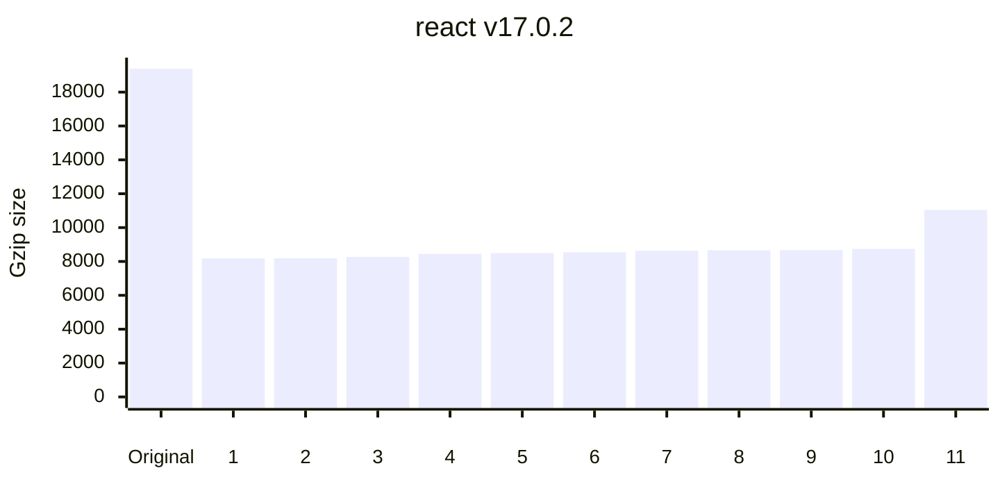
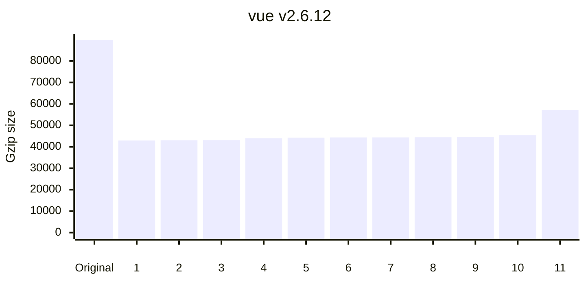
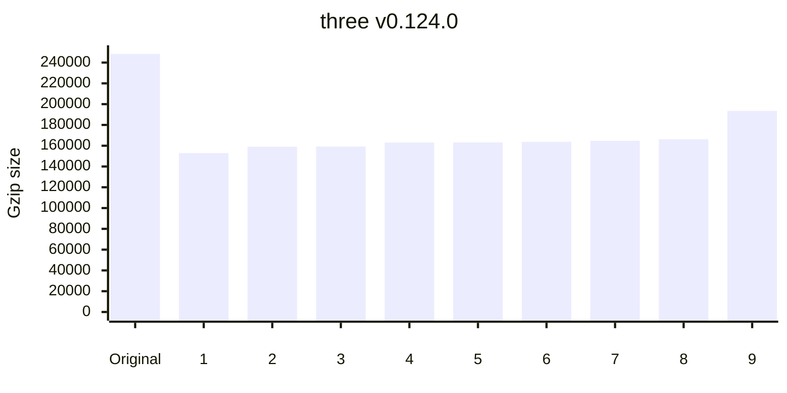
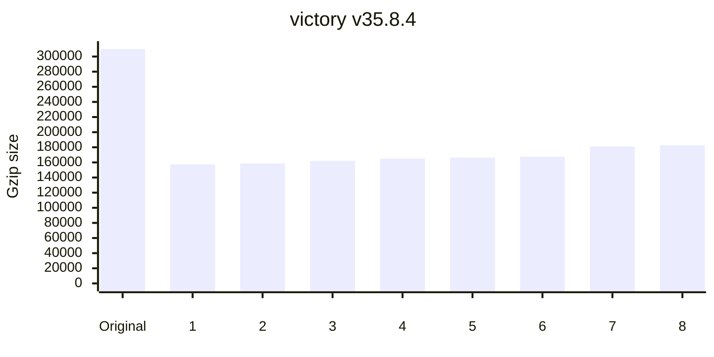
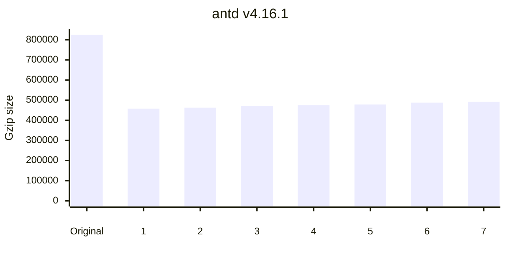
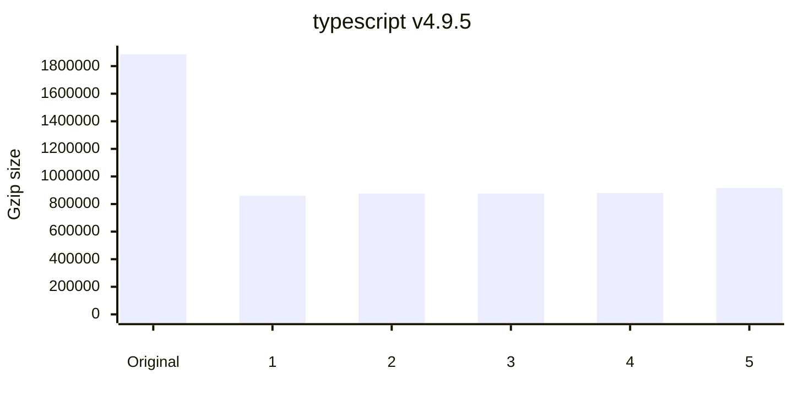

	

<h1 align="center">
	minification benchmarks
</h1>

> What's the best JavaScript minifier?

This project benchmarks the following minifiers:

<!-- minifiers:start -->
- [babel-minify](https://github.com/babel/minify/tree/master/packages/babel-minify) v0.5.2
- [bun](https://github.com/oven-sh/bun) v1.2.5
- [esbuild](https://github.com/evanw/esbuild) v0.25.1
- [google-closure-compiler](https://github.com/google/closure-compiler-npm/tree/master/packages/google-closure-compiler) v20240317.0.0
- [tedivm/jshrink](https://github.com/tedious/JShrink) v1.7.0
- [oxc-minify](https://github.com/oxc-project/oxc.git) v0.57.0
- [@swc/core](https://github.com/swc-project/swc) v1.11.9
- [@tdewolff/minify](https://github.com/tdewolff/minify#readme) v2.21.3
- [terser](https://github.com/terser/terser) v5.39.0
- [uglify-js](https://github.com/mishoo/UglifyJS) v3.19.3
<!-- minifiers:end -->

_Benchmarks last updated on <!-- lastUpdated:start -->Mar 13, 2025<!-- lastUpdated:end -->._

 

	
	

## 🙋‍♂️ Why?

1. To help you pick a minifier that fits your needs
2. To promote JS minifiers and document their performances
3. To encourage healthy competition and improvement amongst minifiers

## 👟 Methodology

- Each minifier is executed in its own process with a 10s timeout
- Artifact integrity is verified by a test before and after minification
- Minifier upgrade PRs are automated via [WhiteSource Renovate](https://www.whitesourcesoftware.com/free-developer-tools/renovate/)
- Benchmarks are updated on every PR via [GitHub Actions](https://github.com/privatenumber/minification-benchmarks/actions/workflows/benchmark.yml)

## ⏱ Metrics

Minifiers are ranked by smallest minzipped size.

#### Minified size

Size of the minified output.

#### Minzipped size

Size of the minified output with [Gzip compression](https://en.wikipedia.org/wiki/Gzip).

For minifiers, this measures how compressable the output is.

For users, this measures network transfer size, which is usually the metric that matters most.

#### Time

How long minification took (average of 5 runs). Each time is annotated with a multiplier relative to the fastest minifier.

## 📋 Results

<!-- benchmarks:start -->

| Artifact                                                                                                                                                                                                                                                                                                                                                                                                                                                                                                                                                                                                                                                                                                                                                                                                                                                           |                    Original size |                       Gzip size |                               |
| :----------------------------------------------------------------------------------------------------------------------------------------------------------------------------------------------------------------------------------------------------------------------------------------------------------------------------------------------------------------------------------------------------------------------------------------------------------------------------------------------------------------------------------------------------------------------------------------------------------------------------------------------------------------------------------------------------------------------------------------------------------------------------------------------------------------------------------------------------------------- | -------------------------------: | ------------------------------: | ----------------------------: |
| [react v17.0.2](https://www.npmjs.com/package/react/v/17.0.2) ([Source](https://unpkg.com/react@17.0.2/cjs/react.development.js))                                                                                                                                                                                                                                                                                                                                                                                                                                                                                                                                                                                                                                                                                                                                  |                       `72.13 kB` |                      `19.39 kB` |                               |
| **Minifier**                                                                                                                                                                                                                                                                                                                                                                                                                                                                                                                                                                                                                                                                                                                                                                                                                                                       |                **Minified size** |              **Minzipped size** |                      **Time** |
| 1. [uglify-js](packages/minifiers/minifiers/uglify-js.ts)                                                                                                                                                                                                                                                                                                                                                                                                                                                                                                                                                                                                                                                                                                                                                                                                          | **🏆-69% `22.64 kB`** | **🏆-58% `8.18 kB`** |    *182x* `503 ms` |
| 2. [google-closure-compiler](packages/minifiers/minifiers/google-closure-compiler.ts)                                                                                                                                                                                                                                                                                                                                                                                                                                                                                                                                                                                                                                                                                                                                                                              |       -68% `22.83 kB` |       -58% `8.19 kB` | *1118x* `3,093 ms` |
| 3. [terser](packages/minifiers/minifiers/terser.ts)                                                                                                                                                                                                                                                                                                                                                                                                                                                                                                                                                                                                                                                                                                                                                                                                                |       -68% `23.07 kB` |       -57% `8.27 kB` |    *102x* `282 ms` |
| 4. [babel-minify](packages/minifiers/minifiers/babel-minify.ts)                                                                                                                                                                                                                                                                                                                                                                                                                                                                                                                                                                                                                                                                                                                                                                                                    |       -67% `23.60 kB` |       -56% `8.45 kB` |    *235x* `651 ms` |
| 5. [oxc-minify](packages/minifiers/minifiers/oxc-minify.ts)                                                                                                                                                                                                                                                                                                                                                                                                                                                                                                                                                                                                                                                                                                                                                                                                        |       -67% `23.52 kB` |       -56% `8.49 kB` |      **🏆 `3 ms`** |
| 6. [esbuild](packages/minifiers/minifiers/esbuild.ts)                                                                                                                                                                                                                                                                                                                                                                                                                                                                                                                                                                                                                                                                                                                                                                                                              |       -67% `23.70 kB` |       -56% `8.54 kB` |       *4x* `13 ms` |
| 7. [@tdewolff/minify](packages/minifiers/minifiers/tdewolff-minify.ts)                                                                                                                                                                                                                                                                                                                                                                                                                                                                                                                                                                                                                                                                                                                                                                                             |       -67% `23.53 kB` |       -55% `8.63 kB` |        *1x* `3 ms` |
| 8. [bun](packages/minifiers/minifiers/bun.ts)                                                                                                                                                                                                                                                                                                                                                                                                                                                                                                                                                                                                                                                                                                                                                                                                                      |       -67% `23.99 kB` |       -55% `8.66 kB` |       *5x* `15 ms` |
| 9. [uglify-js (no compress)](packages/minifiers/minifiers/uglify-js.ts)                                                                                                                                                                                                                                                                                                                                                                                                                                                                                                                                                                                                                                                                                                                                                                                            |       -65% `25.03 kB` |       -55% `8.67 kB` |      *34x* `96 ms` |
| 10. [terser (no compress)](packages/minifiers/minifiers/terser.ts)                                                                                                                                                                                                                                                                                                                                                                                                                                                                                                                                                                                                                                                                                                                                                                                                 |       -65% `25.08 kB` |       -55% `8.75 kB` |     *44x* `123 ms` |
| 11. [tedivm/jshrink](packages/minifiers/minifiers/jshrink/index.ts)                                                                                                                                                                                                                                                                                                                                                                                                                                                                                                                                                                                                                                                                                                                                                                                                |       -43% `40.82 kB` |      -43% `11.04 kB` |     *46x* `129 ms` |
| 12. [@swc/core](packages/minifiers/minifiers/swc.ts) ❌ Failed to parse json:
{ kind: invaliddigit }
note: run with `rust_backtrace=1` environment variable to display a backtrace
{"error":{"message":"failed to handle: failed to parse version of ecmascript: parseinterror { kind: invaliddigit }","stack":"error: failed to handle: failed to parse version of ecmascript: parseinterror { kind: invaliddigit }","stage":"minification"}} |                                ❌ |                              ❌  |                             - |

----

| Artifact                                                                                                                                                                                                                                                                                                                                                                                                                                                                                                                                                                                                                                                                                                                                                                                                                                                           |                    Original size |                        Gzip size |                              |
| :----------------------------------------------------------------------------------------------------------------------------------------------------------------------------------------------------------------------------------------------------------------------------------------------------------------------------------------------------------------------------------------------------------------------------------------------------------------------------------------------------------------------------------------------------------------------------------------------------------------------------------------------------------------------------------------------------------------------------------------------------------------------------------------------------------------------------------------------------------------- | -------------------------------: | -------------------------------: | ---------------------------: |
| [moment v2.29.1](https://www.npmjs.com/package/moment/v/2.29.1) ([Source](https://unpkg.com/moment@2.29.1/moment.js))                                                                                                                                                                                                                                                                                                                                                                                                                                                                                                                                                                                                                                                                                                                                              |                      `173.90 kB` |                       `36.23 kB` |                              |
| **Minifier**                                                                                                                                                                                                                                                                                                                                                                                                                                                                                                                                                                                                                                                                                                                                                                                                                                                       |                **Minified size** |               **Minzipped size** |                     **Time** |
| 1. [uglify-js](packages/minifiers/minifiers/uglify-js.ts)                                                                                                                                                                                                                                                                                                                                                                                                                                                                                                                                                                                                                                                                                                                                                                                                          | **🏆-67% `57.73 kB`** | **🏆-49% `18.57 kB`** | *197x* `1,175 ms` |
| 2. [terser](packages/minifiers/minifiers/terser.ts)                                                                                                                                                                                                                                                                                                                                                                                                                                                                                                                                                                                                                                                                                                                                                                                                                |       -66% `59.13 kB` |       -48% `18.69 kB` |   *113x* `678 ms` |
| 3. [google-closure-compiler](packages/minifiers/minifiers/google-closure-compiler.ts)                                                                                                                                                                                                                                                                                                                                                                                                                                                                                                                                                                                                                                                                                                                                                                              |       -66% `58.27 kB` |       -48% `18.91 kB` | *635x* `3,784 ms` |
| 4. [babel-minify](packages/minifiers/minifiers/babel-minify.ts)                                                                                                                                                                                                                                                                                                                                                                                                                                                                                                                                                                                                                                                                                                                                                                                                    |       -66% `59.70 kB` |       -47% `19.12 kB` | *253x* `1,512 ms` |
| 5. [oxc-minify](packages/minifiers/minifiers/oxc-minify.ts)                                                                                                                                                                                                                                                                                                                                                                                                                                                                                                                                                                                                                                                                                                                                                                                                        |       -66% `59.41 kB` |       -47% `19.22 kB` |      *1x* `10 ms` |
| 6. [esbuild](packages/minifiers/minifiers/esbuild.ts)                                                                                                                                                                                                                                                                                                                                                                                                                                                                                                                                                                                                                                                                                                                                                                                                              |       -66% `59.82 kB` |       -47% `19.33 kB` |      *3x* `20 ms` |
| 7. [@tdewolff/minify](packages/minifiers/minifiers/tdewolff-minify.ts)                                                                                                                                                                                                                                                                                                                                                                                                                                                                                                                                                                                                                                                                                                                                                                                             |       -66% `59.95 kB` |       -46% `19.50 kB` |     **🏆 `6 ms`** |
| 8. [uglify-js (no compress)](packages/minifiers/minifiers/uglify-js.ts)                                                                                                                                                                                                                                                                                                                                                                                                                                                                                                                                                                                                                                                                                                                                                                                            |       -64% `62.50 kB` |       -46% `19.57 kB` |    *37x* `222 ms` |
| 9. [terser (no compress)](packages/minifiers/minifiers/terser.ts)                                                                                                                                                                                                                                                                                                                                                                                                                                                                                                                                                                                                                                                                                                                                                                                                  |       -64% `63.15 kB` |       -46% `19.68 kB` |    *48x* `292 ms` |
| 10. [bun](packages/minifiers/minifiers/bun.ts)                                                                                                                                                                                                                                                                                                                                                                                                                                                                                                                                                                                                                                                                                                                                                                                                                     |       -64% `61.84 kB` |       -45% `19.86 kB` |      *3x* `19 ms` |
| 11. [tedivm/jshrink](packages/minifiers/minifiers/jshrink/index.ts)                                                                                                                                                                                                                                                                                                                                                                                                                                                                                                                                                                                                                                                                                                                                                                                                |       -44% `97.63 kB` |       -31% `25.00 kB` |    *46x* `280 ms` |
| 12. [@swc/core](packages/minifiers/minifiers/swc.ts) ❌ Failed to parse json:
{ kind: invaliddigit }
note: run with `rust_backtrace=1` environment variable to display a backtrace
{"error":{"message":"failed to handle: failed to parse version of ecmascript: parseinterror { kind: invaliddigit }","stack":"error: failed to handle: failed to parse version of ecmascript: parseinterror { kind: invaliddigit }","stage":"minification"}} |                                ❌ |                               ❌  |                            - |

----

| Artifact                                                                                                                                                                                                                                                                                                                                                                                                                                                                                                                                                                                                                                                                                                                                                                                                                                                           |                    Original size |                        Gzip size |                              |
| :----------------------------------------------------------------------------------------------------------------------------------------------------------------------------------------------------------------------------------------------------------------------------------------------------------------------------------------------------------------------------------------------------------------------------------------------------------------------------------------------------------------------------------------------------------------------------------------------------------------------------------------------------------------------------------------------------------------------------------------------------------------------------------------------------------------------------------------------------------------- | -------------------------------: | -------------------------------: | ---------------------------: |
| [jquery v3.5.1](https://www.npmjs.com/package/jquery/v/3.5.1) ([Source](https://unpkg.com/jquery@3.5.1/dist/jquery.js))                                                                                                                                                                                                                                                                                                                                                                                                                                                                                                                                                                                                                                                                                                                                            |                      `287.63 kB` |                       `84.50 kB` |                              |
| **Minifier**                                                                                                                                                                                                                                                                                                                                                                                                                                                                                                                                                                                                                                                                                                                                                                                                                                                       |                **Minified size** |               **Minzipped size** |                     **Time** |
| 1. [uglify-js](packages/minifiers/minifiers/uglify-js.ts)                                                                                                                                                                                                                                                                                                                                                                                                                                                                                                                                                                                                                                                                                                                                                                                                          | **🏆-69% `88.45 kB`** | **🏆-63% `30.90 kB`** | *183x* `1,650 ms` |
| 2. [terser](packages/minifiers/minifiers/terser.ts)                                                                                                                                                                                                                                                                                                                                                                                                                                                                                                                                                                                                                                                                                                                                                                                                                |       -69% `89.51 kB` |       -63% `30.91 kB` |   *102x* `923 ms` |
| 3. [oxc-minify](packages/minifiers/minifiers/oxc-minify.ts)                                                                                                                                                                                                                                                                                                                                                                                                                                                                                                                                                                                                                                                                                                                                                                                                        |       -69% `89.33 kB` |       -63% `30.97 kB` |      *1x* `16 ms` |
| 4. [@tdewolff/minify](packages/minifiers/minifiers/tdewolff-minify.ts)                                                                                                                                                                                                                                                                                                                                                                                                                                                                                                                                                                                                                                                                                                                                                                                             |       -69% `89.85 kB` |       -63% `31.47 kB` |     **🏆 `9 ms`** |
| 5. [uglify-js (no compress)](packages/minifiers/minifiers/uglify-js.ts)                                                                                                                                                                                                                                                                                                                                                                                                                                                                                                                                                                                                                                                                                                                                                                                            |       -67% `94.08 kB` |       -63% `31.47 kB` |    *36x* `325 ms` |
| 6. [terser (no compress)](packages/minifiers/minifiers/terser.ts)                                                                                                                                                                                                                                                                                                                                                                                                                                                                                                                                                                                                                                                                                                                                                                                                  |       -67% `94.55 kB` |       -63% `31.62 kB` |    *41x* `371 ms` |
| 7. [babel-minify](packages/minifiers/minifiers/babel-minify.ts)                                                                                                                                                                                                                                                                                                                                                                                                                                                                                                                                                                                                                                                                                                                                                                                                    |       -68% `92.10 kB` |       -62% `31.80 kB` | *273x* `2,459 ms` |
| 8. [esbuild](packages/minifiers/minifiers/esbuild.ts)                                                                                                                                                                                                                                                                                                                                                                                                                                                                                                                                                                                                                                                                                                                                                                                                              |       -69% `90.07 kB` |       -62% `31.95 kB` |      *4x* `37 ms` |
| 9. [bun](packages/minifiers/minifiers/bun.ts)                                                                                                                                                                                                                                                                                                                                                                                                                                                                                                                                                                                                                                                                                                                                                                                                                      |       -68% `92.55 kB` |       -61% `32.65 kB` |      *3x* `30 ms` |
| 10. [google-closure-compiler](packages/minifiers/minifiers/google-closure-compiler.ts)                                                                                                                                                                                                                                                                                                                                                                                                                                                                                                                                                                                                                                                                                                                                                                             |       -68% `92.70 kB` |       -61% `33.09 kB` | *470x* `4,236 ms` |
| 11. [tedivm/jshrink](packages/minifiers/minifiers/jshrink/index.ts)                                                                                                                                                                                                                                                                                                                                                                                                                                                                                                                                                                                                                                                                                                                                                                                                |      -50% `144.14 kB` |       -52% `40.88 kB` |    *40x* `368 ms` |
| 12. [@swc/core](packages/minifiers/minifiers/swc.ts) ❌ Failed to parse json:
{ kind: invaliddigit }
note: run with `rust_backtrace=1` environment variable to display a backtrace
{"error":{"message":"failed to handle: failed to parse version of ecmascript: parseinterror { kind: invaliddigit }","stack":"error: failed to handle: failed to parse version of ecmascript: parseinterror { kind: invaliddigit }","stage":"minification"}} |                                ❌ |                               ❌  |                            - |

----

| Artifact                                                                                                                                                                                                                                                                                                                                                                                                                                                                                                                                                                                                                                                                                                                                                                                                                                                           |                     Original size |                        Gzip size |                              |
| :----------------------------------------------------------------------------------------------------------------------------------------------------------------------------------------------------------------------------------------------------------------------------------------------------------------------------------------------------------------------------------------------------------------------------------------------------------------------------------------------------------------------------------------------------------------------------------------------------------------------------------------------------------------------------------------------------------------------------------------------------------------------------------------------------------------------------------------------------------------- | --------------------------------: | -------------------------------: | ---------------------------: |
| [vue v2.6.12](https://www.npmjs.com/package/vue/v/2.6.12) ([Source](https://unpkg.com/vue@2.6.12/dist/vue.js))                                                                                                                                                                                                                                                                                                                                                                                                                                                                                                                                                                                                                                                                                                                                                     |                       `342.15 kB` |                       `89.67 kB` |                              |
| **Minifier**                                                                                                                                                                                                                                                                                                                                                                                                                                                                                                                                                                                                                                                                                                                                                                                                                                                       |                 **Minified size** |               **Minzipped size** |                     **Time** |
| 1. [terser](packages/minifiers/minifiers/terser.ts)                                                                                                                                                                                                                                                                                                                                                                                                                                                                                                                                                                                                                                                                                                                                                                                                                |       -66% `116.79 kB` | **🏆-52% `42.92 kB`** |  *87x* `1,138 ms` |
| 2. [uglify-js](packages/minifiers/minifiers/uglify-js.ts)                                                                                                                                                                                                                                                                                                                                                                                                                                                                                                                                                                                                                                                                                                                                                                                                          | **🏆-67% `113.80 kB`** |       -52% `43.04 kB` | *173x* `2,260 ms` |
| 3. [oxc-minify](packages/minifiers/minifiers/oxc-minify.ts)                                                                                                                                                                                                                                                                                                                                                                                                                                                                                                                                                                                                                                                                                                                                                                                                        |       -66% `116.53 kB` |       -52% `43.10 kB` |      *1x* `20 ms` |
| 4. [babel-minify](packages/minifiers/minifiers/babel-minify.ts)                                                                                                                                                                                                                                                                                                                                                                                                                                                                                                                                                                                                                                                                                                                                                                                                    |       -66% `117.90 kB` |       -51% `43.93 kB` | *212x* `2,776 ms` |
| 5. [google-closure-compiler](packages/minifiers/minifiers/google-closure-compiler.ts)                                                                                                                                                                                                                                                                                                                                                                                                                                                                                                                                                                                                                                                                                                                                                                              |       -66% `115.61 kB` |       -51% `44.23 kB` | *369x* `4,820 ms` |
| 6. [esbuild](packages/minifiers/minifiers/esbuild.ts)                                                                                                                                                                                                                                                                                                                                                                                                                                                                                                                                                                                                                                                                                                                                                                                                              |       -65% `118.14 kB` |       -51% `44.37 kB` |      *3x* `42 ms` |
| 7. [@tdewolff/minify](packages/minifiers/minifiers/tdewolff-minify.ts)                                                                                                                                                                                                                                                                                                                                                                                                                                                                                                                                                                                                                                                                                                                                                                                             |       -66% `117.81 kB` |       -51% `44.38 kB` |    **🏆 `13 ms`** |
| 8. [uglify-js (no compress)](packages/minifiers/minifiers/uglify-js.ts)                                                                                                                                                                                                                                                                                                                                                                                                                                                                                                                                                                                                                                                                                                                                                                                            |       -63% `126.14 kB` |       -50% `44.45 kB` |    *28x* `370 ms` |
| 9. [terser (no compress)](packages/minifiers/minifiers/terser.ts)                                                                                                                                                                                                                                                                                                                                                                                                                                                                                                                                                                                                                                                                                                                                                                                                  |       -63% `126.58 kB` |       -50% `44.68 kB` |    *35x* `458 ms` |
| 10. [bun](packages/minifiers/minifiers/bun.ts)                                                                                                                                                                                                                                                                                                                                                                                                                                                                                                                                                                                                                                                                                                                                                                                                                     |       -64% `121.50 kB` |       -49% `45.40 kB` |      *2x* `32 ms` |
| 11. [tedivm/jshrink](packages/minifiers/minifiers/jshrink/index.ts)                                                                                                                                                                                                                                                                                                                                                                                                                                                                                                                                                                                                                                                                                                                                                                                                |       -42% `197.36 kB` |       -36% `57.17 kB` |    *36x* `481 ms` |
| 12. [@swc/core](packages/minifiers/minifiers/swc.ts) ❌ Failed to parse json:
{ kind: invaliddigit }
note: run with `rust_backtrace=1` environment variable to display a backtrace
{"error":{"message":"failed to handle: failed to parse version of ecmascript: parseinterror { kind: invaliddigit }","stack":"error: failed to handle: failed to parse version of ecmascript: parseinterror { kind: invaliddigit }","stage":"minification"}} |                                 ❌ |                               ❌  |                            - |

----

| Artifact                                                                                                                                                                                                                                                                                                                                                                                                                                                                                                                                                                                                                                                                                                                                                                                                                                                           |                    Original size |                        Gzip size |                              |
| :----------------------------------------------------------------------------------------------------------------------------------------------------------------------------------------------------------------------------------------------------------------------------------------------------------------------------------------------------------------------------------------------------------------------------------------------------------------------------------------------------------------------------------------------------------------------------------------------------------------------------------------------------------------------------------------------------------------------------------------------------------------------------------------------------------------------------------------------------------------- | -------------------------------: | -------------------------------: | ---------------------------: |
| [lodash v4.17.21](https://www.npmjs.com/package/lodash/v/4.17.21) ([Source](https://unpkg.com/lodash@4.17.21/lodash.js))                                                                                                                                                                                                                                                                                                                                                                                                                                                                                                                                                                                                                                                                                                                                           |                      `544.09 kB` |                       `96.69 kB` |                              |
| **Minifier**                                                                                                                                                                                                                                                                                                                                                                                                                                                                                                                                                                                                                                                                                                                                                                                                                                                       |                **Minified size** |               **Minzipped size** |                     **Time** |
| 1. [uglify-js](packages/minifiers/minifiers/uglify-js.ts)                                                                                                                                                                                                                                                                                                                                                                                                                                                                                                                                                                                                                                                                                                                                                                                                          | **🏆-87% `68.17 kB`** | **🏆-74% `24.69 kB`** | *135x* `1,739 ms` |
| 2. [google-closure-compiler](packages/minifiers/minifiers/google-closure-compiler.ts)                                                                                                                                                                                                                                                                                                                                                                                                                                                                                                                                                                                                                                                                                                                                                                              |       -86% `73.47 kB` |       -74% `24.97 kB` | *349x* `4,475 ms` |
| 3. [terser](packages/minifiers/minifiers/terser.ts)                                                                                                                                                                                                                                                                                                                                                                                                                                                                                                                                                                                                                                                                                                                                                                                                                |       -87% `70.66 kB` |       -74% `25.19 kB` |    *76x* `976 ms` |
| 4. [babel-minify](packages/minifiers/minifiers/babel-minify.ts)                                                                                                                                                                                                                                                                                                                                                                                                                                                                                                                                                                                                                                                                                                                                                                                                    |       -87% `72.37 kB` |       -74% `25.50 kB` | *168x* `2,159 ms` |
| 5. [uglify-js (no compress)](packages/minifiers/minifiers/uglify-js.ts)                                                                                                                                                                                                                                                                                                                                                                                                                                                                                                                                                                                                                                                                                                                                                                                            |       -86% `74.61 kB` |       -73% `25.86 kB` |    *26x* `342 ms` |
| 6. [oxc-minify](packages/minifiers/minifiers/oxc-minify.ts)                                                                                                                                                                                                                                                                                                                                                                                                                                                                                                                                                                                                                                                                                                                                                                                                        |       -87% `71.38 kB` |       -73% `25.98 kB` |      *1x* `15 ms` |
| 7. [esbuild](packages/minifiers/minifiers/esbuild.ts)                                                                                                                                                                                                                                                                                                                                                                                                                                                                                                                                                                                                                                                                                                                                                                                                              |       -87% `72.48 kB` |       -73% `26.20 kB` |      *2x* `30 ms` |
| 8. [terser (no compress)](packages/minifiers/minifiers/terser.ts)                                                                                                                                                                                                                                                                                                                                                                                                                                                                                                                                                                                                                                                                                                                                                                                                  |       -86% `75.29 kB` |       -73% `26.22 kB` |    *30x* `394 ms` |
| 9. [@tdewolff/minify](packages/minifiers/minifiers/tdewolff-minify.ts)                                                                                                                                                                                                                                                                                                                                                                                                                                                                                                                                                                                                                                                                                                                                                                                             |       -87% `71.90 kB` |       -73% `26.50 kB` |    **🏆 `13 ms`** |
| 10. [bun](packages/minifiers/minifiers/bun.ts)                                                                                                                                                                                                                                                                                                                                                                                                                                                                                                                                                                                                                                                                                                                                                                                                                     |       -87% `73.45 kB` |       -72% `26.66 kB` |      *1x* `25 ms` |
| 11. [tedivm/jshrink](packages/minifiers/minifiers/jshrink/index.ts)                                                                                                                                                                                                                                                                                                                                                                                                                                                                                                                                                                                                                                                                                                                                                                                                |      -73% `148.78 kB` |       -62% `36.33 kB` |    *28x* `365 ms` |
| 12. [@swc/core](packages/minifiers/minifiers/swc.ts) ❌ Failed to parse json:
{ kind: invaliddigit }
note: run with `rust_backtrace=1` environment variable to display a backtrace
{"error":{"message":"failed to handle: failed to parse version of ecmascript: parseinterror { kind: invaliddigit }","stack":"error: failed to handle: failed to parse version of ecmascript: parseinterror { kind: invaliddigit }","stage":"minification"}} |                                ❌ |                               ❌  |                            - |

----

| Artifact                                                                                                                                                                                                                                                                                                                                                                                                                                                                                                                                                                                                                                                                                                                                                                                                                                                           |                     Original size |                        Gzip size |                              |
| :----------------------------------------------------------------------------------------------------------------------------------------------------------------------------------------------------------------------------------------------------------------------------------------------------------------------------------------------------------------------------------------------------------------------------------------------------------------------------------------------------------------------------------------------------------------------------------------------------------------------------------------------------------------------------------------------------------------------------------------------------------------------------------------------------------------------------------------------------------------- | --------------------------------: | -------------------------------: | ---------------------------: |
| [d3 v6.3.1](https://www.npmjs.com/package/d3/v/6.3.1) ([Source](https://unpkg.com/d3@6.3.1/dist/d3.js))                                                                                                                                                                                                                                                                                                                                                                                                                                                                                                                                                                                                                                                                                                                                                            |                       `555.77 kB` |                      `130.69 kB` |                              |
| **Minifier**                                                                                                                                                                                                                                                                                                                                                                                                                                                                                                                                                                                                                                                                                                                                                                                                                                                       |                 **Minified size** |               **Minzipped size** |                     **Time** |
| 1. [uglify-js](packages/minifiers/minifiers/uglify-js.ts)                                                                                                                                                                                                                                                                                                                                                                                                                                                                                                                                                                                                                                                                                                                                                                                                          | **🏆-53% `263.56 kB`** | **🏆-33% `87.02 kB`** | *116x* `4,053 ms` |
| 2. [terser](packages/minifiers/minifiers/terser.ts)                                                                                                                                                                                                                                                                                                                                                                                                                                                                                                                                                                                                                                                                                                                                                                                                                |       -52% `267.57 kB` |       -33% `88.06 kB` |  *67x* `2,340 ms` |
| 3. [oxc-minify](packages/minifiers/minifiers/oxc-minify.ts)                                                                                                                                                                                                                                                                                                                                                                                                                                                                                                                                                                                                                                                                                                                                                                                                        |       -51% `270.84 kB` |       -33% `88.16 kB` |      *1x* `46 ms` |
| 4. [uglify-js (no compress)](packages/minifiers/minifiers/uglify-js.ts)                                                                                                                                                                                                                                                                                                                                                                                                                                                                                                                                                                                                                                                                                                                                                                                            |       -50% `275.35 kB` |       -32% `88.32 kB` |    *20x* `728 ms` |
| 5. [terser (no compress)](packages/minifiers/minifiers/terser.ts)                                                                                                                                                                                                                                                                                                                                                                                                                                                                                                                                                                                                                                                                                                                                                                                                  |       -50% `276.47 kB` |       -32% `89.16 kB` |  *29x* `1,038 ms` |
| 6. [@tdewolff/minify](packages/minifiers/minifiers/tdewolff-minify.ts)                                                                                                                                                                                                                                                                                                                                                                                                                                                                                                                                                                                                                                                                                                                                                                                             |       -51% `269.93 kB` |       -31% `89.89 kB` |    **🏆 `35 ms`** |
| 7. [esbuild](packages/minifiers/minifiers/esbuild.ts)                                                                                                                                                                                                                                                                                                                                                                                                                                                                                                                                                                                                                                                                                                                                                                                                              |       -51% `270.13 kB` |       -31% `90.80 kB` |      *2x* `72 ms` |
| 8. [bun](packages/minifiers/minifiers/bun.ts)                                                                                                                                                                                                                                                                                                                                                                                                                                                                                                                                                                                                                                                                                                                                                                                                                      |       -51% `273.41 kB` |       -29% `92.40 kB` |      *1x* `51 ms` |
| 9. [google-closure-compiler](packages/minifiers/minifiers/google-closure-compiler.ts)                                                                                                                                                                                                                                                                                                                                                                                                                                                                                                                                                                                                                                                                                                                                                                              |       -51% `270.30 kB` |       -28% `94.12 kB` | *207x* `7,200 ms` |
| 10. [babel-minify](packages/minifiers/minifiers/babel-minify.ts) ❌ Minification                                                                                                                                                                                                                                                                                                                                                                                                                                                                                                                                                                                                                                                                                                                                            |                                 ❌ |                               ❌  |                            - |
| 11. [tedivm/jshrink](packages/minifiers/minifiers/jshrink/index.ts) ❌ Minification                                                                                                                                                                                                                                                                                                                                                                                                                                                                                                                                                                                                                                                                                                                                         |                                 ❌ |                               ❌  |                            - |
| 12. [@swc/core](packages/minifiers/minifiers/swc.ts) ❌ Failed to parse json:
{ kind: invaliddigit }
note: run with `rust_backtrace=1` environment variable to display a backtrace
{"error":{"message":"failed to handle: failed to parse version of ecmascript: parseinterror { kind: invaliddigit }","stack":"error: failed to handle: failed to parse version of ecmascript: parseinterror { kind: invaliddigit }","stage":"minification"}} |                                 ❌ |                               ❌  |                            - |

----

| Artifact                                                                                                                                                                                                                                                                                                                                                                                                                                                                                                                                                                                                                                                                                                                                                                                                                                                           |                     Original size |                         Gzip size |                              |
| :----------------------------------------------------------------------------------------------------------------------------------------------------------------------------------------------------------------------------------------------------------------------------------------------------------------------------------------------------------------------------------------------------------------------------------------------------------------------------------------------------------------------------------------------------------------------------------------------------------------------------------------------------------------------------------------------------------------------------------------------------------------------------------------------------------------------------------------------------------------- | --------------------------------: | --------------------------------: | ---------------------------: |
| [terser v5.30.3](https://www.npmjs.com/package/terser/v/5.30.3) ([Source](https://unpkg.com/terser@5.30.3/dist/bundle.min.js))                                                                                                                                                                                                                                                                                                                                                                                                                                                                                                                                                                                                                                                                                                                                     |                         `1.01 MB` |                       `193.76 kB` |                              |
| **Minifier**                                                                                                                                                                                                                                                                                                                                                                                                                                                                                                                                                                                                                                                                                                                                                                                                                                                       |                 **Minified size** |                **Minzipped size** |                     **Time** |
| 1. [oxc-minify](packages/minifiers/minifiers/oxc-minify.ts)                                                                                                                                                                                                                                                                                                                                                                                                                                                                                                                                                                                                                                                                                                                                                                                                        | **🏆-56% `439.58 kB`** | **🏆-37% `122.16 kB`** |      *1x* `42 ms` |
| 2. [uglify-js](packages/minifiers/minifiers/uglify-js.ts)                                                                                                                                                                                                                                                                                                                                                                                                                                                                                                                                                                                                                                                                                                                                                                                                          |       -55% `451.19 kB` |       -36% `123.33 kB` | *123x* `3,942 ms` |
| 3. [terser](packages/minifiers/minifiers/terser.ts)                                                                                                                                                                                                                                                                                                                                                                                                                                                                                                                                                                                                                                                                                                                                                                                                                |       -55% `458.28 kB` |       -36% `123.48 kB` |  *70x* `2,247 ms` |
| 4. [terser (no compress)](packages/minifiers/minifiers/terser.ts)                                                                                                                                                                                                                                                                                                                                                                                                                                                                                                                                                                                                                                                                                                                                                                                                  |       -53% `474.40 kB` |       -36% `124.43 kB` |    *30x* `982 ms` |
| 5. [uglify-js (no compress)](packages/minifiers/minifiers/uglify-js.ts)                                                                                                                                                                                                                                                                                                                                                                                                                                                                                                                                                                                                                                                                                                                                                                                            |       -53% `472.16 kB` |       -36% `124.61 kB` |    *24x* `797 ms` |
| 6. [@tdewolff/minify](packages/minifiers/minifiers/tdewolff-minify.ts)                                                                                                                                                                                                                                                                                                                                                                                                                                                                                                                                                                                                                                                                                                                                                                                             |       -55% `456.70 kB` |       -36% `124.90 kB` |    **🏆 `32 ms`** |
| 7. [google-closure-compiler](packages/minifiers/minifiers/google-closure-compiler.ts)                                                                                                                                                                                                                                                                                                                                                                                                                                                                                                                                                                                                                                                                                                                                                                              |       -56% `439.95 kB` |       -35% `126.56 kB` | *210x* `6,733 ms` |
| 8. [esbuild](packages/minifiers/minifiers/esbuild.ts)                                                                                                                                                                                                                                                                                                                                                                                                                                                                                                                                                                                                                                                                                                                                                                                                              |       -55% `458.89 kB` |       -35% `126.71 kB` |      *2x* `66 ms` |
| 9. [bun](packages/minifiers/minifiers/bun.ts)                                                                                                                                                                                                                                                                                                                                                                                                                                                                                                                                                                                                                                                                                                                                                                                                                      |       -54% `466.80 kB` |       -34% `127.65 kB` |      *1x* `48 ms` |
| 10. [tedivm/jshrink](packages/minifiers/minifiers/jshrink/index.ts)                                                                                                                                                                                                                                                                                                                                                                                                                                                                                                                                                                                                                                                                                                                                                                                                |       -37% `633.71 kB` |       -25% `145.18 kB` |  *41x* `1,332 ms` |
| 11. [babel-minify](packages/minifiers/minifiers/babel-minify.ts) ❌ Minification                                                                                                                                                                                                                                                                                                                                                                                                                                                                                                                                                                                                                                                                                                                                            |                                 ❌ |                                ❌  |                            - |
| 12. [@swc/core](packages/minifiers/minifiers/swc.ts) ❌ Failed to parse json:
{ kind: invaliddigit }
note: run with `rust_backtrace=1` environment variable to display a backtrace
{"error":{"message":"failed to handle: failed to parse version of ecmascript: parseinterror { kind: invaliddigit }","stack":"error: failed to handle: failed to parse version of ecmascript: parseinterror { kind: invaliddigit }","stage":"minification"}} |                                 ❌ |                                ❌  |                            - |

----

| Artifact                                                                                                                                                                                                                                                                                                                                                                                                                                                                                                                                                                                                                                                                                                                                                                                                                                                           |                     Original size |                         Gzip size |                                   |
| :----------------------------------------------------------------------------------------------------------------------------------------------------------------------------------------------------------------------------------------------------------------------------------------------------------------------------------------------------------------------------------------------------------------------------------------------------------------------------------------------------------------------------------------------------------------------------------------------------------------------------------------------------------------------------------------------------------------------------------------------------------------------------------------------------------------------------------------------------------------- | --------------------------------: | --------------------------------: | --------------------------------: |
| [three v0.124.0](https://www.npmjs.com/package/three/v/0.124.0) ([Source](https://unpkg.com/three@0.124.0/build/three.js))                                                                                                                                                                                                                                                                                                                                                                                                                                                                                                                                                                                                                                                                                                                                         |                         `1.25 MB` |                       `248.27 kB` |                                   |
| **Minifier**                                                                                                                                                                                                                                                                                                                                                                                                                                                                                                                                                                                                                                                                                                                                                                                                                                                       |                 **Minified size** |                **Minzipped size** |                          **Time** |
| 1. [oxc-minify](packages/minifiers/minifiers/oxc-minify.ts)                                                                                                                                                                                                                                                                                                                                                                                                                                                                                                                                                                                                                                                                                                                                                                                                        | **🏆-52% `603.03 kB`** | **🏆-38% `152.93 kB`** |           *1x* `60 ms` |
| 2. [uglify-js](packages/minifiers/minifiers/uglify-js.ts)                                                                                                                                                                                                                                                                                                                                                                                                                                                                                                                                                                                                                                                                                                                                                                                                          |       -49% `641.59 kB` |       -36% `159.07 kB` |      *107x* `5,225 ms` |
| 3. [terser](packages/minifiers/minifiers/terser.ts)                                                                                                                                                                                                                                                                                                                                                                                                                                                                                                                                                                                                                                                                                                                                                                                                                |       -48% `653.25 kB` |       -36% `159.20 kB` |       *62x* `3,017 ms` |
| 4. [uglify-js (no compress)](packages/minifiers/minifiers/uglify-js.ts)                                                                                                                                                                                                                                                                                                                                                                                                                                                                                                                                                                                                                                                                                                                                                                                            |       -46% `674.49 kB` |       -34% `163.04 kB` |       *21x* `1,020 ms` |
| 5. [terser (no compress)](packages/minifiers/minifiers/terser.ts)                                                                                                                                                                                                                                                                                                                                                                                                                                                                                                                                                                                                                                                                                                                                                                                                  |       -46% `675.50 kB` |       -34% `163.20 kB` |       *27x* `1,318 ms` |
| 6. [esbuild](packages/minifiers/minifiers/esbuild.ts)                                                                                                                                                                                                                                                                                                                                                                                                                                                                                                                                                                                                                                                                                                                                                                                                              |       -48% `646.76 kB` |       -34% `163.73 kB` |           *1x* `89 ms` |
| 7. [@tdewolff/minify](packages/minifiers/minifiers/tdewolff-minify.ts)                                                                                                                                                                                                                                                                                                                                                                                                                                                                                                                                                                                                                                                                                                                                                                                             |       -48% `644.55 kB` |       -34% `164.74 kB` |         **🏆 `48 ms`** |
| 8. [bun](packages/minifiers/minifiers/bun.ts)                                                                                                                                                                                                                                                                                                                                                                                                                                                                                                                                                                                                                                                                                                                                                                                                                      |       -47% `655.93 kB` |       -33% `166.21 kB` |           *1x* `60 ms` |
| 9. [tedivm/jshrink](packages/minifiers/minifiers/jshrink/index.ts)                                                                                                                                                                                                                                                                                                                                                                                                                                                                                                                                                                                                                                                                                                                                                                                                 |       -24% `952.01 kB` |       -22% `193.47 kB` |       *35x* `1,719 ms` |
| 10. [babel-minify](packages/minifiers/minifiers/babel-minify.ts) ❌ Timed out                                                                                                                                                                                                                                                                                                                                                                                                                                                                                                                                                                                                                                                                                                                                                    |                                 - |                                 - | :warning: `+10,000 ms` |
| 11. [google-closure-compiler](packages/minifiers/minifiers/google-closure-compiler.ts) ❌ Timed out                                                                                                                                                                                                                                                                                                                                                                                                                                                                                                                                                                                                                                                                                                                              |                                 - |                                 - | :warning: `+10,000 ms` |
| 12. [@swc/core](packages/minifiers/minifiers/swc.ts) ❌ Failed to parse json:
{ kind: invaliddigit }
note: run with `rust_backtrace=1` environment variable to display a backtrace
{"error":{"message":"failed to handle: failed to parse version of ecmascript: parseinterror { kind: invaliddigit }","stack":"error: failed to handle: failed to parse version of ecmascript: parseinterror { kind: invaliddigit }","stage":"minification"}} |                                 ❌ |                                ❌  |                                 - |

----

| Artifact                                                                                                                                                                                                                                                                                                                                                                                                                                                                                                                                                                                                                                                                                                                                                                                                                                                           |                     Original size |                         Gzip size |                                   |
| :----------------------------------------------------------------------------------------------------------------------------------------------------------------------------------------------------------------------------------------------------------------------------------------------------------------------------------------------------------------------------------------------------------------------------------------------------------------------------------------------------------------------------------------------------------------------------------------------------------------------------------------------------------------------------------------------------------------------------------------------------------------------------------------------------------------------------------------------------------------- | --------------------------------: | --------------------------------: | --------------------------------: |
| [victory v35.8.4](https://www.npmjs.com/package/victory/v/35.8.4) ([Source](https://unpkg.com/victory@35.8.4/dist/victory.js))                                                                                                                                                                                                                                                                                                                                                                                                                                                                                                                                                                                                                                                                                                                                     |                         `2.13 MB` |                       `309.94 kB` |                                   |
| **Minifier**                                                                                                                                                                                                                                                                                                                                                                                                                                                                                                                                                                                                                                                                                                                                                                                                                                                       |                 **Minified size** |                **Minzipped size** |                          **Time** |
| 1. [uglify-js](packages/minifiers/minifiers/uglify-js.ts)                                                                                                                                                                                                                                                                                                                                                                                                                                                                                                                                                                                                                                                                                                                                                                                                          | **🏆-67% `694.78 kB`** | **🏆-49% `157.44 kB`** |      *104x* `6,708 ms` |
| 2. [terser](packages/minifiers/minifiers/terser.ts)                                                                                                                                                                                                                                                                                                                                                                                                                                                                                                                                                                                                                                                                                                                                                                                                                |       -66% `715.44 kB` |       -49% `158.68 kB` |       *63x* `4,077 ms` |
| 3. [oxc-minify](packages/minifiers/minifiers/oxc-minify.ts)                                                                                                                                                                                                                                                                                                                                                                                                                                                                                                                                                                                                                                                                                                                                                                                                        |       -66% `715.76 kB` |       -48% `162.10 kB` |          *1x* `103 ms` |
| 4. [@tdewolff/minify](packages/minifiers/minifiers/tdewolff-minify.ts)                                                                                                                                                                                                                                                                                                                                                                                                                                                                                                                                                                                                                                                                                                                                                                                             |       -66% `718.73 kB` |       -47% `165.13 kB` |         **🏆 `64 ms`** |
| 5. [terser (no compress)](packages/minifiers/minifiers/terser.ts)                                                                                                                                                                                                                                                                                                                                                                                                                                                                                                                                                                                                                                                                                                                                                                                                  |       -64% `759.34 kB` |       -46% `166.39 kB` |       *25x* `1,653 ms` |
| 6. [uglify-js (no compress)](packages/minifiers/minifiers/uglify-js.ts)                                                                                                                                                                                                                                                                                                                                                                                                                                                                                                                                                                                                                                                                                                                                                                                            |       -65% `756.53 kB` |       -46% `167.58 kB` |       *20x* `1,346 ms` |
| 7. [esbuild](packages/minifiers/minifiers/esbuild.ts)                                                                                                                                                                                                                                                                                                                                                                                                                                                                                                                                                                                                                                                                                                                                                                                                              |       -66% `724.14 kB` |       -42% `181.07 kB` |          *1x* `123 ms` |
| 8. [bun](packages/minifiers/minifiers/bun.ts)                                                                                                                                                                                                                                                                                                                                                                                                                                                                                                                                                                                                                                                                                                                                                                                                                      |       -66% `727.90 kB` |       -41% `182.67 kB` |           *1x* `83 ms` |
| 9. [google-closure-compiler](packages/minifiers/minifiers/google-closure-compiler.ts) ❌ Timed out                                                                                                                                                                                                                                                                                                                                                                                                                                                                                                                                                                                                                                                                                                                               |                                 - |                                 - | :warning: `+10,000 ms` |
| 10. [babel-minify](packages/minifiers/minifiers/babel-minify.ts) ❌ Minification                                                                                                                                                                                                                                                                                                                                                                                                                                                                                                                                                                                                                                                                                                                                            |                                 ❌ |                                ❌  |                                 - |
| 11. [tedivm/jshrink](packages/minifiers/minifiers/jshrink/index.ts) ❌ Post-validation                                                                                                                                                                                                                                                                                                                                                                                                                                                                                                                                                                                                                                                                                                                                   |                                 ❌ |                                ❌  |                                 - |
| 12. [@swc/core](packages/minifiers/minifiers/swc.ts) ❌ Failed to parse json:
{ kind: invaliddigit }
note: run with `rust_backtrace=1` environment variable to display a backtrace
{"error":{"message":"failed to handle: failed to parse version of ecmascript: parseinterror { kind: invaliddigit }","stack":"error: failed to handle: failed to parse version of ecmascript: parseinterror { kind: invaliddigit }","stage":"minification"}} |                                 ❌ |                                ❌  |                                 - |

----

| Artifact                                                                                                                                                                                                                                                                                                                                                                                                                                                                                                                                                                                                                                                                                                                                                                                                                                                           |                   Original size |                         Gzip size |                                   |
| :----------------------------------------------------------------------------------------------------------------------------------------------------------------------------------------------------------------------------------------------------------------------------------------------------------------------------------------------------------------------------------------------------------------------------------------------------------------------------------------------------------------------------------------------------------------------------------------------------------------------------------------------------------------------------------------------------------------------------------------------------------------------------------------------------------------------------------------------------------------- | ------------------------------: | --------------------------------: | --------------------------------: |
| [echarts v5.1.1](https://www.npmjs.com/package/echarts/v/5.1.1) ([Source](https://unpkg.com/echarts@5.1.1/dist/echarts.js))                                                                                                                                                                                                                                                                                                                                                                                                                                                                                                                                                                                                                                                                                                                                        |                       `3.20 MB` |                       `684.61 kB` |                                   |
| **Minifier**                                                                                                                                                                                                                                                                                                                                                                                                                                                                                                                                                                                                                                                                                                                                                                                                                                                       |               **Minified size** |                **Minzipped size** |                          **Time** |
| 1. [terser](packages/minifiers/minifiers/terser.ts)                                                                                                                                                                                                                                                                                                                                                                                                                                                                                                                                                                                                                                                                                                                                                                                                                | **🏆-69% `1.00 MB`** | **🏆-53% `321.93 kB`** |       *51x* `6,177 ms` |
| 2. [oxc-minify](packages/minifiers/minifiers/oxc-minify.ts)                                                                                                                                                                                                                                                                                                                                                                                                                                                                                                                                                                                                                                                                                                                                                                                                        |       -69% `1.00 MB` |       -53% `322.92 kB` |          *2x* `254 ms` |
| 3. [terser (no compress)](packages/minifiers/minifiers/terser.ts)                                                                                                                                                                                                                                                                                                                                                                                                                                                                                                                                                                                                                                                                                                                                                                                                  |       -66% `1.07 MB` |       -52% `330.74 kB` |       *22x* `2,708 ms` |
| 4. [uglify-js (no compress)](packages/minifiers/minifiers/uglify-js.ts)                                                                                                                                                                                                                                                                                                                                                                                                                                                                                                                                                                                                                                                                                                                                                                                            |       -67% `1.07 MB` |       -52% `331.41 kB` |       *15x* `1,804 ms` |
| 5. [esbuild](packages/minifiers/minifiers/esbuild.ts)                                                                                                                                                                                                                                                                                                                                                                                                                                                                                                                                                                                                                                                                                                                                                                                                              |       -68% `1.01 MB` |       -52% `331.56 kB` |          *1x* `201 ms` |
| 6. [@tdewolff/minify](packages/minifiers/minifiers/tdewolff-minify.ts)                                                                                                                                                                                                                                                                                                                                                                                                                                                                                                                                                                                                                                                                                                                                                                                             |       -68% `1.01 MB` |       -52% `331.79 kB` |        **🏆 `119 ms`** |
| 7. [bun](packages/minifiers/minifiers/bun.ts)                                                                                                                                                                                                                                                                                                                                                                                                                                                                                                                                                                                                                                                                                                                                                                                                                      |       -68% `1.02 MB` |       -51% `337.93 kB` |          *1x* `138 ms` |
| 8. [babel-minify](packages/minifiers/minifiers/babel-minify.ts) ❌ Timed out                                                                                                                                                                                                                                                                                                                                                                                                                                                                                                                                                                                                                                                                                                                                                     |                               - |                                 - | :warning: `+10,000 ms` |
| 9. [google-closure-compiler](packages/minifiers/minifiers/google-closure-compiler.ts) ❌ Timed out                                                                                                                                                                                                                                                                                                                                                                                                                                                                                                                                                                                                                                                                                                                               |                               - |                                 - | :warning: `+10,000 ms` |
| 10. [uglify-js](packages/minifiers/minifiers/uglify-js.ts) ❌ Timed out                                                                                                                                                                                                                                                                                                                                                                                                                                                                                                                                                                                                                                                                                                                                                          |                               - |                                 - | :warning: `+10,000 ms` |
| 11. [tedivm/jshrink](packages/minifiers/minifiers/jshrink/index.ts) ❌ Minification                                                                                                                                                                                                                                                                                                                                                                                                                                                                                                                                                                                                                                                                                                                                         |                               ❌ |                                ❌  |                                 - |
| 12. [@swc/core](packages/minifiers/minifiers/swc.ts) ❌ Failed to parse json:
{ kind: invaliddigit }
note: run with `rust_backtrace=1` environment variable to display a backtrace
{"error":{"message":"failed to handle: failed to parse version of ecmascript: parseinterror { kind: invaliddigit }","stack":"error: failed to handle: failed to parse version of ecmascript: parseinterror { kind: invaliddigit }","stage":"minification"}} |                               ❌ |                                ❌  |                                 - |

----

| Artifact                                                                                                                                                                                                                                                                                                                                                                                                                                                                                                                                                                                                                                                                                                                                                                                                                                                           |                   Original size |                         Gzip size |                                   |
| :----------------------------------------------------------------------------------------------------------------------------------------------------------------------------------------------------------------------------------------------------------------------------------------------------------------------------------------------------------------------------------------------------------------------------------------------------------------------------------------------------------------------------------------------------------------------------------------------------------------------------------------------------------------------------------------------------------------------------------------------------------------------------------------------------------------------------------------------------------------- | ------------------------------: | --------------------------------: | --------------------------------: |
| [antd v4.16.1](https://www.npmjs.com/package/antd/v/4.16.1) ([Source](https://unpkg.com/antd@4.16.1/dist/antd.js))                                                                                                                                                                                                                                                                                                                                                                                                                                                                                                                                                                                                                                                                                                                                                 |                       `6.67 MB` |                       `825.18 kB` |                                   |
| **Minifier**                                                                                                                                                                                                                                                                                                                                                                                                                                                                                                                                                                                                                                                                                                                                                                                                                                                       |               **Minified size** |                **Minzipped size** |                          **Time** |
| 1. [terser](packages/minifiers/minifiers/terser.ts)                                                                                                                                                                                                                                                                                                                                                                                                                                                                                                                                                                                                                                                                                                                                                                                                                | **🏆-66% `2.25 MB`** | **🏆-45% `457.79 kB`** |       *48x* `7,018 ms` |
| 2. [oxc-minify](packages/minifiers/minifiers/oxc-minify.ts)                                                                                                                                                                                                                                                                                                                                                                                                                                                                                                                                                                                                                                                                                                                                                                                                        |       -66% `2.28 MB` |       -44% `462.69 kB` |          *1x* `245 ms` |
| 3. [@tdewolff/minify](packages/minifiers/minifiers/tdewolff-minify.ts)                                                                                                                                                                                                                                                                                                                                                                                                                                                                                                                                                                                                                                                                                                                                                                                             |       -66% `2.30 MB` |       -43% `472.04 kB` |        **🏆 `144 ms`** |
| 4. [terser (no compress)](packages/minifiers/minifiers/terser.ts)                                                                                                                                                                                                                                                                                                                                                                                                                                                                                                                                                                                                                                                                                                                                                                                                  |       -64% `2.43 MB` |       -42% `475.48 kB` |       *21x* `3,108 ms` |
| 5. [uglify-js (no compress)](packages/minifiers/minifiers/uglify-js.ts)                                                                                                                                                                                                                                                                                                                                                                                                                                                                                                                                                                                                                                                                                                                                                                                            |       -64% `2.42 MB` |       -42% `478.57 kB` |       *17x* `2,523 ms` |
| 6. [esbuild](packages/minifiers/minifiers/esbuild.ts)                                                                                                                                                                                                                                                                                                                                                                                                                                                                                                                                                                                                                                                                                                                                                                                                              |       -65% `2.31 MB` |       -41% `488.28 kB` |          *2x* `304 ms` |
| 7. [bun](packages/minifiers/minifiers/bun.ts)                                                                                                                                                                                                                                                                                                                                                                                                                                                                                                                                                                                                                                                                                                                                                                                                                      |       -66% `2.30 MB` |       -40% `491.83 kB` |          *1x* `189 ms` |
| 8. [babel-minify](packages/minifiers/minifiers/babel-minify.ts) ❌ Timed out                                                                                                                                                                                                                                                                                                                                                                                                                                                                                                                                                                                                                                                                                                                                                     |                               - |                                 - | :warning: `+10,000 ms` |
| 9. [google-closure-compiler](packages/minifiers/minifiers/google-closure-compiler.ts) ❌ Timed out                                                                                                                                                                                                                                                                                                                                                                                                                                                                                                                                                                                                                                                                                                                               |                               - |                                 - | :warning: `+10,000 ms` |
| 10. [tedivm/jshrink](packages/minifiers/minifiers/jshrink/index.ts) ❌ Timed out                                                                                                                                                                                                                                                                                                                                                                                                                                                                                                                                                                                                                                                                                                                                                 |                               - |                                 - | :warning: `+10,000 ms` |
| 11. [uglify-js](packages/minifiers/minifiers/uglify-js.ts) ❌ Timed out                                                                                                                                                                                                                                                                                                                                                                                                                                                                                                                                                                                                                                                                                                                                                          |                               - |                                 - | :warning: `+10,000 ms` |
| 12. [@swc/core](packages/minifiers/minifiers/swc.ts) ❌ Failed to parse json:
{ kind: invaliddigit }
note: run with `rust_backtrace=1` environment variable to display a backtrace
{"error":{"message":"failed to handle: failed to parse version of ecmascript: parseinterror { kind: invaliddigit }","stack":"error: failed to handle: failed to parse version of ecmascript: parseinterror { kind: invaliddigit }","stage":"minification"}} |                               ❌ |                                ❌  |                                 - |

----

| Artifact                                                                                                                                                                                                                                                                                                                                                                                                                                                                                                                                                                                                                                                                                                                                                                                                                                                           |                   Original size |                         Gzip size |                                   |
| :----------------------------------------------------------------------------------------------------------------------------------------------------------------------------------------------------------------------------------------------------------------------------------------------------------------------------------------------------------------------------------------------------------------------------------------------------------------------------------------------------------------------------------------------------------------------------------------------------------------------------------------------------------------------------------------------------------------------------------------------------------------------------------------------------------------------------------------------------------------- | ------------------------------: | --------------------------------: | --------------------------------: |
| [typescript v4.9.5](https://www.npmjs.com/package/typescript/v/4.9.5) ([Source](https://unpkg.com/typescript@4.9.5/lib/typescript.js))                                                                                                                                                                                                                                                                                                                                                                                                                                                                                                                                                                                                                                                                                                                             |                      `10.95 MB` |                         `1.88 MB` |                                   |
| **Minifier**                                                                                                                                                                                                                                                                                                                                                                                                                                                                                                                                                                                                                                                                                                                                                                                                                                                       |               **Minified size** |                **Minzipped size** |                          **Time** |
| 1. [oxc-minify](packages/minifiers/minifiers/oxc-minify.ts)                                                                                                                                                                                                                                                                                                                                                                                                                                                                                                                                                                                                                                                                                                                                                                                                        | **🏆-69% `3.35 MB`** | **🏆-54% `860.66 kB`** |          *2x* `721 ms` |
| 2. [uglify-js (no compress)](packages/minifiers/minifiers/uglify-js.ts)                                                                                                                                                                                                                                                                                                                                                                                                                                                                                                                                                                                                                                                                                                                                                                                            |       -68% `3.54 MB` |       -53% `876.54 kB` |       *15x* `3,994 ms` |
| 3. [@tdewolff/minify](packages/minifiers/minifiers/tdewolff-minify.ts)                                                                                                                                                                                                                                                                                                                                                                                                                                                                                                                                                                                                                                                                                                                                                                                             |       -69% `3.36 MB` |       -53% `876.66 kB` |        **🏆 `262 ms`** |
| 4. [terser (no compress)](packages/minifiers/minifiers/terser.ts)                                                                                                                                                                                                                                                                                                                                                                                                                                                                                                                                                                                                                                                                                                                                                                                                  |       -68% `3.53 MB` |       -53% `879.30 kB` |       *20x* `5,368 ms` |
| 5. [esbuild](packages/minifiers/minifiers/esbuild.ts)                                                                                                                                                                                                                                                                                                                                                                                                                                                                                                                                                                                                                                                                                                                                                                                                              |       -68% `3.49 MB` |       -51% `915.55 kB` |          *1x* `502 ms` |
| 6. [babel-minify](packages/minifiers/minifiers/babel-minify.ts) ❌ Timed out                                                                                                                                                                                                                                                                                                                                                                                                                                                                                                                                                                                                                                                                                                                                                     |                               - |                                 - | :warning: `+10,000 ms` |
| 7. [google-closure-compiler](packages/minifiers/minifiers/google-closure-compiler.ts) ❌ Timed out                                                                                                                                                                                                                                                                                                                                                                                                                                                                                                                                                                                                                                                                                                                               |                               - |                                 - | :warning: `+10,000 ms` |
| 8. [tedivm/jshrink](packages/minifiers/minifiers/jshrink/index.ts) ❌ Timed out                                                                                                                                                                                                                                                                                                                                                                                                                                                                                                                                                                                                                                                                                                                                                  |                               - |                                 - | :warning: `+10,000 ms` |
| 9. [terser](packages/minifiers/minifiers/terser.ts) ❌ Timed out                                                                                                                                                                                                                                                                                                                                                                                                                                                                                                                                                                                                                                                                                                                                                                 |                               - |                                 - | :warning: `+10,000 ms` |
| 10. [uglify-js](packages/minifiers/minifiers/uglify-js.ts) ❌ Timed out                                                                                                                                                                                                                                                                                                                                                                                                                                                                                                                                                                                                                                                                                                                                                          |                               - |                                 - | :warning: `+10,000 ms` |
| 11. [@swc/core](packages/minifiers/minifiers/swc.ts) ❌ Failed to parse json:
{ kind: invaliddigit }
note: run with `rust_backtrace=1` environment variable to display a backtrace
{"error":{"message":"failed to handle: failed to parse version of ecmascript: parseinterror { kind: invaliddigit }","stack":"error: failed to handle: failed to parse version of ecmascript: parseinterror { kind: invaliddigit }","stage":"minification"}} |                               ❌ |                                ❌  |                                 - |
| 12. [bun](packages/minifiers/minifiers/bun.ts) ❌ Post-validation                                                                                                                                                                                                                                                                                                                                                                                                                                                                                                                                                                                                                                                                                                                                                        |                               ❌ |                                ❌  |                                 - |

<!-- benchmarks:end -->

## Sponsors

	

